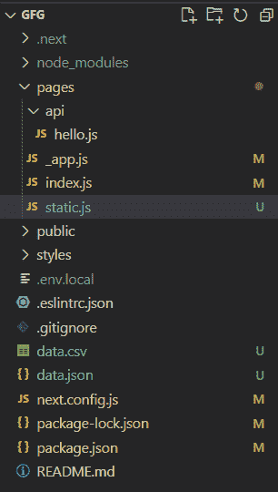
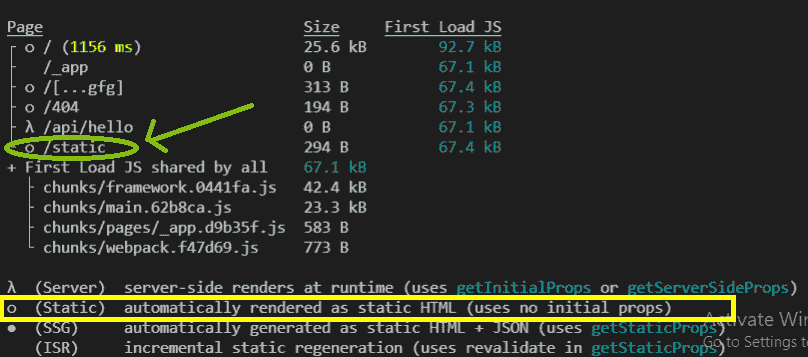

# Next.js 自动静态优化

> 原文:[https://www . geesforgeks . org/next-js-automatic-static-optimization/](https://www.geeksforgeeks.org/next-js-automatic-static-optimization/)

在本文中，我们将学习 NextJS 中的自动静态优化。

NextJS 是一个基于 React 的框架。它有能力为不同的平台开发漂亮的网络应用程序，如视窗、Linux 和 mac。动态路径的链接有助于有条件地呈现您的 NextJS 组件。自动静态优化是 NextJS 的一个特性，在它的帮助下，我们可以创建混合页面，这些页面可以根据内容在服务器端和客户端呈现。

在 NextJS 中，如果页面没有阻塞数据需求，那么页面将由 nextjs 在客户端呈现，如果页面包含**getserverseadprops**或 **getInitialProps** ，那么页面将在服务器端呈现。这个方法帮助我们在 nextjs 中创建混合应用程序，它包含服务器端和客户端呈现的页面。

**创建 NextJS 应用程序:**您可以使用以下命令创建一个新的 NextJS 项目:

```
npx create-next-app gfg
```

**项目结构:**会是这样的。



**创建静态优化页面:**现在我们要创建一个新的 javascript 文件，该文件将不包含任何 getServerSideProps 或 getInitialProps。Next.js 将通过将页面预渲染为静态 HTML 来自动静态优化该页面

将以下内容添加到上面创建的文件中。

## static.js

```
import React from 'react'

export default function Static() {
    return (
        <div>
            This file is statically generated
        </div>
    )
}
```

现在，如果您在终端中运行下面的代码，那么 nextjs 将为您的应用程序构建一个优化的生产版本，在这个版本中，您可以看到 static.js 文件被转换成 static.js，这个文件是静态生成的，并将在客户端呈现。

```
npm run build
```

### 输出:

