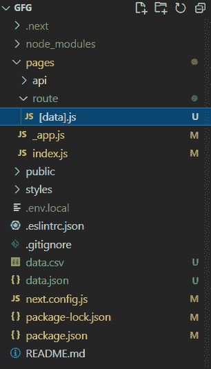
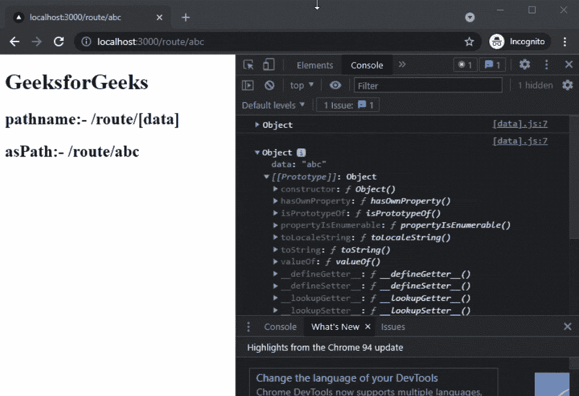

# Next.js 动态路由段

> 原文:[https://www . geesforgeks . org/next-js-dynamic-route-segments/](https://www.geeksforgeeks.org/next-js-dynamic-route-segments/)

在本文中，我们将学习如何在我们的 NextJS 项目中获取当前路线。

NextJS 是一个基于 React 的框架。它有能力为不同的平台开发漂亮的网络应用程序，如视窗、Linux 和 mac。动态路径的链接有助于有条件地呈现您的 NextJS 组件。

动态路由段是我们可以在 NextJs 应用程序中使用文件名中的括号创建的动态路由(也称为 url slugs、漂亮的 url 等)。这将帮助开发人员创建更复杂的应用程序，仅使用预定义的路径很难创建。

**创建 NextJS 应用程序:**您可以使用以下命令创建一个新的 NextJs 项目:

```
npx create-next-app gfg
```

**项目结构:**会是这样的。



NextJs 允许该功能无需太多努力就能创建动态路由。您可以按照以下步骤创建动态路线。

**步骤 1:** 创建一个名为“动态”的新文件夹，并在该文件夹内创建一个动态路由。我们可以通过在文件名中使用方括号在 NextJs 中创建动态路由。例如:-

```
/pages/route/[file_name].js
```

**步骤 2:** 创建一个名为“**【数据】的动态路由文件。js** 并在文件中添加以下内容。

## java 描述语言

```
import React from 'react'
import {useRouter} from 'next/router';

export default function getRoute() {
    // Calling useRouter() hook
    const router = useRouter()
    console.log(router.query)
    return (
        <div>
            <h1>GeeksforGeeks</h1>
            <h2>pathname:- {router.pathname}</h2>
            <h2>asPath:- {router.asPath}</h2>
        </div>
    )
}
```

在上面的例子中，首先，我们调用我们的 useRouter()钩子，然后，我们在控制台中显示路由器的对象。

*   **路径名:**当前路线。这是“/pages”中页面的路径。
*   **查询:**解析为对象的查询字符串。
*   **asPath:** 浏览器中显示的路径(包括查询)。

**第三步:**在终端输入以下命令，启动开发服务器。

```
npm run dev
```

### 输出:

