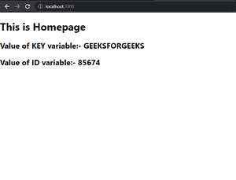

# Next.js 环境变量

> 原文:[https://www . geesforgeks . org/next-js-环境-变量/](https://www.geeksforgeeks.org/next-js-environment-variables/)

在本文中，我们将学习如何在 Next.js 中使用环境变量。Next.js 内置了对环境变量的支持，您可以在项目中的任何地方声明和使用这些变量。

按照以下步骤在 Next.js 应用程序中设置环境变量。

**步骤 1:** 要创建新的 Next.js 应用程序，请在您的终端中运行以下命令:

```
npx create-next-app GFG
```

**步骤 2:** 创建项目文件夹(即 GFG)后，使用以下命令移动到该文件夹:

```
cd GFG
```

**项目结构:**会是这样的。


**第三步:** **创建*****. env . local*****文件–**我们将创建一个 *.env.local* 文件来创建特定于我们本地机器的环境变量。您还可以使用其他环境变量文件类型，例如:

*   。包封/包围（动词 envelop 的简写）
*   . env 环境]
*   . env 环境]。当地的
*   环境发展
*   . env.development.local

创建文件后，我们可以在上面存储环境变量。

**例:**我们可以有如下数据的 *.env.local* 文件。

```
KEY="GEEKSFORGEEKS"
ID=85674
```

**第 4 步:访问环境变量–**现在，您可以使用“process.env.VARIABLE_NAME”访问您的环境变量。为了尝试这一点，让我们从一个 NextJs 应用程序的主页访问我们的环境变量。

**文件名:**页面/索引. js

## java 描述语言

```
export const getServerSideProps = async () => {
  return {
    props: {

      // Returning value of Environment
      // variable as prop
      value: process.env.KEY,
      id: process.env.ID,
    },
  };
};

export default function Home({ value, id }) {
  return (
    <div>
      {/* Adding Heading */}
      <h1>This is Homepage</h1>

      {/* Adding the value of Environment variable */}
      <h2>Value of KEY variable:- {value}</h2>
      <h2>Value of ID variable:- {id}</h2>
    </div>
  );
}
```

**步骤 5:运行应用程序–**运行以下命令启动服务器。

```
npm start
```

**输出:**我们将在您的浏览器屏幕上看到以下输出。

