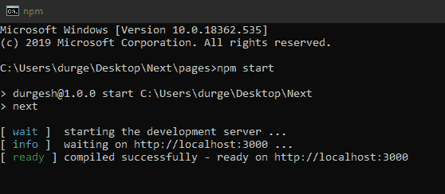
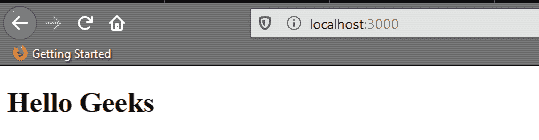

# Next.js 简介

> 原文:[https://www.geeksforgeeks.org/next-js-introduction/](https://www.geeksforgeeks.org/next-js-introduction/)

**Next.js** 是一个基于 react 的框架。它有能力为不同的平台开发漂亮的网络应用程序，如视窗、Linux 和 mac。如果您在 react 方面没有什么经验，并且希望更多地了解 react 生态系统，那么您应该了解 Next.js 框架。
下面简单介绍一下 Next.js

**简介:** Next.js 基于 react、webpack 和 babel。它是创建 web 应用程序的一个很棒的工具，并以服务器端渲染而闻名。下一个. js 由 [Zeit](https://github.com/zeit/next.js/) 打造。了解 HTML、CSS、Java Script 和 React 的开发人员可以轻松学习并切换到 next.js。

**主要特征:**

*   **热代码重新加载:**当保存代码中的更改时，它会自动重新加载应用程序。
*   **自动代码拆分:**通过该功能，代码中的每个导入都与每个页面捆绑在一起并提供服务。这意味着不必要的代码永远不会加载到页面上。
*   **生态系统兼容性:**兼容 JavaScript，Node 和 react。
*   **服务器渲染:**在向客户端发送 HTML 之前，在服务器端轻松渲染 react 组件。
*   **style-JSX:**style-JSX 允许你直接在 JavaScript 代码里面写 CSS。

**示例:**

```
function Home() {
    return (
        <div className="container">
        <p>Hello Geeks</p>
        <style jsx>{`
            .container {
                margin: 50px;
            }
            p {
                color: blue;
            }
        `}</style>
        </div>
    )
}

export default Home
```

**安装和运行 Next.js 应用程序的步骤:**

*   **第一步:**安装 next.js 需要 npm 和 node.js，可以从[这里](https://www.geeksforgeeks.org/installation-of-node-js-on-windows/)安装 node.js。通过在终端上运行这些命令来确认安装。

    ```
    node -v
    npm -v
    ```

*   **Step 2:** Now create a folder for your project on desktop navigate to folder through your code editor and run the following command on terminal.

    ```
    npm init -y
    npm install --save next react react-dom
    ```

    在这一步之后，我们已经在系统中安装了所有的依赖项。现在在 package.json 文件中添加以下脚本

    ```
    {
      "scripts": {
        "dev": "next",
        "build": "next build",
        "start": "next start"
      }
    }
    ```

    要在浏览器中运行应用程序，请使用终端中的命令`npm start`。

*   **第三步:**在页面文件夹中添加一个文件 index.js，并在其中添加以下代码。

    ```
    import React from'react';
    import Link from'next/link';

    export default class extends React.Component {
        render() {
            return ( {

            // This is Jsx contains HTML
            // code in Javascript}
            <div>
                <h1>Hello Geeks</h1>
                {
                    // This is Styled-jsx contains
                    // CSS code in Javascript}
                    <style jsx>{`
                        a{
                            color:grey;
                            text-decoration:none;
                        }
                    `}</style>
                }
            </div>
            )
        }  
    }
    ```

*   **Step 4:** Now start the application by running `npm start`.
    

    **输出:**
    

**参考:**T2】https://nextjs.org/docs/getting-started