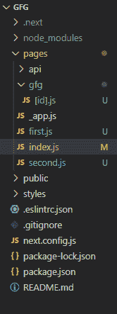
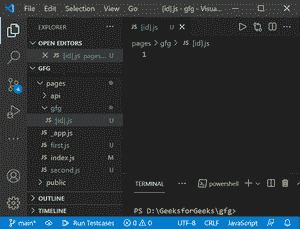
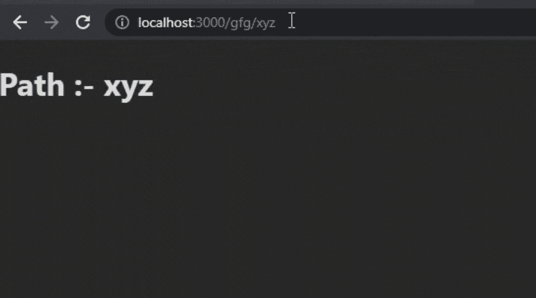
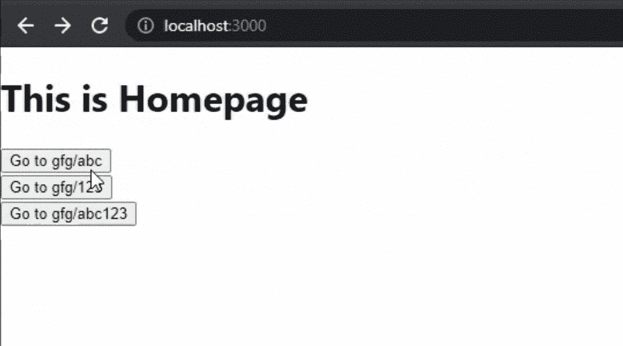

# 链接到动态路径

> 原文:[https://www . geesforgeks . org/next-js-link-to-dynamic-path/](https://www.geeksforgeeks.org/next-js-linking-to-dynamic-paths/)

在本文中，我们将学习如何在 Next.js 项目中创建和链接动态路径。NextJS 是一个基于 React 的框架。它有能力为不同的平台开发漂亮的网络应用程序，如视窗、Linux 和苹果。动态路径的链接有助于有条件地呈现您的 NextJS 组件。

**创建 NextJS 应用程序:**您可以使用以下命令创建一个新的 Next.js 项目:

```
npx create-next-app GFG
```

**项目结构:**会是这样的。



**创建动态路径:**在 Next.js 中，我们可以通过在页面名称中添加括号来创建动态路由。这里我们将创建一个名为 *gfg* 的文件夹，在这个文件夹中，我们将创建我们的文件*【id】。js* 文件如下所示。



**文件名:[id]。js** 现在我们将在这个文件中使用 useRouter()函数显示我们的路径。

## java 描述语言

```
// Importing useRouter()
import { useRouter } from 'next/router'

const Gfg = () => {

  // Initializing useRouter()
  const router = useRouter()

  return <h1>Path :- {router.query.id} </h1>
}

export default Gfg;
```

**运行应用程序的步骤:**现在通过运行以下命令启动应用程序。

```
npm start
```

**输出:**



**链接到动态路径:**在 Next.js 中，我们可以使用 link 组件轻松链接到动态路径。在 index.js 文件中添加下面的代码。

**文件名:index.js**

## java 描述语言

```
// Import Link component
import Link from 'next/link'

export default function Home() {
  return (
    <div>
      {/* Adding Heading */}
      <h1>
        This is Homepage
      </h1>
      {/* Adding Buttons */}
      <Link href='/gfg/abc'>
      <a>
        <button>Go to gfg/abc</button>
      </a>
      </Link>
      <br/>
      <Link href='/gfg/123'>
      <a>
        <button>Go to gfg/123</button>
      </a>
      </Link>
      <br/>
      <Link href='/gfg/abc123'>
      <a>
        <button>Go to gfg/abc123</button>
      </a>
      </Link>
    </div>
  )
}
```

**运行应用程序的步骤:**现在通过运行以下命令启动应用程序。

```
npm start
```

**输出:**

