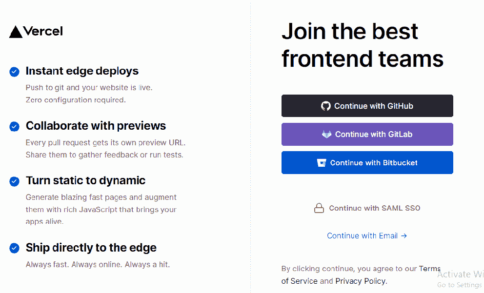
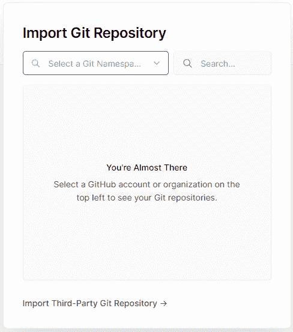
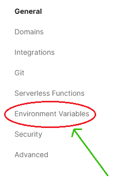
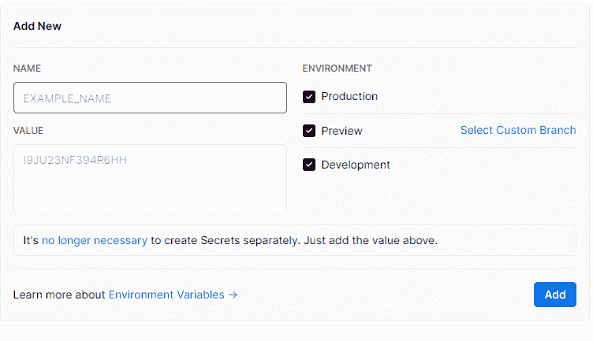

# Vercel 上的 next . js

> 原文:[https://www.geeksforgeeks.org/next-js-on-vercel/](https://www.geeksforgeeks.org/next-js-on-vercel/)

在本文中，我们将看到为我们的 nextjs 应用选择 vercel 的特性和好处，以及我们如何在 vercel 中导出我们的 NextJs 应用。

**Vercel 的优势:** Vercel 是由 NextJs 的创作者专门为 NextJs 应用制作的，因此它具有许多优势和功能，包括:-

*   **SSR 支持:**在 vercel 中，你可以在服务器端毫无问题地渲染任何页面。
*   **快速响应时间:**所有的 javascript、css、图片等都是通过 vercel Edge Network 提供的，速度非常快。
*   **轻松部署:**您可以在几分钟内轻松地在 vercel 中部署您的 NextJs 项目。
*   **免费访问:**你可以在 vercel 上完全免费托管你的非商业项目。

**在 vercel 中部署:**您可以使用以下步骤轻松地在 Vercel 中部署您的 NextJs 项目。

**步骤 1:** 在 Github 中部署您的 NextJs 项目。你可以阅读这篇关于[如何在 Github](https://www.geeksforgeeks.org/how-to-deploy-your-react-websites-on-github/) 中部署应用的文章。

**第 2 步:**在 Vercel 上创建新账户。完全免费，不需要信用卡细节。

**第三步:**登录后可以看到“新建项目”按钮。点击它创建一个新项目，

**第 4 步:**之后，点击“从 GitHub 导入”，可以看到你的 GitHub 库列表。选择你的下一个项目，就这样。您的应用程序已部署。

**添加环境变量:**在 vercel 中，可以轻松添加环境变量。按照以下步骤添加环境变量。

**步骤 1:** 转到已部署项目的仪表板。

**第二步:**点击设置按钮。

**第三步:**点击左侧的环境变量。

**第 4 步:**现在可以在这里添加环境变量了。

