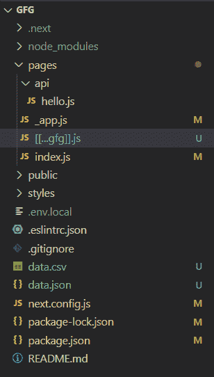
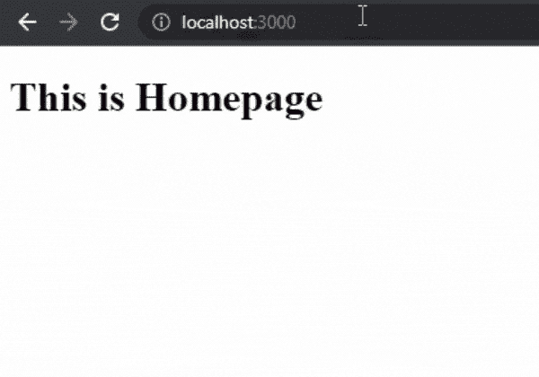
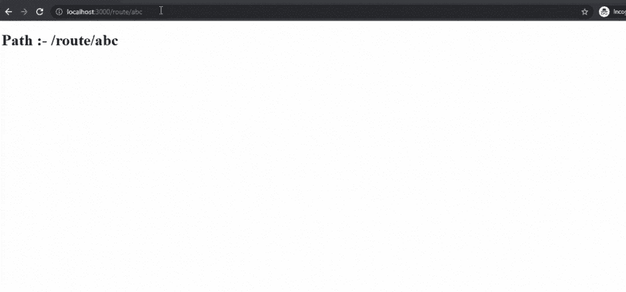

# Next.js 可选抓所有路线

> 原文:[https://www . geesforgeks . org/next-js-optional-catch-all-routes/](https://www.geeksforgeeks.org/next-js-optional-catch-all-routes/)

在本文中，我们将学习如何在我们的 NextJS 项目中实现可选的全面路线。

NextJS 是一个基于 React 的框架。它有能力为不同的平台开发漂亮的网络应用程序，如视窗、Linux 和 mac。动态路径的链接有助于有条件地呈现您的 NextJS 组件。

**创建 NextJS 应用程序:**您可以使用以下命令创建一个新的 NextJs 项目:

```
npx create-next-app gfg
```

创建项目文件夹(即 gfg)后，使用以下命令移动到该文件夹。

```
cd gfg
```

**项目结构:**会是这样的。



**可选的全部捕获路线:**我们可以使用可选的全部捕获路线在 NextJs 中使全部捕获路线成为可选的。为此，我们必须在文件名的双方括号内添加三个点。例如:-

```
./pages/[[...file_name]].js
```

现在让我们创建一个新的动态路由来选择性地捕获所有路径。为此，我们将在 pages 目录中的新路由文件夹内创建一个名为 **[[…gfg]]的新 javascript 文件。js** 。之后，在该文件中添加以下内容。

## java 描述语言

```
// Importing useRouter()
import { useRouter } from 'next/router'

function Gfg(){
  // Initializing useRouter()
  const router = useRouter()

  return <h1>Path :- {router.asPath} </h1>
}

export default Gfg;
```

这里我们使用路由器获取当前路径的值，然后显示当前路径名。

**运行应用程序的步骤:**从项目的根目录使用以下命令运行应用程序。

```
npm run dev
```

### 输出:



**总括路线与可选的总括路线有何不同:**在可选的总括路线中，没有参数的路线也将匹配(在上面的示例中“/route”也是匹配的)，但是在总括路线中，没有参数的路线将不匹配。

让我们更改上面的可选捕获所有路线文件 **[。gfg]]。js** 捕捉所有路线文件[…gfg]。带有以下内容的 js。

## java 描述语言

```
// Importing useRouter()
import { useRouter } from 'next/router'

function Gfg(){
  // Initializing useRouter()
  const router = useRouter()

  return <h1>Path :- {router.asPath} </h1>
}

export default Gfg;
```

现在，这将与路径“/route”不匹配。

**运行应用程序的步骤:**从项目的根目录使用以下命令运行应用程序。

```
npm run dev
```

### 输出:

