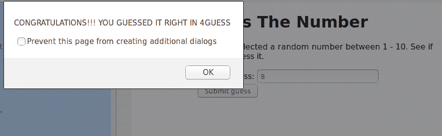

# 使用 JavaScript 的猜数字游戏

> 原文:[https://www . geesforgeks . org/number-guess-game-use-JavaScript/](https://www.geeksforgeeks.org/number-guessing-game-using-javascript/)

**先决条件:**

*   [HTML 基础知识](https://www.geeksforgeeks.org/tag/html/)
*   [Javascript 基础知识](https://www.geeksforgeeks.org/javascript-tutorial/)

游戏是在最小猜测次数范围 1-10 内猜测一个由计算机生成的随机数。

**要使用的功能:**

**1。document.getElementById("给定 Id "):**document . getelementbyid()用于从具有用户提供(指定)的 id 的 HTML 页面中获取元素。
**。值"**用于访问被访问的 HTML 元素的值。

**2。math . random():**random()函数用于生成一个介于 0(包含)和 1(不包含)之间的随机数。然后将生成的数字乘以 10，再加上 1，生成 1–10 的数字。

**3。math . floor():**floor()函数用于将数字返回到最近的整数(向下)。如果传递的参数是整数，则该值不会被舍入。

**游戏的实施。**

```html
                        <!DOCTYPE html>
<html>
<head>
    <meta charset="utf-8">
    <title>Number Guessing Game</title>

    <style>
        html {
    font-family: sans-serif;
    }

        body {
    width: 50%;
    max-width: 800px;
    min-width: 480px;
    margin: 0 auto;
    }
    </style>
</head>

<body>
<h1>Guess The Number</h1>

<p>We have selected a random number between 1 - 10. 
See if you can guess it.</p>

<div class="form">
    <label for="guessField">Enter a guess: </label>
    <input type = "text" id = "guessField" class = "guessField">
    <input type = "submit" value = "Submit guess" 
           class = "guessSubmit" id = "submitguess">
</div>

<script type = "text/javascript">

    // random value generated
    var y = Math.floor(Math.random() * 10 + 1);

    // counting the number of guesses
    // made for correct Guess
    var guess = 1;

    document.getElementById("submitguess").onclick = function(){

   // number guessed by user     
   var x = document.getElementById("guessField").value;

   if(x == y)
   {    
       alert("CONGRATULATIONS!!! YOU GUESSED IT RIGHT IN "
               + guess + " GUESS ");
   }
   else if(x > y) /* if guessed number is greater
                   than actual number*/ 
   {    
       guess++;
       alert("OOPS SORRY!! TRY A SMALLER NUMBER");
   }
   else
   {
       guess++;
       alert("OOPS SORRY!! TRY A GREATER NUMBER")
   }
}
</script>
</body>
</html>                    
```

**输出:**
