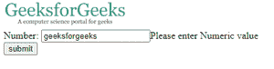
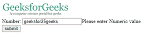
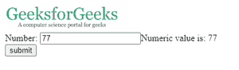

# JavaScript 中的数字验证

> 原文:[https://www . geesforgeks . org/number-validation-in-JavaScript/](https://www.geeksforgeeks.org/number-validation-in-javascript/)

有时，输入到文本字段中的数据需要采用正确的格式，并且必须是特定的类型，以便有效地使用表单。例如，电话号码、滚动号码等是一些必须用数字而不是字母表示的细节。

**进场:**

我们使用了 [isNaN()](https://www.geeksforgeeks.org/number-isnan-javascript/) 函数来验证文本字段的数值。文本字段数据在函数中传递，如果传递的数据是数字，则 isNan()返回 true，如果数据不是数字或数字和字母的组合，则返回 false。

下面是一个 HTML 和 JavaScript 代码，用于验证文本字段是否包含数字。

**示例:**

```
<!DOCTYPE html>
<html>
    <head>
        <script>
            /* this function is called when we
            click on the submit button*/
            function numberValidation() {
                /*get the value of the textfield using a 
                combination of name and id*/
                //form is the name of the form coded below
                //numbers are the name of the inputfield
                /*value is used to fetch the value written 
                in that particular field*/
                var n = document.form.numbers.value;

/* isNan() function check whether passed variable 
   is number or not*/
                if (isNaN(n)) {
/*numberText is the ID of span that print "Please enter 
Numeric value" if the value of inputfield is not a number*/
                    document.getElementById(
                      "numberText").innerHTML =
                      "Please enter Numeric value";
                    return false;
                } else {
                    /*numberText is the ID of span that print 
      "Numeric value" if the value of inputfield is a number*/
                    document.getElementById(
                      "numberText").innerHTML = 
                      "Numeric value is: " + n;
                    return true;
                }
            }
        </script>
    </head>

    <body>
        <!-- GeeksforGeeks image logo-->
        

        <!-- making the form with form tag than
             conatins inputField and a button -->
        <!-- onsubmit calls the numberValidation
             function which is created above -->
        <form name="form"
              onsubmit="return numberValidation()">
            <!-- name of input type is numbers 
       and create of id of span as numberText-->
            <!-- Respective output of input 
         is printed in span field -->
            Number: <input type="text"
                           name="numbers" />
          <span id="numberText"></span>
          <br />
            <input type="submit"
                   value="submit" />
        </form>
    </body>
</html>
```

**输出:**
**情况 1:文本字段包含字母**


**情况 2:文本字段包含字母和数字**

**情况 3:文本字段仅包含数字**
