# Javascript 中的对象

> 原文:[https://www.geeksforgeeks.org/objects-in-javascript/](https://www.geeksforgeeks.org/objects-in-javascript/)

对象，在 JavaScript 中，是最重要的数据类型，构成了现代 JavaScript 的构建块。这些对象与 JavaScript 的基本数据类型(数字、字符串、布尔、空、未定义和符号)有很大不同，因为这些基本数据类型都存储一个值(取决于它们的类型)。

*   对象更复杂，每个对象可能包含这些原始数据类型以及引用数据类型的任意组合。
*   对象是一种引用数据类型。被赋予引用值的变量被赋予引用或指向该值的指针。该引用或指针指向内存中存储对象的位置。变量实际上并不存储值。
*   松散地说，JavaScript 中的**对象可以被定义为相关数据的无序集合，原始或引用类型，形式为“键:值”对。**这些键可以是变量或函数，在对象的上下文中分别称为属性和方法。

可以使用带可选属性列表的方括号{…}创建对象。属性是“键:值”对，其中键是字符串(也称为“属性名”)，值可以是任何东西。
为了理解这个相当抽象的定义，让我们看一个 JavaScript 对象的例子:

```
let school = {
    name : "Vivekananda School",
    location : "Delhi",
    established : "1971"
}

```

在上例**中【名称】、【地点】、【成立】**都是**【钥匙】**和**【维威卡难达学校】【德里】和 1971** 分别是这些钥匙的值。

这些键中的每一个都被称为对象的**属性**。JavaScript 中的一个对象也可以有一个成员函数，在这种情况下，它将被称为该对象的**方法**。

让我们看看这样一个例子:

```
// javascript code demonstrating a simple object
let school = {
    name: 'Vivekananda School',
    location : 'Delhi',
    established : '1971',
    displayInfo : function(){
        console.log(`${school.name} was established 
              in ${school.established} at ${school.location}`);
    }
}
school.displayInfo();   
```

**输出:**
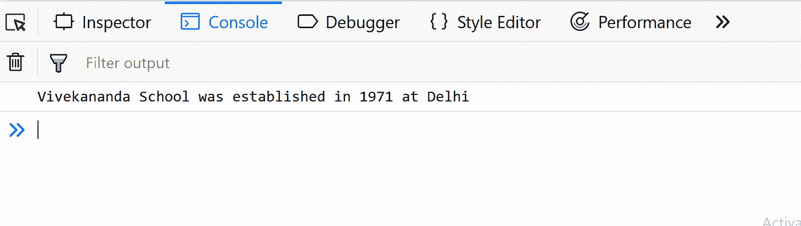

在上面的例子中，**“display info”**是学校对象的一个方法，用于处理存储在其属性中的对象数据。

**JavaScript 对象的属性**

属性名可以是字符串或数字。如果属性名是数字，则必须使用如下的“括号符号”来访问它们:

```
let school = {
    name: 'Vivekananda School',
    location : 'Delhi',
    established : '1971',
    20 : 1000,
    displayInfo : function(){
        console.log(`The value of the key 20 is ${school['20']}`);
    }
}
school.displayInfo();   
```

**输出:**
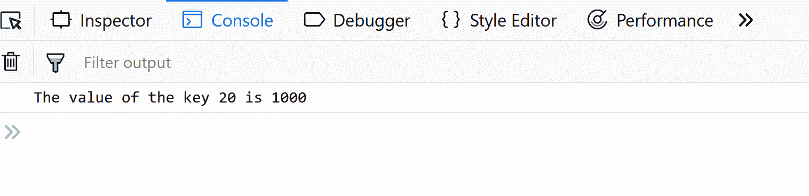

但是后面会有更多关于括号符号的内容。

属性名也可以是由多个空格分隔的字符串。在这种情况下，这些属性名必须用引号括起来:

```
let school = {
    "school name" : "Vivekananda School",
}

```

像是数字的属性名一样，它们也必须使用括号符号来访问。例如，如果我们想访问“维威卡难达学校”的“维威卡难达”，我们可以这样做:

```
// bracket notation 
let school = {
    name: 'Vivekananda School',
    displayInfo : function(){
        console.log(`${school.name.split(' ')[0]}`);
    }
}
school.displayInfo(); // Vivekananda
```

**输出:**
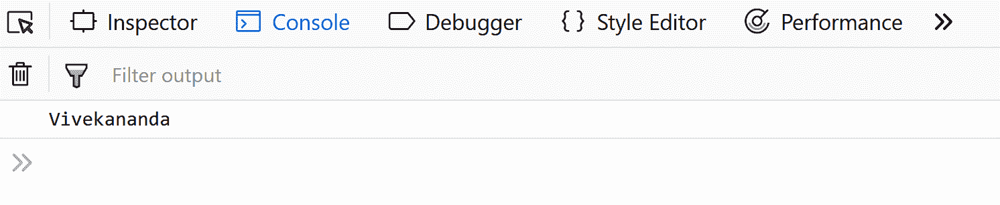
在上面的代码中，我们使用了括号符号，还使用了 javascript 提供的 split 方法，您将在 strings 文章中了解该方法。

**继承属性**

对象的继承属性是那些从对象原型继承的属性，而不是为对象本身定义的属性，这就是所谓的对象自己的属性。要验证一个属性是否是对象自己的属性，我们可以使用 **`hasOwnProperty`** 方法。

**属性属性**
JavaScript 中的数据属性有四个属性。

*   **值:**属性的值。
*   **可写:**为真时，属性的值可以更改
*   **可枚举:**为真时，属性可以通过“for-in”枚举进行迭代。否则，该属性被认为是不可枚举的。
*   **可配置:**如果为假，尝试删除属性、将属性更改为访问或属性、或更改其属性(除[[值]]之外，或将[[可写]]更改为假)将失败。

```
// hasOwnProperty code in js
const object1 = new Object();
object1.property1 = 42;

console.log(object1.hasOwnProperty('property1')); // true
```

**输出:**
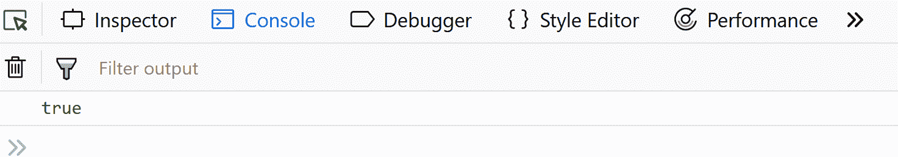

**创建对象**

有几种方法或语法来创建对象。我们已经使用了其中的一种，称为对象字面语法。除了对象文字语法，JavaScript 中的对象也可以使用构造函数、对象构造函数或原型模式来创建。

1.  **Using the Object literal syntax :** Object literal syntax uses the {…} notation to initialize an object an its methods/properties directly.
    Let us look at an example of creating objects using this method :

    ```
    var obj = {
        member1 : value1,
        member2 : value2,
    };

    ```

    这些成员可以是任何东西——字符串、数字、函数、数组甚至其他对象。像这样的对象被称为对象文字。这不同于其他涉及使用构造函数和类或原型的对象创建方法，下面已经讨论过了。

2.  **Object Constructor :** Another way to create objects in JavaScript involves using the “Object” constructor. The Object constructor creates an object wrapper for the given value. This, used in conjunction with the “new” keyword allows us to initialize new objects.
    Example :

    ```
    const school = new Object();
    school.name = 'Vivekanada school';
    school.location = 'Delhi';
    school.established = 1971;

    school.displayInfo = function(){
        console.log(`${school.name} was established 
              in ${school.established} at ${school.location}`);
    }

    school.displayInfo();
    ```

    **输出:**
    

    上面提到的两种方法不太适合需要创建多个同类对象的程序，因为它需要为每个这样的对象重复编写上面的代码行。为了解决这个问题，我们可以在 JavaScript 中使用另外两种对象创建方法，这两种方法可以显著减少这种负担，如下所述:

3.  **Constructors:** Constructors in JavaScript, like in most other OOP languages, provides a template for creation of objects. In other words, it defines a set of properties and methods that would be common to all objects initialized using the constructor.
    Let us see an example :

    ```
    function Vehicle(name, maker) {
       this.name = name;
       this.maker = maker;
    }

    let car1 = new Vehicle('Fiesta', 'Ford');
    let car2 = new Vehicle('Santa Fe', 'Hyundai')

    console.log(car1.name);    // Output: Fiesta
    console.log(car2.name);    // Output: Santa Fe
    ```

    **输出:**
    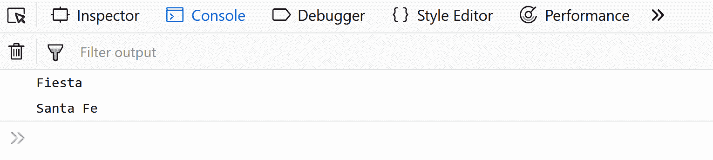
    注意功能 Vehicle 前“new”关键字的用法。在任何函数将其转换为构造函数之前，以这种方式使用“new”关键字。“新车辆()”实际上是:

    *   它创建一个新的对象，并将该对象的构造函数属性设置为 schools(需要注意的是，该属性是一个不可枚举的特殊默认属性，不能通过手动设置“constructor: someFunction”属性来更改)。
    *   然后，它设置对象与 **`Vehicle`** 函数的原型对象一起工作(JavaScript 中的每个函数都获得一个原型对象，它最初只是一个空对象，但可以修改。该对象在实例化时继承其构造函数原型对象的所有属性)。
    *   然后在新对象的上下文中调用 vehicle()，这意味着当在构造函数(Vehicle())中遇到“this”关键字时，它指的是在第一步中创建的新对象。
    *   完成后，新创建的对象将返回 car1 和 car2(在上面的示例中)。

    在类内部，可以有名为 **`constructor()`** 的特殊方法。

    ```
    class people {
        constructor()
        {
            this.name = "Adam";
        }
    }

    let person1 = new people();

    // Output : Adam    
    console.log(person1.name);    
    ```

    **输出:**
    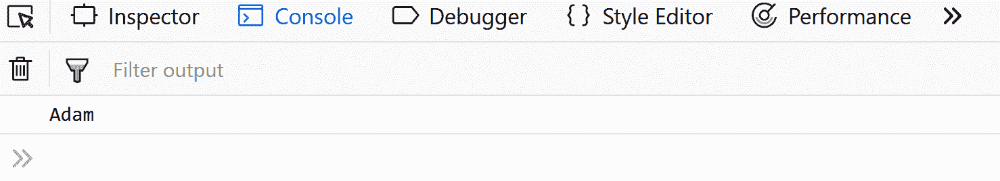
    在一个名为`constructor()`的类中有多个函数会导致错误。

4.  **Prototypes :** Another way to create objects involves using prototypes. Every JavaScript function has a `prototype` object property by default(it is empty by default). Methods or properties may be attached to this property. A detailed description of prototypes is beyond the scope of this introduction to objects.
    However you may familiarize yourself with the basic syntax used as below:

    ```
    let obj = Object.create(prototype_object, propertiesObject)
              // the second propertiesObject argument is optional

    ```

    使用对象创建()方法的一个例子是:

    ```
    let footballers = {
        position: "Striker"
    }

    let footballer1 = Object.create(footballers);

        // Output : Striker    
    console.log(footballer1.position); 
    ```

    **输出:**
    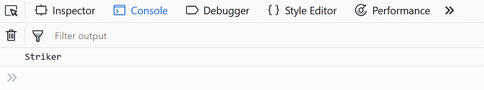
    在上面的例子中，足球运动员充当了创建对象“足球运动员 1”的原型。

    以这种方式创建的所有对象都继承其原型对象的所有属性和方法。原型可以有原型，那些可以有原型，等等。这在 JavaScript 中被称为原型链接。该链以 **`Object.prototype`** 结束，这是所有对象的默认原型后备。默认情况下，Javascript 对象从 Object.prototype 继承属性和方法，但是这些很容易被覆盖。有趣的是，默认原型并不总是 Object.prototype。例如，String 和 Arrays 有它们自己的默认原型——string . prototype 和 Array.prototype。

**访问对象成员**

对象成员(属性或方法)可以使用:

1.  dot notation :

    ```
    (objectName.memberName)
    ```

    ```
    let school = {
        name : "Vivekanada",
        location : "Delhi",
        established : 1971,
        20 : 1000,
        displayinfo : function() {
            console.log(`${school.name} was established 
              in ${school.established} at ${school.location}`);
        }

    }

    console.log(school.name);

    console.log(school.established);
    ```

    **输出:**
    

2.  Bracket Notation :

    ```
     objectName["memberName"]
    ```

    ```
    let school = {
        name : "Vivekanada School",
        location : "Delhi",
        established : 1995,
        20 : 1000,
        displayinfo : function() {
            document.write(`${school.name} was established 
              in ${school.established} at ${school.location}`);
        }
    }

    // Output : Vivekanada School
    console.log(school['name']); 

    // Output: 1000
    console.log(school['20']); 
    ```

    **输出:**
    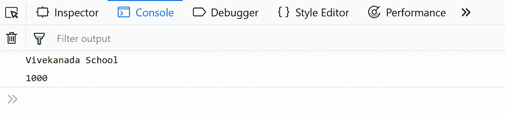

与点符号不同，方括号关键字适用于任何字符串组合，包括但不限于多单词字符串。
例如:

```
somePerson.first name // invalid
    somePerson["first name"] // valid

```

与点符号不同，括号符号还可以包含任何表达式变量的结果名称，这些变量的值是在运行时计算的。
例如:

```
let key = "first name" somePerson[key] = "Name Surname"

```

使用点符号时，类似的操作是不可能的。

**迭代对象的所有键**

为了迭代一个对象的所有现有可枚举键，我们可以使用 **`for...in`** 构造。值得注意的是，这允许我们只访问可枚举的对象属性(回想一下，可枚举是数据属性的四个属性之一)。
例如，从 Object.prototype 继承的属性是不可枚举的。但是，从某处继承的可枚举属性也可以使用 **`for...in`** 构造
来访问。示例:

```
let person = {
    gender : "male"
}

var person1 = Object.create(person);
person1.name = "Adam";
person1.age = 45;
person1.nationality = "Australian";

for (let key in person1) {
// Output : name, age, nationality 
// and gender
    console.log(key); 
}          
```

**输出:**
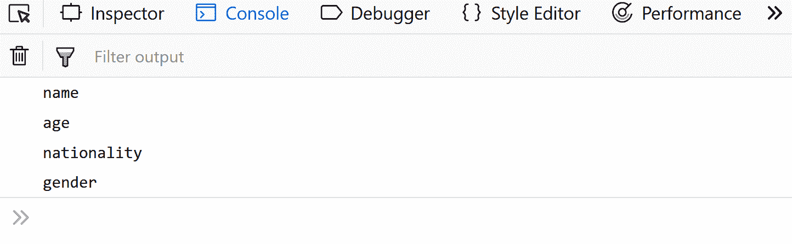

**删除属性**

要删除一个对象的属性，我们可以使用`delete`操作符。下面列出了它的用法示例:

```
let obj1 = {
    propfirst : "Name"
} 

// Output : Name
console.log(obj1.propfirst); 
delete obj1.propfirst

// Output : undefined
console.log(obj1.propfirst);             
```

**输出:**
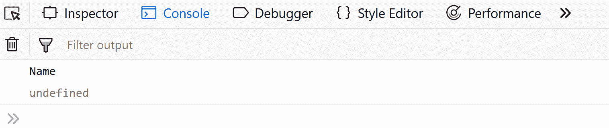

需要注意的是，我们不能以这种方式删除继承的属性或不可配置的属性。
例如:

```
let obj1 = {
    propfirst : "Name"
} 
// Output : Name
console.log(obj1.propfirst) 
  let obj2 = Object.create(obj1);

 // Output : Name
  console.log(obj2.propfirst);

  // Output : true.
  console.log(delete obj2.propfirst); 

    // Surprisingly Note that this will return true
    // regardless of whether the deletion was successful

    // Output : Name    
    console.log(obj2.propfirst); 
```

**输出:**
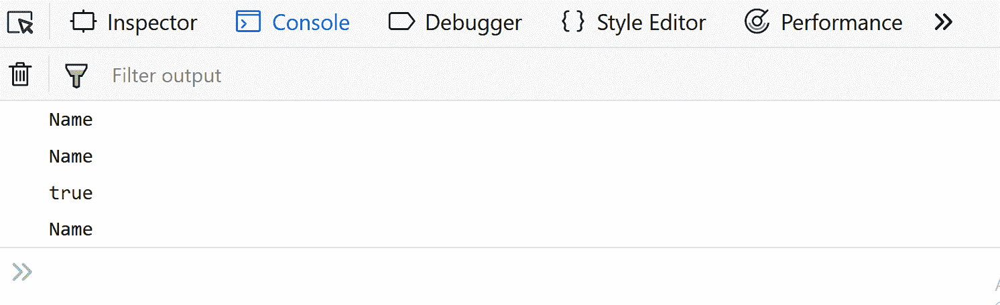