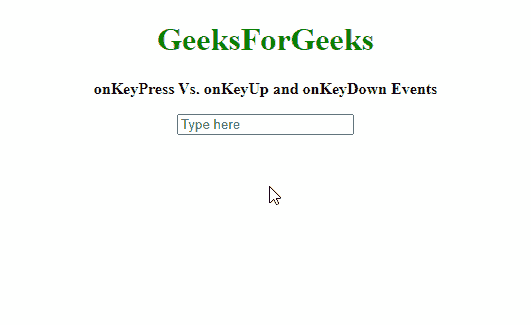

# 在 JavaScript 中按下向上键和向下键事件

> 原文:[https://www . geeksforgeeks . org/onkey press-onkey up-and-onkey down-events-in-JavaScript/](https://www.geeksforgeeks.org/onkeypress-onkeyup-and-onkeydown-events-in-javascript/)

在 JavaScript 中，每当按键被按下或释放时，都会触发某些事件。这些事件中的每一个都有不同的含义，可以根据当前状态和使用的密钥来实现某些功能。

按键时触发的这些事件的顺序如下:

*   **按键事件:**当用户按下按键时，该事件发生。即使按下的键没有产生字符值，也会出现这种情况。
*   **按键事件:**当用户按下产生字符值的按键时，该事件发生。这些键包括字母键、数字键和标点键。修饰键，如“Shift”、“CapsLock”、“Ctrl”等。不产生字符，因此它们没有“按键”事件。
*   **按键事件:**当用户释放按键时，该事件发生。即使释放的键不产生字符值，也会出现这种情况。

请注意，不同的浏览器可能对上述事件有不同的实现。**按下**、**按下**和**按下**事件可分别用于检测这些事件。

下面的例子显示了不同的事件，当一个键按下它们各自的顺序时被触发。

**示例:**

## 超文本标记语言

```html
<!DOCTYPE html>
<html>

<body style="text-align:center;">
    <h1 style="color:green;">
        GeeksForGeeks
    </h1>

    <p>
        <b>onKeyPress Vs. onKeyUp
            and onKeyDown Events</b>
    </p>

    <input type="text" id="field" placeholder="Type here">
    <p id="status"></p>

    <script>
        // Script to test which key 
        // event gets triggered 
        // when a key is pressed
        var key_pressed =
            document.getElementById('field');

        key_pressed
            .addEventListener("keydown", onKeyDown);
        key_pressed
            .addEventListener("keypress", onKeyPress);
        key_pressed
            .addEventListener("keyup", onKeyUp);

        function onKeyDown(event) {
            document.getElementById("status")
                .innerHTML = 'keydown: '
                + event.key + '<br>'
        }
        function onKeyPress(event) {
            document.getElementById("status")
                .innerHTML += 'keypress: '
                + event.key + '<br>'
        }
        function onKeyUp(event) {
            document.getElementById("status")
                .innerHTML += 'keyup: '
                + event.key + '<br>'
        }
    </script>
</body>

</html>
```

**输出:**

