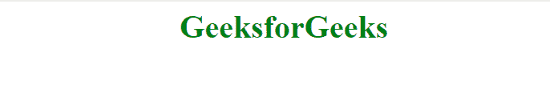

# 使用 JavaScript 打开链接，无需点击

> 原文:[https://www . geesforgeks . org/open-a-link-无需点击-it-use-JavaScript/](https://www.geeksforgeeks.org/open-a-link-without-clicking-on-it-using-javascript/)

**问题陈述:**如何使用 JavaScript 打开链接而不点击？

**解决方法:**当鼠标移过文本时，链接将打开。它返回一个新创建的窗口，如果调用失败，则返回空值。

**语法:**

```
window.open( URL, name, Specs )
```

**参数:**该功能接受三个参数，如上所述，描述如下:

*   **URL:** 为可选参数。用于指定需要打开的网页的网址。如果未指定网址，则会打开一个新窗口。
*   **名称:**可选参数，用于指定目标属性。
    *   **_blank:** 网址加载到新窗口。它是可选的。
    *   **_ top:**URL 替换当前页面。
*   **规格:**可选参数。这是一个逗号分隔的项目列表，没有空格。
    *   **高度:**表示像素中窗口的高度。
    *   **宽度-** 表示像素中窗口的宽度。

**注意:**允许弹出网页浏览器。

**程序 1:** URL 加载到新窗口。

```
<!DOCTYPE html>
<html>
    <head>
        <title>Javascript open link without click</title>
        <style>
            .gfg {
                text-align:center;
                font-size:40px;
                font-weight:bold;
                color:green;
            }
        </style>
        <script>
            function myFunction() {
                window.open("https://www.geeksforgeeks.org");
            }
        </script>
    </head>
    <body>
        <div class = "gfg" onmouseover = "myFunction()">
                GeeksforGeeks
        </div>
    </body>
</html>                    
```

**输出:**


**程序 2:** URL 加载到当前窗口。

```
<!DOCTYPE html>
<html>
    <head>
        <title>Javascript open link without click</title>
        <style>
            .gfg {
                text-align:center;
                font-size:40px;
                font-weight:bold;
                color:green;
            }
        </style>
        <script>
            function myFunction() {
                window.open("https://www.geeksforgeeks.org", "_top");
            }
        </script>
    </head>
    <body>
        <div class = "gfg" onmouseover = "myFunction()">
            GeeksforGeeks
        </div>
    </body>
</html>  
```

**输出:**


**程序 3:** 将 URL 加载到特定大小的新窗口中。

```
<!DOCTYPE html>
<html>
    <head>
        <title>Javascript open link without click</title>
        <style>
            .gfg {
                text-align:center;
                font-size:40px;
                font-weight:bold;
                color:green;
            }
        </style>
        <script>
            function myFunction() {
                window.open('https://www.geeksforgeeks.org',
                              ' ', 'width=500, height=300');
            }
        </script>
    </head>
    <body>
        <div class = "gfg" onmouseover = "myFunction()">
            GeeksforGeeks
        </div>
    </body>
</html>  
```

**输出:**
