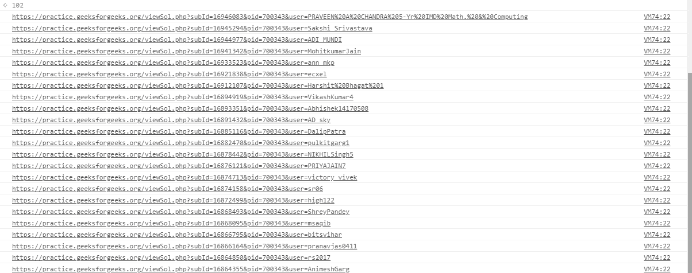

# 使用 JavaScript 打开提交页面的所有人员解决方案链接

> 原文:[https://www . geesforgeks . org/open-all-person-solution-link-from-submission-page-use-JavaScript/](https://www.geeksforgeeks.org/open-all-persons-solution-links-from-submission-page-using-javascript/)

JavaScript 是一种符合 ECMAScript 规范的高级解释编程语言。jQuery 是一个 JavaScript 库，旨在简化 HTML DOM 树的遍历和操作。

**示例:**

*   **步骤 1:** 打开任何 geeksforgeeks 解决方案页面。喜欢打开[问题提交页面](https://practice.geeksforgeeks.org/problem_submissions.php?lang=CPP&pid=700343)。按 F12 或通过检查选项在检查模式下打开页面。
*   **第二步:**现在在控制台窗口复制粘贴下面的 javascript 代码，按回车键。在 2.5 秒内，所有的解决方案将被一一列出。

**示例:**

```
<script>

// Array to insert page links
javascript: var arr = [];
var i = 1;

// Accessing the dom to find the "View solution" 
// link of each person's solution
for(i = 1; i <= 30; i++) {
    var flag = false;
    if (document.getElementsByClassName("well table whiteBgColor")
                                     [0].children[0].children[i]) {

        var link = document.getElementsByClassName
                                     ("well table whiteBgColor")
        [0].children[0].children[i].lastElementChild.children[0]
                                       .href.trim().toString();

        // If ith submission is not there
        // then break the loop 
        flag = true;
    }

    if (!flag) {
        break;
    }

    arr.push(link);
}

// Opening multiple tabs with 
// the links in the array 
function open_win() {
    for(var i = 0; i < arr.length; i++) {
        console.log(arr[i]);
        window.open(arr[i]);
    }
}

// In 2.5 seconds multiple tabs will get 
// open with the search results links 
setTimeout(function() {
    open_win();
}, 2500);
</script>
```

**输出:**


**注意:**第一次运行脚本时会出现一个弹出窗口。我们必须允许弹出窗口，因为 Chrome 想知道我们是否希望使用多个选项卡。然后重新运行脚本。