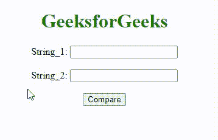
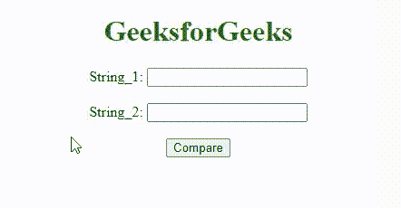
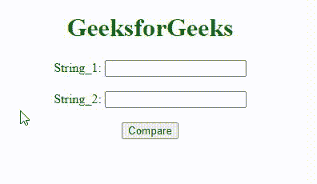

# JavaScript 中比较字符串的最佳方式

> 原文:[https://www . geesforgeks . org/JavaScript 中字符串比较的最佳方式/](https://www.geeksforgeeks.org/optimum-way-to-compare-strings-in-javascript/)

在本文中，我们将了解使用内置 Javascript 方法比较字符串的最佳方式&将通过示例看到它们的实现。问题是优化比较 2 个 JavaScript 字符串。为此，这里讨论了一些最常用的技术。下面讨论的方法用于下面的例子。

[**字符串 localeCompare()**](https://www.geeksforgeeks.org/javascript-string-localecompare/) **方法:**此方法比较当前区域设置中的两个字符串。当前区域设置基于浏览器的语言设置。此方法返回一个数字，该数字指示字符串在排序顺序中是在比较字符串之前、之后还是等于比较字符串。

**语法:**

```
string.localeCompare(String_2);
```

**参数:**

*   **String_2:** 此必需参数指定要比较的字符串。

关于操作符的更多细节，请参考 [JavaScript 操作符完整参考](https://www.geeksforgeeks.org/javascript-operators-complete-reference/)一文。

**示例 1:** 本示例使用 **localeCompare()方法**比较 2 个字符串，并返回 **0，-1 或 1** 。该方法进行**区分大小写比较**。

## 超文本标记语言

```
<!DOCTYPE html>
<html>

<head>
    <title>JavaScript Optimum way to compare strings</title>
</head>

<body style="text-align:center;" id="body">
    <h1 style="color:green;"> 
            GeeksforGeeks 
        </h1> String_1:
    <input type="text" id="text1" name="tname1">
    <br>
    <br> String_2:
    <input type="text" id="text2" name="tname2">
    <br>
    <br>
    <button onclick="gfg_Run()"> Compare </button>
    <p id="GFG_DOWN" style="color:green;
              font-size: 20px;
              font-weight: bold;"> </p>

    <script>
        var str1 = document.getElementById("text1");
        var str2 = document.getElementById("text2");
        var el_down = document.getElementById("GFG_DOWN");

        function gfg_Run() {
            var a = str1.value;
            var b = str2.value;
            var ans = a.localeCompare(b);
            var res = "";
            if(ans == -1) {
                res = '"' + a + '" comes before "' + b + '"';
            } else if(ans == 0) {
                res = 'Both string are same';
            } else {
                res = '"' + a + '" comes after "' + b + '"';
            }
            el_down.innerHTML = res;
        }
    </script>
</body>

</html>
```

**输出:**



localeCompare()方法

**示例 2:** 本示例通过写入一个条件来比较 2 个字符串，该条件根据比较结果返回 **0、-1** 、**或 1** 。这个方法也做**区分大小写比较**。

## 超文本标记语言

```
<!DOCTYPE html>
<html>

<head>
    <title>JavaScript Optimum way to compare strings</title>
</head>

<body style="text-align:center;" id="body">
    <h1 style="color:green;"> 
            GeeksforGeeks 
        </h1> String_1:
    <input type="text" id="text1" name="tname1">
    <br>
    <br> String_2:
    <input type="text" id="text2" name="tname2">
    <br>
    <br>
    <button onclick="gfg_Run()">Compare</button>
    <p id="GFG_DOWN" style="color:green;
              font-size: 20px;
              font-weight: bold;"> </p>

    <script>
        var str1 = document.getElementById("text1");
        var str2 = document.getElementById("text2");
        var el_down = document.getElementById("GFG_DOWN");

        function gfg_Run() {
            var a = str1.value;
            var b = str2.value;
            var ans = a < b ? -1 : (a > b ? 1 : 0);
            var res = "";
            if(ans == -1) {
                res = '"' + a + '" comes before "' + b + '"';
            } else if(ans == 0) {
                res = 'Both string are same';
            } else {
                res = '"' + a + '" comes after "' + b + '"';
            }
            el_down.innerHTML = res;
        }
    </script>
</body>

</html>
```

**输出:**



字符串比较

**示例 3:** 本示例使用 **localeCompare()方法**比较两个相同的字符串(也区分大小写)。

## 超文本标记语言

```
<!DOCTYPE html>
<html>

<head>
    <title>JavaScript Optimum way to compare strings</title>
</head>

<body style="text-align:center;" id="body">
    <h1 style="color:green;"> 
            GeeksforGeeks 
        </h1> String_1:
    <input type="text" id="text1" name="tname1">
    <br>
    <br> String_2:
    <input type="text" id="text2" name="tname2">
    <br>
    <br>
    <button onclick="gfg_Run()"> Compare </button>
    <p id="GFG_DOWN" style="color:green;
              font-size: 20px;
              font-weight: bold;"> </p>

    <script>
      var str1 = document.getElementById("text1");
      var str2 = document.getElementById("text2");
      var el_down = document.getElementById("GFG_DOWN");

      function gfg_Run() {
        var a = str1.value;
        var b = str2.value;
        var ans = a.localeCompare(b);
        var res = "";
        if(ans == -1) {
            res = '"' + a + '" comes before "' + b + '"';
        } else if(ans == 0) {
            res = 'Both string are same';
        } else {
            res = '"' + a + '" comes after "' + b + '"';
        }
        el_down.innerHTML = res;
      }
    </script>
</body>

</html>
```

**输出:**



字符串比较的 localeCompareMethod