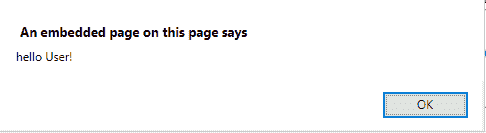
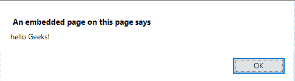

# 在 JavaScript 中传递函数作为参数

> 原文:[https://www . geesforgeks . org/passing-a-function-as-a-parameter-in-JavaScript/](https://www.geeksforgeeks.org/passing-a-function-as-a-parameter-in-javascript/)

将函数作为参数传递给函数与将变量作为参数传递给函数非常相似。下面的例子描述了如何将一个函数作为参数传递给另一个函数。

**示例 1:** 本示例将函数**极客 _ 内部**传递给函数**极客 _ 外部**作为参数。

```
<!DOCTYPE html> 
<html> 
    <head> 
        <title> 
            JavaScript | Pass a function as parameter 
        </title> 
    </head> 

    <body style = "text-align:center;"> 

        <h1 style = "color:green;" > 
            GeeksForGeeks 
        </h1> 

        <p> 
            Passing function as arguments. 
        </p> 

        <!-- Function call after clicking the button -->
        <button onclick = "geeks_outer(geeks_inner)"> 
            Click Here 
        </button>     

        <script> 
            function geeks_inner(value){
                return 'hello User!';
            }
            function geeks_outer(func){
                alert(func());
            }
        </script> 
    </body> 
</html>                    
```

**输出:**

*   **点击按钮前:**
    
*   **点击按钮后:**
    

**示例 2:** 这个示例传递了一个函数 **geeks_inner** 以及一个参数‘Geeks！’以功能**极客 _ 天外**为论据。

```
<!DOCTYPE html> 
<html> 
    <head> 
        <title> 
            JavaScript | Pass a function as parameter 
        </title> 
    </head>     

    <body style = "text-align:center;"> 

        <h1 style = "color:green;" > 
            GeeksForGeeks 
        </h1> 

        <p> 
            Passing function as arguments. 
        </p>             

        <button onclick = "geeks_outer('Geeks!', geeks_inner)"> 
            Click Here 
        </button>         

        <!-- Script to uses function call using
            function as argument -->
        <script> 
            function geeks_inner(value){
                return 'hello '+value;
            }
            function geeks_outer(a, func){
                alert(func(a));
        }         
        </script> 
    </body> 
</html>                    
```

**输出:**

*   **点击按钮前:**
    
*   **点击按钮后:**
    