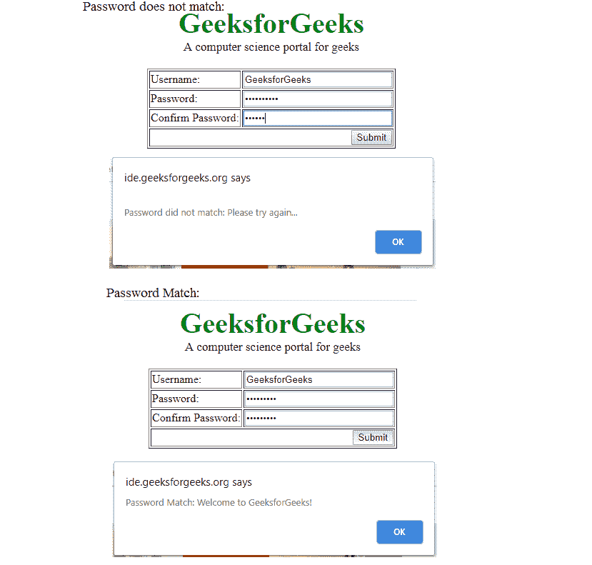

# 使用 JavaScript 进行密码匹配

> 原文:[https://www . geesforgeks . org/password-matching-use-JavaScript/](https://www.geeksforgeeks.org/password-matching-using-javascript/)

给定两个框，即**密码**和**确认密码**。任务是检查输入的密码是否匹配。

它用于在线申请表或社交网站注册账户，以验证用户输入的密码是否正确。这是验证密码匹配的简单方法。第一个密码存储在*密码 1* 变量中，确认密码存储在*密码 2* 变量中。然后检查两个变量值是否相等，密码是否匹配，否则密码不匹配。

下面是上述方法的实现:

```
<!DOCTYPE html>
<html>
    <head>
        <script>

            // Function to check Whether both passwords
            // is same or not.
            function checkPassword(form) {
                password1 = form.password1.value;
                password2 = form.password2.value;

                // If password not entered
                if (password1 == '')
                    alert ("Please enter Password");

                // If confirm password not entered
                else if (password2 == '')
                    alert ("Please enter confirm password");

                // If Not same return False.    
                else if (password1 != password2) {
                    alert ("\nPassword did not match: Please try again...")
                    return false;
                }

                // If same return True.
                else{
                    alert("Password Match: Welcome to GeeksforGeeks!")
                    return true;
                }
            }
        </script>
        <style>
            .gfg {
                font-size:40px;
                color:green;
                font-weight:bold;
                text-align:center;
            }
            .geeks {
                font-size:17px;
                text-align:center;
                margin-bottom:20px;
            }
        </style>
    </head>
    <body>
        <div class = "gfg">GeeksforGeeks</div>
        <div class = "geeks">A computer science portal for geeks</div>
        <form onSubmit = "return checkPassword(this)">
        <table border = 1 align = "center">
            <tr>
                <!-- Enter Username -->
                <td>Username:</td>
                <td><input type = text name = name size = 25</td>
            </tr>
            <tr>
                <!-- Enter Password. -->
                <td>Password:</td>
                <td><input type = password name = password1 size = 25</td>
            </tr>
            <tr>
                <!-- To Confirm Password. -->
                <td>Confirm Password:</td>
                <td><input type = password name = password2 size = 25></td>
            </tr>
            <tr>
                <td colspan = 2 align = right>
                <input type = submit value = "Submit"></td>
            </tr>
        </table>
        </form>
    </body>
</html>                    
```

**输出:**
