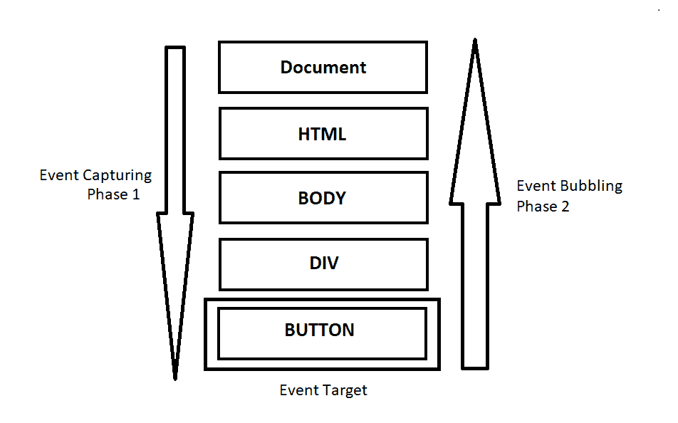
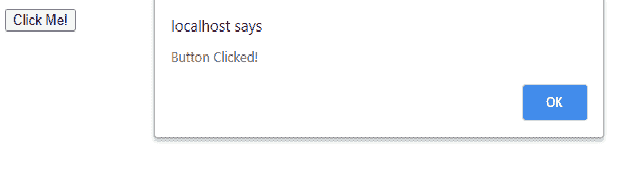
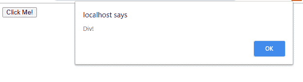
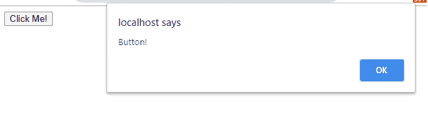
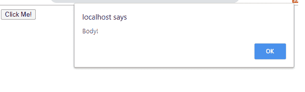

# JavaScript 事件的阶段

> 原文:[https://www.geeksforgeeks.org/phases-of-javascript-event/](https://www.geeksforgeeks.org/phases-of-javascript-event/)

在 JavaScript 事件的生命周期中，有三个不同的阶段。

*   捕获阶段
*   目标阶段
*   起泡阶段

它们遵循上面列出的相同顺序。

**捕捉阶段**是事件深入元素的时候。**目标阶段**是事件到达元素时，**冒泡阶段**是事件从元素冒泡时。



那么在一个事件的三个阶段中，哪一个阶段使用了 **addEventListener()** 呢，程序员如何改变呢？

## 超文本标记语言

```
<!DOCTYPE html>
<html>

<body>
    <div class="container">
        <button id="btn">Click Me!</button>
    </div>

    <script type="text/javascript">
        document.getElementById('btn')
            .addEventListener('click', 
            function () {
                alert('Button Clicked!');
            })
    </script>
</body>

</html>
```

**Output:**


在**冒泡**阶段将调用 **addEventListener()** 方法。上面显示的代码将使用带有两个参数的 addEventListener()。但是，在上面的代码中，**。addEventListener()** 可以用第三个参数“true”来调用，这将在捕获阶段更早地调用侦听器。

**例:**

## 超文本标记语言

```
<DOCTYPE html>
    <html>

    <body id="bdy">
        <div id="container">
            <button id="btn">Click Me!</button>
        </div>
        <script type="text/javascript">
            document.getElementById('bdy')
                .addEventListener('click', function () {
                alert('Body!');
            })
            document.getElementById('container')
                .addEventListener('click', function () {
                alert('Div!');
            }, true)
            document.getElementById('btn')
                .addEventListener('click', function () {
                alert('Button!');
            })
        </script>
    </body>

    </html>
```

**Output:**




在上面的代码中，*主体*和*按钮*处于冒泡阶段(默认)，而 *div* 设置为捕获阶段。当点击*按钮*时，它再次从顶部开始。说到*体*元素，它不运行功能，因为我们还处于捕捉阶段。但是当它到达 *div* 时，它运行该函数，因为 **addEventListener()** 的第三个参数为“真”。所以它必须在捕获阶段运行。当它到达按钮时，它从捕获阶段切换到目标阶段，最后切换到起泡阶段。它触发处于默认模式的**添加事件监听器**。

所以上面的代码会给出一个警告消息框，显示“div”，然后是“button”，最后是“body”。