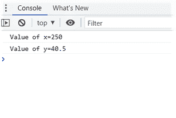
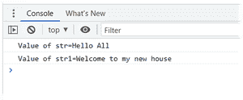
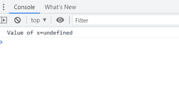
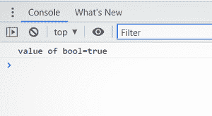
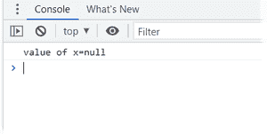
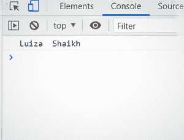
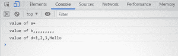

# JavaScript 中的原始和非原始数据类型

> Original: [https://www.geeksforgeeks.org/primitive-and-non-primitive-data-types-in-javascript/](https://www.geeksforgeeks.org/primitive-and-non-primitive-data-types-in-javascript/)

**数据类型：**每个变量都有一个数据类型，它告诉我们变量中存储了什么类型的数据。 JavaScript 中有两种类型的数据类型，即原始数据类型和非原始数据类型。

**原始数据类型：**JavaScript 语言提供的预定义数据类型称为原始数据类型。 基元数据类型也称为内置数据类型。

**非基元数据类型：**从 JavaScript 语言的基元数据类型派生的数据类型称为非基元数据类型。 它也称为派生数据类型或引用数据类型。

Javascript 中有五种类型的原始数据类型。

**1.Number：**javascript 中的 Number 数据类型可以用来保存十进制值，也可以保存不带小数的值。

## JavaScript

```
<script>
    let x = 250;
    let y = 40.5;
    console.log("Value of x=" + x);
    console.log("Value of y=" + y);
</script>
```

发帖主题：Re：Колибри0.7.0



数字输出

**2.****字符串：**javascript 中的字符串数据类型表示由单引号或双引号括起来的字符序列。

## JavaScript

```
<script>
    let str = 'Hello All';
    let str1 = "Welcome to my new house";
    console.log("Value of str=" + str);
    console.log("Value of str1=" + str1);
</script>
```

发帖主题：Re：Колибри0.7.0



字符串输出

**3、未定义：**未定义的含义是‘未赋值’。

## JavaScript

```
<script>
    console.log("Value of x=" + x);
</script>
```

发帖主题：Re：Колибри0.7.0



未定义的数据输出

**4.布尔值：**布尔型数据类型只能接受两个值，即 true 和 false。

## JavaScript

```
<script>
    console.log("value of bool=" + bool);
</script>
```

发帖主题：Re：Колибри0.7.0



布尔输出

**5.NULL：**此数据类型只能包含一个可能为 NULL 的值。

## JavaScript

```
<script>
    let x = null;
    console.log("Value of x=" + x);
</script>
```



零二次输出

**非原始数据类型如下：**

**1.对象：Javascript 中的**对象是具有属性和方法的实体。 在 javascript 中，一切都是对象。

如何在 javascript 中创建对象：

*   **使用构造函数定义对象：**

```
// Create an empty generic object
var obj = new Object();

// Create a user defined object
var mycar = new Car();
```

*   **使用文字表示法定义对象：**

```
// An empty object
var square = {};

// Here a and b are keys and
// 20 and 30 are values
var circle = {a: 20, b: 30};
```

**示例：**

## JavaScript

```
<script>

    // Creating object with the name person
    let person = {
        firstName: "Luiza",
        lastName: "Shaikh",
    };

    // Print the value of object on console
    console.log(person.firstName 
        + "  " + person.lastName);
</script>
```



对象输出

**数组：**借助数组，我们可以在一个名称下存储多个元素。

**声明****一维数组的方法：**

```
// Call it with no arguments
var a = new Array();

// Call it with single numeric argument
var b = new Array(10);

// Explicitly specify two or
// more array elements
var d = new Array(1, 2, 3, "Hello");
```

**示例：**

## JavaScript

```
<script>
    var a = new Array();
    var b = new Array(10);
    var d = new Array(1, 2, 3, "Hello");
    console.log("value of a=" + a);
    console.log("value of b" + b);
    console.log("value of d=" + d);
</script>
```

发帖主题：Re：Колибри0.7.0



完整输出掩码

**JavaScript 不支持二维数组。 但是我们可以通过创建数组的数组来做到这一点。**