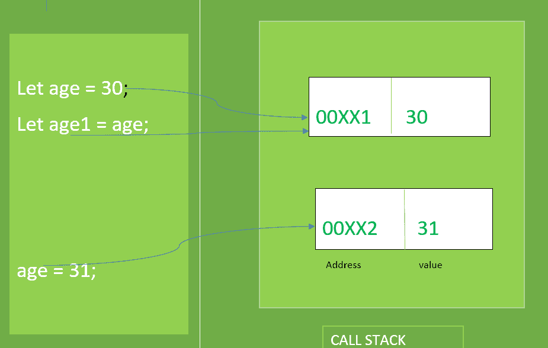
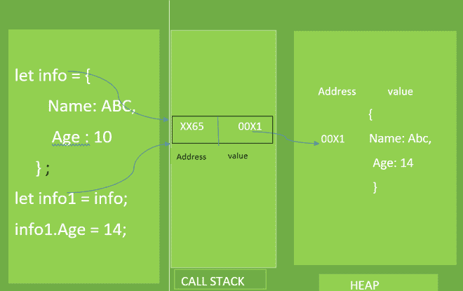

# JavaScript 中的原语和参考值

> Original: [https://www.geeksforgeeks.org/primitive-and-reference-value-in-javascript/](https://www.geeksforgeeks.org/primitive-and-reference-value-in-javascript/)

在 JavaScript 中，一个变量可以存储两种类型值，原始值或引用值。 本文将描述并帮助比较这两种类型的值。

**原始值：**JavaScript 提供了数字、字符串、布尔值、未定义、符号、BigInt 六种类型的原始值。 原始值的大小是固定的，因此 JavaScript 将原始值存储在**调用堆栈(执行上下文)中。**

当我们访问原始值时，我们操作存储在该变量中的实际值。 因此，原始变量通过值访问**。** 当我们将一个存储原始值的变量赋给另一个变量时，将创建存储在该变量中的值并将其复制到新变量中。

让我们举个例子来理解原始值：



原始值

## JavaScript

```
let age = 30;
let age1 = age; // Pointing to age

console.log(`age = ${age}  age1 = ${age1}`);

age = 31; // Pointing to new address

console.log(`age = ${age}  age1 = ${age1}`);
```

发帖主题：Re：Колибри0.7.0

```
 age = 30  age1 = 30
 age = 31  age1 = 30
```

**参考值：**JavaScript 提供了 Array、Object、Function 三种类型的参考值。 参考值的大小是动态的，因此它存储在**堆**上。

当我们访问引用值时，我们通过引用来操作它，而不是通过它存储的实际值。 因此，通过引用来访问作为参考值的变量**。 当我们将引用值从一个变量赋给另一个变量时，变量中存储的值也会复制到新变量的位置，但不同之处在于，现在两个变量中存储的值都是堆中存储的实际对象的地址。 因此，这两个变量都引用同一对象，因此我们可以从这两个变量操作原始对象。**

让我们举一个例子来理解一下参考价值：



参考值

## JavaScript

```
let info = {
    Name :"Abc",
    Age :10
}
console.log(`Name : ${info.Name} Age : ${info.Age}`);

let info1 = info;
info1.Age = 14; // Change the Age of original object
console.log(`Name : ${info.Name} Age : ${info.Age}`);
```

**输出：**

```
Name : Abc Age : 10
Name : Abc Age : 14
```