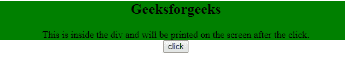
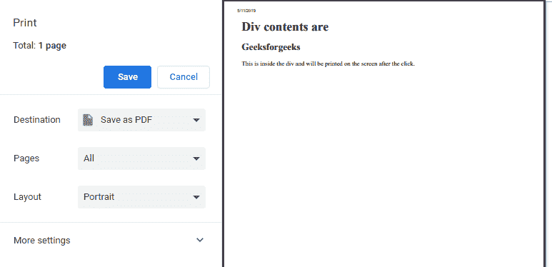
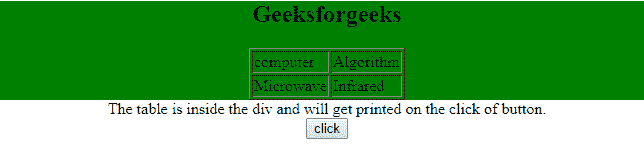
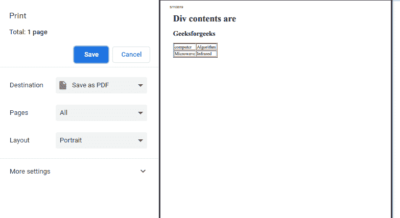

# 使用 JavaScript

打印 div 元素的内容

> Original: [https://www.geeksforgeeks.org/print-the-contents-of-a-div-element-using-javascript/](https://www.geeksforgeeks.org/print-the-contents-of-a-div-element-using-javascript/)

要在 JavaScript 中打印 div 的内容，首先将 div 的内容存储在一个 JavaScript 变量中，然后单击 Print 按钮。 要提取的 HTML div 元素的内容。 然后创建一个 JavaScript 弹出窗口，并将提取的 HTML div 元素内容写入该弹出窗口，最后使用 JavaScript Window Print 命令打印该窗口。

**示例 1：**本例使用 JavaScript Window Print 命令打印 div 元素的内容。

```
<!DOCTYPE html>
<html>

<head>
    <title>
        Print the content of a div
    </title>

    <!-- Script to print the content of a div -->
    <script>
        function printDiv() {
            var divContents = document.getElementById("GFG").innerHTML;
            var a = window.open('', '', 'height=500, width=500');
            a.document.write('<html>');
            a.document.write('<body > <h1>Div contents are <br>');
            a.document.write(divContents);
            a.document.write('</body></html>');
            a.document.close();
            a.print();
        }
    </script>
</head>

<body style="text-align:center;">

    <div id="GFG" style="background-color: green;">

        <h2>Geeksforgeeks</h2>

        <p>
            This is inside the div and will be printed
            on the screen after the click.
        </p>
    </div>

    <input type="button" value="click" onclick="printDiv()"> 
</body>

</html>                    
```

发帖主题：Re：Колибри0.7.0

*   **点击按钮前：**
    
*   **点击按钮后：**
    

**示例 2：**本例使用 JavaScript Window Print 命令打印 div 元素的内容。

```
<!DOCTYPE html>
<html>

<head>
    <title>
        Print the content of a div
    </title>

    <!-- Script to print the content of a div -->
    <script>
        function printDiv() {
            var divContents = document.getElementById("GFG").innerHTML;
            var a = window.open('', '', 'height=500, width=500');
            a.document.write('<html>');
            a.document.write('<body > <h1>Div contents are <br>');
            a.document.write(divContents);
            a.document.write('</body></html>');
            a.document.close();
            a.print();
        }
    </script>
</head>

<body>
    <center>
        <div id="GFG" style="background-color: green;">

            <h2>Geeksforgeeks</h2>

            <table border="1px">
                <tr>
                    <td>computer</td>
                    <td>Algorithm</td>
                </tr>
                <tr>
                    <td>Microwave</td>
                    <td>Infrared</td>
                </tr>
            </table>
        </div>

        <p>
            The table is inside the div and will get
            printed on the click of button.
        </p>

        <input type="button" value="click"
                    onclick="printDiv()"> 
    </center> 
</body>

</html>                                    
```

发帖主题：Re：Колибри0.7.0

*   **点击按钮前：**
    
*   **点击按钮后：**
    

JavaScript 最为人所知的是网页开发，但它也用于各种非浏览器环境中。 您可以按照[JavaScript 教程](https://www.geeksforgeeks.org/javascript-tutorial/)和[JavaScript 示例](https://www.geeksforgeeks.org/javascript-examples/)从头开始学习 JavaScript。