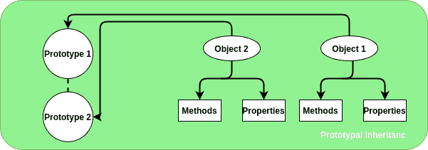

# JavaScript 中使用 __proto__ 的原型继承

> Original: [https://www.geeksforgeeks.org/prototypal-inheritance-using-__proto__-in-javascript/](https://www.geeksforgeeks.org/prototypal-inheritance-using-__proto__-in-javascript/)

每个对象及其方法和属性都包含一个称为**[[Prototype]]**的内部隐藏属性。 原型继承是 javascript 中用于在对象中添加方法和属性的功能。 它是一个对象可以继承另一个对象的属性和方法的方法。 传统上，为了获取和设置对象的[[Prototype]]，我们使用 Object.getPrototypeOf 和 Object.setPrototypeOf。 现在，在现代语言中，它是使用**__proto__**设置的。



**语法：**

```
ChildObject.__proto__ = ParentObject
```

**示例**在给定的示例中，有两个对象‘Person’和‘GFGuser’。 对象‘GFGuser’继承对象‘Person’的方法和属性，并进一步使用它们。

```
<!DOCTYPE html>
<html lang="en">
    <head>
        <meta charset="UTF-8" />
        <title>prototype</title>
    </head>
    <body>
        <script>
            // object person
            let person = {
                talk: true,
                Canfly() {
                    return "Sorry, Can't fly";
                },
            };
            // Object GFGuser
            let GFGuser = {
                CanCode: true,
                CanCook() {
                    return "Can't say";
                },

              //  Inheriting the properties and methods of person
                __proto__: person, 
            };

            // Printing on console
            // Property of person
            console.log("Can a GFG User talk: " + GFGuser.talk); 

            // Method of person
            console.log("Can a GFG User fly: " + GFGuser.Canfly()); 

            // Property of GFGuser
            console.log("Can a GFG User code: " + GFGuser.CanCode); 

            // Method of GFGuser
            console.log("Can a GFG User cook: " + GFGuser.CanCook()); 
        </script>
    </body>
</html>
```

帖子主题：Re：Колибрипрограммированияпрограмма