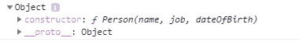
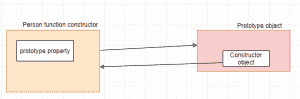
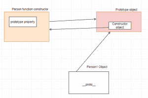
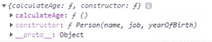
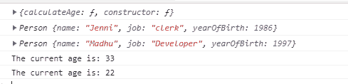

# JavaScript 中的原型

> Original: [https://www.geeksforgeeks.org/prototype-in-javascript/](https://www.geeksforgeeks.org/prototype-in-javascript/)

JavaScript 是一种基于原型的语言，因此，每当我们使用 JavaScript 创建函数时，JavaScript 引擎都会在函数内添加*Prototype*属性，**Prototype 属性**基本上是一个对象(也称为 Prototype 对象)，我们可以在 Prototype 对象中附加方法和属性，这使得所有其他对象都可以继承这些方法和属性。

**考虑以下示例：-**

创建对象有不同的方法，其中一种方法是使用函数构造函数创建对象。

```
<script>
// function constructor
function Person(name, job, yearOfBirth){   
    this.name= name;
    this.job= job;
    this.yearOfBirth= yearOfBirth;
}
// this will show Person's prototype property.
console.log(Person.prototype);
</script> 
```

**输出：-**



在上图中，您可以看到 Person 具有 Prototype 属性，且 Prototype 属性具有再次指向 Person 构造函数构造函数的构造函数。

#### **我们可以通过一张图片来理解这一点：**



当我们使用上面的函数构造函数创建对象时，JavaScript 引擎将在指向原型的构造函数对象的对象中添加 Dunderproto 或 __proto__。



现在，我们将向 Person 函数构造函数中的 Prototype 属性添加一个方法 culateAge()，该构造函数将由不同的对象继承。 以下是此操作的代码：-

```
<script>
// function constructor
function Person(name, job, yearOfBirth){   
    this.name= name;
    this.job= job;
    this.yearOfBirth= yearOfBirth;
}
Person.prototype.calculateAge= function(){
    console.log('The current age is: '+(2019- this.yearOfBirth));
}
console.log(Person.prototype);
</script>
```

**输出：-**



在上图中，我们可以看到**culateAge()方法**被添加到 Prototype 属性。 现在，我们将创建两个不同的对象，它们将继承**culateAge()方法**，并记住，**当某个方法(或属性)被调用时，它首先检查对象内部，但当它找不到时，然后搜索对象的原型。**

```
<script>

 // function constructor
function Person(name, job, yearOfBirth){  
    this.name= name;
    this.job= job;
    this.yearOfBirth= yearOfBirth;
}
// adding calculateAge() method to the Prototype property
Person.prototype.calculateAge= function(){ 
    console.log('The current age is: '+(2019- this.yearOfBirth));
}
console.log(Person.prototype);

// creating Object Person1
let Person1= new Person('Jenni', 'clerk', 1986); 
console.log(Person1)
let Person2= new Person('Madhu', 'Developer', 1997);
console.log(Person2)

Person1.calculateAge();
Person2.calculateAge();

</script>
```

**输出：-**


这里，我们使用构造函数 Person 创建了 Person1 和 Person2 两个对象，当我们调用 Person1.culateAge()和 Person2.culateAge()时，它首先会检查 Person 1 和 Person2 对象中是否存在它，如果不存在，它将移动 Person 的 Prototype 对象并打印当前年龄，**，它显示 Prototype 属性使其他对象能够继承函数构造函数的所有属性和方法。**