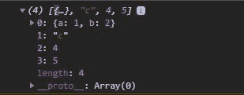

# Ramda.js R.Without()函数

> Original: [https://www.geeksforgeeks.org/ramda-js-r-without-function/](https://www.geeksforgeeks.org/ramda-js-r-without-function/)

**Ramda.js**是 JavaScript 中的一个库，用于处理数组、字符串、对象等，但是是以函数的方式。 Ramda 中的**Without()**函数用于返回删除了特定值集的数组。 它在 javascript 中作为过滤器工作。

**语法：**

```
R.without(elementArray, array)
```

**参数：**此函数接受上述两个参数，如下所述：

*   **elementArray：**它是要从原始数组中移除的元素数组。
*   **数组：**它是要作为第二个参数给出的原始数组。

**注：**这两个参数都必须给出。

**返回值：**该函数的返回类型为数组。

下面的示例说明了 Ramda.js 中的 R.less()函数。

**示例 1：**

## 超文本标记语言

```
<!DOCTYPE html>
<html lang="en">

<head>
    <meta charset="UTF-8">
    <meta name="viewport" content=
        "width=device-width, initial-scale=1.0">
    <title>NodeJS Ramda.replace() method</title>
</head>

<body>
    <!-- By linking this script "R" is attached
        as the global variable in the browser-->
    <script src=
"//cdnjs.cloudflare.com/ajax/libs/ramda/0.25.0/ramda.min.js">
    </script>

    <script>
        let elementArray = ["a", "b"];
        let array = ["a", "a", "b", "c", "d"]

         // Applying R.without function
        const newArray = R.without(elementArray, array);
        console.log(newArray)
    </script>
</body>

</html>
```

发帖主题：Re：Колибри0.7.0


**示例 2：**当给定对象数组并且数组由对象数组过滤时。

## JavaScript

```
<!DOCTYPE html>
<html lang="en">

<head>
    <meta charset="UTF-8">
    <meta name="viewport" content=
        "width=device-width, initial-scale=1.0">
    <title>NodeJS Ramda.replace() function</title>
</head>

<body>
    <!-- By linking this script "R" is attached 
        as the global variable in the browser-->
    <script src=
"//cdnjs.cloudflare.com/ajax/libs/ramda/0.25.0/ramda.min.js">
    </script>

    <script>
        let elementArray = [{ "a": 1 }, "b"];

        // Array of objects
        let array = [{ "a": 1, "b": 2 }, 
                { "a": 1 }, "c", 4, 5]

        // Filtering array
        const newArray = 
            R.without(elementArray, array);
        console.log(newArray)
    </script>
</body>

</html>
```

发帖主题：Re：Колибри0.7.0



**注意：**请通过 CDN 导入这些附加文件：

> “