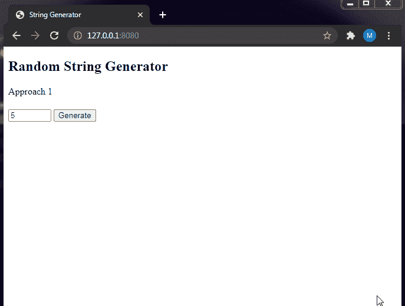

# 使用 JavaScript 的随机字符串生成器

> 原文:[https://www . geesforgeks . org/random-string-generator-use-JavaScript/](https://www.geeksforgeeks.org/random-string-generator-using-javascript/)

**JavaScript** 是一种轻量级、跨平台、可解释的脚本语言。它以开发网页而闻名，许多非浏览器环境也使用它。JavaScript 可用于 [**客户端**](https://www.geeksforgeeks.org/server-side-client-side-programming/) 开发以及 [**服务器端**](https://www.geeksforgeeks.org/server-side-client-side-programming/) 开发。

在本文中，我们需要使用 Javascript 创建一个随机字符串生成器，它将生成一组随机字符串&当用户单击按钮时显示出来。此外，我们还可以从用户那里获取字符串长度的输入。在客户端，一旦使用文档对象模型(DOM)概念生成了这些字符串，它就会呈现出来。

**方法:**对于在 Javascript 中生成随机字符串，我们可以使用内置方法，这些方法将实际生成字符串，并可以相应地操作文档对象模型(dom)。我们将使用数学库访问随机()函数，该函数将帮助生成随机索引和长度为字符串 ie 的倍数。，它将在传递字符串或字符集时追加字符。

我们可以用两种方法生成随机字符串。，我们可以迭代循环指定长度的字符集，也可以使用 **String.fromCharCode()** 方法将 UTF-16 代码转换为它们的等效字符并返回字符串。通过使用第二种方法，我们可以从用户手动获取字符串长度的输入，然后通过访问 DOM 元素生成该特定长度的字符串。对于这两种方法，我们都将使用 Math.random()函数。

**生成随机字符串:**这里我们只生成小写字母字符的字符串。让我们从讨论生成字符串的两种不同方法开始。

**方法 1:** 从指定长度的字符集生成随机字符串:

*   声明将用于生成字符串的字符集。
*   从输入中获取该字符集的长度。
*   构建用于随机字符生成的迭代循环。
*   在 javascript 中使用数学函数&将它们赋给变量。

我们将利用上述概念&使用 Javascript 和 DOM 操作随机生成用户定义长度的字符串。

**定义字符集:**我们定义了一个变量**“字符”**，它将包含我们需要的所有字符。我们将使用另一个变量**“结果”**，它被初始化为一个空字符串。
**访问字符串的长度:**之后，我们将使用 **document.getElementById** 方法获取我们需要生成的字符串的长度，以访问包含该长度的 HTML 元素或用户输入字段。

```html
length = document.getElementById("strlength").value;
```

因此，我们使用了在 HTML <输入>标签中声明的**“str length”**id。我们可以使用**获得元素的值。值“**属性，然后将其分配给一个**“长度”**变量。因此，我们现在已经获得了生成所需的字符串长度。

**生成随机字符:**我们将使用 for 循环来生成 n(长度)个字符，并将这些字符追加到字符串中。当索引值从 0 开始时，循环将从 0 运行到 length -1。

```html
for ( let i = 0; i < length; i++ ) {
        // Code
}
```

现在，我们将使用 **Math.random()** 函数来生成字符串中的随机索引。在此之前，我们需要获取“字符”字符串的长度，并将其存储在常量变量**“字符长度”中。**这将为我们提供长度为 26 的**“字符长度**”字符串。现在，使用 **charAt()** 函数返回字符串&中指定索引处的字符，我们可以得到随机数。

**Math.random()** 函数将给出 0 & 1 ie 之间的值。，十进制值&我们需要将其四舍五入得到一个整数值。因此，我们使用**数学地板**来舍入十进制值。我们将把**数学.随机()**函数乘以变量**字符长度，**得到精确的整数值。因此，这将为我们提供一个介于 0 和**字符长度** -1 之间的整数。

```html
Math.floor(Math.random() * charactersLength)
```

上面的语法给出了介于 0 和**字符长度** -1 之间的整数，因为 Javascript 中的字符串是基于 0 的索引。

因此，通过使用 **characters.charAt()** 方法，我们可以获得该特定索引处的字符。我们最终将其添加到空字符串“result”中，在循环结束时，我们得到一个包含随机字符的字符串。

**示例:**本示例描述了指定长度字符的随机数生成。

## 超文本标记语言

```html
<!DOCTYPE html>
<html lang="en">

<head>
    <meta charset="UTF-8">
    <title>String Generator</title>
</head>

<body>
    <h2>Random String Generator</h2>
    <h4 id="target"></h4>
    <input id="strlength" type="number" value="5" min="1" max="100" />
    <button id="gen" onClick="generate()">Generate</button>

    <script>
    function generate() {
        let length = document.getElementById("strlength").value;
        const characters = 'abcdefghijklmnopqrstuvwxyz';
        let result = ' ';
        const charactersLength = characters.length;
        for(let i = 0; i < length; i++) {
            result += 
            characters.charAt(Math.floor(Math.random() * charactersLength));
        }
        document.getElementById("target").innerHTML = result
    }
    </script>
</body>

</html>
```

**输出:**



**方法 2:** 使用 String.fromCharCode()函数生成随机字符串:

*   获取要从输入中生成的字符串的长度。
*   为随机字符生成构建迭代循环。
*   使用字符串和数学函数生成字符。

我们可以使用像 **String.fromCharCode()** 这样的内置函数来生成一个随机字符。声明字符集&访问其长度的步骤将类似于第一种方法 ie。，我们将创建长度变量来获取用户输入的长度。之后，我们创建一个空字符串“结果”来存储生成的字符串。然后，我们运行 for 循环来迭代字符串的长度。

```html
for ( let i = 0; i < length; i++ ) {
       // Code
}
```

现在，我们使用函数 [String.fromCharCode](https://www.geeksforgeeks.org/javascript-string-fromcharcode-method/) 使用 for 循环逐个生成字符。String.fromCharCode 采用整数或 UTF-16 代码单位，并给出等效的字符串。这里，我们使用整数 97，即小写字母的起点。您可以参考 UTF-16 表来获取小写字母的值。因此，在 UTF-16 中，得到小写字母“a”是 97，我们可以在数字上加上 26，得到最后一个字母“z”是 122。所以，我们只需要生成 26 个随机数，并将其加到 97。

我们可以使用 **Math.random()** 函数返回一个介于 0 和 1 之间的值，为了得到整数值，我们需要 floor()函数来得到精确的整数值&因此，我们使用 **Math.floor()** 。但这只会让我们得到 0，每次我们需要将数字**数学.随机()**乘以 26 才能得到想要的结果。

```html
97 + Math.floor(Math.random() * 26)
```

这将给出介于 97 和 122 之间的值，即“a”到“z”。因此，通过将它们包含在函数 String.fromCharCode()中来获得实际的字符串。

**显示生成的字符串:**我们已经使用 innerHTML 属性显示了字符串，并使用其 id 值访问了 HTML 元素。因此，使用“document.getElementById”方法从 HTML 代码中获取 Id 为“target”的元素 h4，然后使用访问 HTML 值。innerHTML”。我们将该值赋给随机生成的字符串“result”。这将在 HTML 模板中显示字符串。

```html
document.getElementById("target").innerHTML = result;
```

**示例:**本示例描述了使用 String.fromCharCode()函数生成随机数的过程。

## 超文本标记语言

```html
<!DOCTYPE html>
<html lang="en">

<head>
    <meta charset="UTF-8">
    <title>String Generator</title>
</head>

<body>
    <h2>Random String Generator</h2>
    <h4 id="target"></h4>
    <input id="strlength" type="number" value="5" min="1" max="100" />
    <button id="gen" onClick="generate()">Generate</button>

    <script>
    function generate() {
        let length = document.getElementById("strlength").value;
        let result = ' ';
        for(let i = 0; i < length; i++) {
            result += 
            String.fromCharCode(97 + Math.floor(Math.random() * 26));
        }
        document.getElementById("target").innerHTML = result
    }
    </script>
</body>

</html>
```

**输出:**

