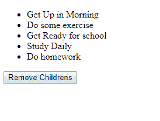
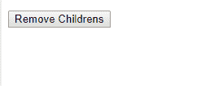

# 移除 JavaScript 中 DOM 节点的所有子元素

> 原文:[https://www . geesforgeks . org/remove-所有子元素-DOM-in-node-in-JavaScript/](https://www.geeksforgeeks.org/remove-all-the-child-elements-of-a-dom-node-in-javascript/)

子节点可以通过 **removeChild()** 从父节点中移除，节点本身可以通过 **remove()** 移除。
移除一个节点的所有子节点的另一个方法是设置它的 **innerHTML=""** 属性，它是一个产生相同输出的空字符串。不建议使用这种方法。

**示例-1:** 使用**“remove child()”**。

```
<!DOCTYPE html>
<html lang="en">

<head>
    <meta charset="UTF-8">
    <meta name="viewport"
          content="width=device-width, 
                   initial-scale=1.0">
    <meta http-equiv="X-UA-Compatible" 
          content="ie=edge">

    <title>Document</title>
</head>

<body>
    <ul>
        <li>Get Up in Morning</li>
        <li>Do some exercise</li>
        <li>Get Ready for school</li>
        <li>Study Daily</li>
        <li>Do homework</li>
    </ul>
    <input id="btn"
           type="button" 
           value="Remove Childrens">
</body>
<script>
    function deleteChild() {
        var e = document.querySelector("ul");

        //e.firstElementChild can be used.
        var child = e.lastElementChild; 
        while (child) {
            e.removeChild(child);
            child = e.lastElementChild;
        }
    }
    var btn = document.getElementById(
    "btn").onclick = function() {
        deleteChild();
    }
</script>

</html>
```

**输出:**
**点击按钮前:**

**点击按钮后:**


**示例-2:** 使用**innerHTML =“**属性。

```
<!DOCTYPE html>
<html lang="en">

<head>
    <meta charset="UTF-8">
    <meta name="viewport" 
          content="width=device-width, 
                   initial-scale=1.0">
    <meta http-equiv="X-UA-Compatible" 
          content="ie=edge">
    <title>
      Document
  </title>
</head>

<body>
    <ul>
        <li>Get Up in Morning</li>
        <li>Do some exercise</li>
        <li>Get Ready for school</li>
        <li>Study Daily</li>
        <li>Do homework</li>
    </ul>
    <input id="btn" 
           type="button"
           value="Remove Childrens">
</body>
<script>
    function deleteChild() {
        var e = document.querySelector("ul");
        e.innerHTML = "";
    }
    var btn = document.getElementById(
      "btn").onclick = function() {
        deleteChild();
    }
</script>

</html>
```

**输出:**
**点击按钮前:**

**点击按钮后:**


**示例-3** 使用**“remove child()”**。

```
<!DOCTYPE html>
<html lang="en">

<head>
    <meta charset="UTF-8">
    <meta name="viewport" 
          content="width=device-width, 
                   initial-scale=1.0">
    <meta http-equiv="X-UA-Compatible" 
          content="ie=edge">
    <title>Document</title>
</head>

<body>
    <ul>
        <li>Get Up in Morning</li>
        <li>Do some exercise</li>
        <li>Get Ready for school</li>
        <li>Study Daily</li>
        <li>Do homework</li>
    </ul>
    <input id="btn"
           type="button"
           value="Remove Childrens">
</body>
<script>
    function deleteChild() {
        var e = document.querySelector("ul");
        var first = e.firstElementChild;
        while (first) {
            first.remove();
            first = e.firstElementChild;
        }
    }
    var btn = document.getElementById(
      "btn").onclick = function() {
        deleteChild();
    }
</script>

</html>
```

**输出:**
**点击按钮前:**

**点击按钮后:**
