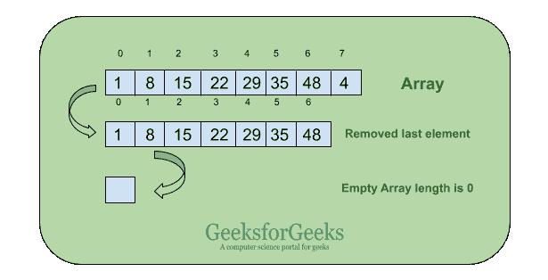

# 从 JavaScript 数组中移除元素

> 原文:[https://www . geesforgeks . org/remove-elements-from-a-JavaScript-array/](https://www.geeksforgeeks.org/remove-elements-from-a-javascript-array/)



[JavaScript 数组](https://www.geeksforgeeks.org/arrays-in-javascript/)是用于存储元素或一组值的单个变量。您可以在数组的任何位置添加或移除元素。在本文中，我们将讨论从数组中移除元素的不同方法。从 JavaScript 数组中移除元素的方法有很多，下面讨论:

*   [**pop()函数**](https://www.geeksforgeeks.org/javascript-array-prototype-pop/) **:这个方法是用来从一个数组的末尾移除元素的。**
*   [**shift()函数:**](https://www.geeksforgeeks.org/javascript-array-prototype-shift/) 这个方法是用来从一个数组的开始处移除元素的。
*   [**【拼接】()功能:**](https://www.geeksforgeeks.org/javascript-array-splice-method/) 此方法用于从数组的特定索引中移除元素。
*   [**filter()函数:**](https://www.geeksforgeeks.org/javascript-array-filter/) 此方法用于以编程方式移除元素。

**注意:**还有一些其他的方法是由 JavaScript 内置方法创建的。
以下示例说明了从 JavaScript 数组中移除元素的方法:
**使用 pop()方法移除数组元素:**该方法用于移除数组的最后一个元素并返回移除的元素。该函数将数组的长度减少 1。

**例 1:**

## java 描述语言

```
<script>
// JavaScript code to illustrate pop() function
// to remove array elements

function func() {
    var arr = ["shift", "splice", "filter", "pop"];

    // Popping the last element from the array
    var popped = arr.pop();
    document.write("Removed element: " + popped + "<br>");
    document.write("Remaining elements: " + arr);
}
func();
</script>
```

**输出:**

```
Removed element: pop
Remaining elements: shift, splice, filter

```

**例 2:**

## java 描述语言

```
<script>
// Declare and initialize an array
var array = ["pop", "splice", "filter", "shift"]

document.write("Original array: " + array + "<br>")

// Loop run while array length not zero
while (array.length) {

    // Remove elements from array
    array.pop();
}
document.write("Array Length: " + array.length )

</script>
```

**输出:**

```
Original array: pop, splice, filter, shift
Array Length: 0
```

**使用 shift()方法移除数组元素:**此方法用于移除数组的第一个元素，并将原始数组的大小减少 1。

**示例:**

## java 描述语言

```
<script>
// JavaScript code to illustrate shift() method
// to remove elements from array
function func() {
    var arr = ["shift", "splice", "filter", "pop"];

    // Removing the first element from array
    var shifted = arr.shift();
    document.write("Removed element: " + shifted + "<br>");
    document.write("Remaining elements: " + arr);
}
func();
</script>                   
```

**输出:**

```
Removed element: shift
Remaining elements: splice, filter, pop
```

**使用 splice()方法移除数组元素:**此方法用于通过移除现有元素和/或添加新元素来修改数组的内容。要通过 splice()方法移除元素，可以用不同的方式指定元素。

**示例 1:** 使用拼接的索引方法从 JavaScript 数组中移除元素。

## java 描述语言

```
<script>
// JavaScript code to illustrate splice() function

function func() {
    var arr = ["shift", "splice", "filter", "pop"];

    // Removing the specified element from the array
    var spliced = arr.splice(1, 1);
    document.write("Removed element: " + spliced + "<br>");
    document.write("Remaining elements: " + arr);
}
func();
</script>                   
```

**输出:**

```
Removed element: splice
Remaining elements: shift, filter, pop
```

**示例 2:** 使用拼接方法的值从 JavaScript 数组中移除元素。

## java 描述语言

```
<script>

// JavaScript code to illustrate splice() function
function func() {
    var arr = ["shift", "splice", "filter", "pop"];

    // Removing the specified element by value from the array
    for (var i = 0; i < arr.length; i++) {
        if (arr[i] === "splice") {
            var spliced = arr.splice(i, 1);
            document.write("Removed element: " + spliced + "<br>");
            document.write("Remaining elements: " + arr);
        }
    }
}
func();
</script>               
```

**输出:**

```
Removed element: splice
Remaining elements: shift, filter, pop
```

**示例 3:** 使用拼接方法从 JavaScript 数组中移除每个元素。

## java 描述语言

```
<script>
// Declare and initialize array
var array = ["pop", "splice", "filter", "shift"]

document.write("Original array: " + array + "<br>")

// Making the length of array to 0 by using splice method
array.splice(0, array.length);
document.write("Empty array: " + array )
</script>
```

**输出:**

```
Original array: pop, splice, filter, shift
Empty array:
```

**使用 filter()方法移除数组元素:**此方法用于从给定数组创建新数组，该数组仅由给定数组中满足自变量函数设置的条件的元素组成。要通过 filter()方法移除元素，可以用不同的方式指定元素。

**示例:**使用 filter 方法的值从 JavaScript 数组中移除元素。

## java 描述语言

```
<script>

// JavaScript to illustrate filter() method
function isPositive( value ) {
    return value > 0;
}

function func() {
    var filtered = [101, 98, 12, -1, 848].filter( isPositive );
    document.write("Positive elements in array: " + filtered);
}
func();
</script>
```

**输出:**

```
Positive elements in array: 101, 98, 12, 848

```

**使用移除方法移除数组元素:**使用过滤器方法创建移除方法，以从 JavaScript 数组中移除元素。这些方法的工作顺序相反。

**示例:**

## java 描述语言

```
<script>

// Declare and initialize an array
var array = ["lowdash", "remove", "delete", "reset"]

// Using filter method to create a remove method
function arrayRemove(arr, value) {

   return arr.filter(function(geeks){
       return geeks != value;
   });

}

var result = arrayRemove(array, "delete");
document.write("Remaining elements: " + result)
</script>
```

**输出:**

```
Remaining elements: lowdash, remove, reset
```

**通过删除操作符删除数组元素:**使用删除操作符从 JavaScript 数组中删除元素。

**示例:**

## java 描述语言

```
<script>

// Declare and initialize an array
var array = ["lowdash", "remove", "delete", "reset"]

// Delete element at index 2
var deleted = delete array[2];

document.write("Removed: " + deleted + "<br>");
document.write("Remaining elements: " + array);
</script>        
```

**输出:**

```
Removed: true
Remaining elements: lowdash, remove,,reset

```

**通过清除和重置运算符移除数组元素:**使用清除和重置运算符从 JavaScript 数组中移除元素。

**例 1:**

## java 描述语言

```
<script>

// Declare and initialize an array
var array = ["lowdash", "remove", "delete", "reset"]

// Sorting array in another array
var arraygeeks = array

// Delete each element of array
array = []
document.write("Empty array: " + array + "<br>")
document.write("Original array: " + arraygeeks)

</script>               
```

**输出:**

```
Empty array:
Original array: lowdash, remove, delete, reset

```

**例 2:**

## java 描述语言

```
<script>

// Declare and initialize an array
var array = ["lowdash", "remove", "delete", "reset"]

document.write("Original array: " + array + "<br>")

// Making the array length to 0
array.length = 0;
document.write("Empty array: " + array )

</script>                               
```

**输出:**

```
Original array: lowdash, remove, delete, reset
Empty array:
```

**通过 lowdash 库移除数组元素:**使用 lowdash 库从 JavaScript 数组中移除元素。要使用 lowdash 库，您需要在系统上本地安装它。

**示例:**

## 超文本标记语言

```
<script type="text/javascript" src=
"//cdnjs.cloudflare.com/ajax/libs/lodash.js/0.10.0/lodash.min.js">

// Declare and initialize an array
var array = [101, 98, 12, -1, 848];
var evens= _.remove(array, function(n) {
    return n % 2 == 0;
});

console.log("odd elements: " + array + "<br>");
console.log("even elements: " + evens);

</script>                   
```

**输出:**

```
odd elements: 101, -1
even elements: 98, 12, 848
```