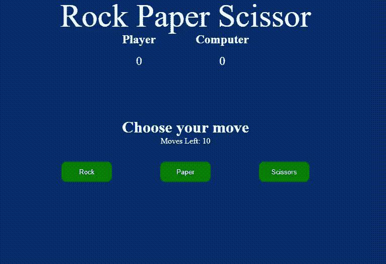

# 使用 Javascript 的石头、纸张和剪刀游戏

> 原文:[https://www . geesforgeks . org/rock-paper-and-剪刀-game-use-JavaScript/](https://www.geeksforgeeks.org/rock-paper-and-scissor-game-using-javascript/)

**简介:**

石头、纸和剪刀游戏是一个简单有趣的游戏，玩家必须制作石头、纸或剪刀。它只有两种可能的结果，一个是平局，或者一个玩家赢了，另一个玩家输了。我们将使用 JavaScript 设计游戏，玩家将对着电脑玩。总共会有 10 个动作。玩家必须在石头、纸和剪刀中选择一种。电脑端会产生一个随机选项，每次获胜的一方会得到一分。10 次移动结束后，最终结果将显示在屏幕上，并带有重启游戏的按钮。游戏将完全响应，因此它可以在每个设备上播放。

**HTML 布局:**

HTML 给出了游戏的基本结构。***styles . CSS*****文件链接在头部标签中，该标签将用于设置 HTML 的样式。**

**代码中使用的元素描述如下:**

*   **带有课程标题的 div 用于在屏幕上显示标题。**
*   **一个有等级分数的 div 包含两个以上的 div，显示玩家和电脑的分数。**
*   **带类移动的 Div 只显示一个文本，带类移动的 div 会显示游戏结束前剩下的移动次数。**
*   **带有类选项的 div 包含三个按钮岩石、纸张和剪刀，用户可以使用它们来提供输入。**
*   **带有类结果的 div 将显示每次移动的结果和 10 次移动后的最终结果，带有类重新加载的按钮将允许重新加载游戏。**

## **index.html**

```
<!-- index.html -->

<!DOCTYPE html>
<html lang="en">
<head>
    <meta charset="UTF-8">
    <meta name="viewport" 
          content="width=device-width, 
                   initial-scale=1.0">
    <link rel="stylesheet" href="styles.css">
    <title>Rock Paper Scissor</title>
</head>
<body>
    <section class="game">
        <!--Title -->
        <div class="title">Rock Paper Scissor</div>

          <!--Display Score of player and computer -->
        <div class="score">  
            <div class="playerScore">
                <h2>Player</h2>
                <p class="p-count count">0</p>
            </div>       
            <div class="computerScore">
                <h2>Computer</h2>
                <p class="c-count count">0</p>
            </div>
        </div>

        <div class="move">Choose your move</div>

          <!--Number of moves left before game ends -->
        <div class="movesleft">Moves Left: 10 </div>

          <!--Options available to player to play game -->
        <div class="options">
            <button class="rock">Rock</button>
            <button class="paper">Paper</button>
            <button class="scissor">Scissors</button>    
        </div>

          <!--Final result of game -->
        <div class="result"></div>

          <!--Reload the game -->
        <button class="reload"></button>

    </section>

    <script src="app.js"></script>
</body>
</html>
```

****CSS 样式:****

**这种样式用于游戏。你可以根据需要改变款式。**

## **styles.css**

```
/* styles.css */
/* universal selector - Applies to whole document */
*{
    padding: 0;
    margin: 0;
    box-sizing: border-box;
    background: #082c6c;
    color: #fff;
}
/* To center everything in game */
.game{
    display: flex;
    flex-direction: column;
    height: 100vh;
    width: 100vw;
    justify-content: center;
    align-items: center;
}

/* Title of the game */
.title{
    position: absolute;
    top: 0;
    font-size: 4rem;
    z-index: 2;
}

/* Score Board */
.score{
    display: flex;
    width: 30vw;
    justify-content: space-evenly;
    position: absolute;
    top: 70px;
    z-index: 1;
}

/* Score  */
.p-count,.c-count{
    text-align: center;
    font-size: 1.5rem;
    margin-top: 1rem;
}

/* displaying three buttons in one line */
.options{
    display: flex;
    width: 50vw;
    justify-content: space-evenly;
    margin-top: 2rem;
}

/* Styling on alll three buttons */
.rock, .paper, .scissor{
    padding: 0.8rem;
    width: 100px;
    border-radius: 10px;
    background: green;
    outline: none;
    border-color: green;
    border: none;
    cursor: pointer;
}

.move{
    font-size: 2rem;
    font-weight: bold;
}

/* Reload button style */
.reload {
    display: none;
    margin-top: 2rem;
    padding: 1rem;
    background: green;
    outline: none;
    border: none;
    border-radius: 10px;
    cursor: pointer;
}

.result{
    margin-top: 20px;
    font-size: 1.2rem;
}

/* Responsive Design */
@media screen and (max-width: 612px)
{  
    .title{
        text-align: center;
    }
    .score{
        position: absolute;
        top: 200px;
        width: 100vw;
    }
    .options{
        width: 100vw;
    }
```

****使用 JavaScript 的逻辑:****

**游戏的主要逻辑是用 JavaScript 创建的。我们将执行 DOM 操作，因此 JavaScript 的基本知识足以构建游戏。**

**遵循步骤**

*   **创建一个包含游戏所有逻辑的功能**游戏()**。**
*   **在函数内部声明三个变量 **playerScore** 、 **computerScore** ，招式将分别记录*玩家的得分、计算机的得分以及完成的招式*。**
*   **创建一个函数 **playGame()** 并且在函数内部使用 DOM 操作来获得我们在 HTML 中为玩家输入创建的所有三个按钮。创建一个包含所有三个按钮作为元素的数组播放选项。同样，为计算机选项创建一个数组。**
*   **在 playerOptions 上使用 **forEach()循环**，这样我们就可以用一段代码在所有按钮上添加一个事件监听器。在循环内，增量移动计数器 1，显示屏向左移动 10 减去移动。为电脑选项生成一个随机值，并将其与玩家的输入进行比较。**
*   **创建一个函数 **winner()** ，该函数将接收两个参数，一个是玩家的输入，另一个是计算机的选项。该函数将决定谁在玩家和计算机之间赢得分数。**
*   **创建一个函数 gameOver()，它将通过重载按钮显示最终结果。当移动等于 10 时，将调用该函数。**
*   **在游戏()函数内部调用 playGame()函数。**
*   **现在调用文件末尾的 game()函数。**

**下面是实现:**

## **app.js**

```
// app.js

// Complete logic of game inside this function
const game = () => {
    let playerScore = 0;
    let computerScore = 0;
    let moves = 0;

    // Function to 
    const playGame = () => {
        const rockBtn = document.querySelector('.rock');
        const paperBtn = document.querySelector('.paper');
        const scissorBtn = document.querySelector('.scissor');
        const playerOptions = [rockBtn,paperBtn,scissorBtn];
        const computerOptions = ['rock','paper','scissors']

        // Function to start playing game
        playerOptions.forEach(option => {
            option.addEventListener('click',function(){

                const movesLeft = document.querySelector('.movesleft');
                moves++;
                movesLeft.innerText = `Moves Left: ${10-moves}`;

                const choiceNumber = Math.floor(Math.random()*3);
                const computerChoice = computerOptions[choiceNumber];

                // Function to check who wins
                winner(this.innerText,computerChoice)

                // Calling gameOver function after 10 moves
                if(moves == 10){
                    gameOver(playerOptions,movesLeft);
                }
            })
        })

    }

    // Function to decide winner
    const winner = (player,computer) => {
        const result = document.querySelector('.result');
        const playerScoreBoard = document.querySelector('.p-count');
        const computerScoreBoard = document.querySelector('.c-count');
        player = player.toLowerCase();
        computer = computer.toLowerCase();
        if(player === computer){
            result.textContent = 'Tie'
        }
        else if(player == 'rock'){
            if(computer == 'paper'){
                result.textContent = 'Computer Won';
                computerScore++;
                computerScoreBoard.textContent = computerScore;

            }else{
                result.textContent = 'Player Won'
                playerScore++;
                playerScoreBoard.textContent = playerScore;
            }
        }
        else if(player == 'scissors'){
            if(computer == 'rock'){
                result.textContent = 'Computer Won';
                computerScore++;
                computerScoreBoard.textContent = computerScore;
            }else{
                result.textContent = 'Player Won';
                playerScore++;
                playerScoreBoard.textContent = playerScore;
            }
        }
        else if(player == 'paper'){
            if(computer == 'scissors'){
                result.textContent = 'Computer Won';
                computerScore++;
                computerScoreBoard.textContent = computerScore;
            }else{
                result.textContent = 'Player Won';
                playerScore++;
                playerScoreBoard.textContent = playerScore;
            }
        }
    }

    // Function to run when game is over
    const gameOver = (playerOptions,movesLeft) => {

        const chooseMove = document.querySelector('.move');
        const result = document.querySelector('.result');
        const reloadBtn = document.querySelector('.reload');

        playerOptions.forEach(option => {
            option.style.display = 'none';
        })

        chooseMove.innerText = 'Game Over!!'
        movesLeft.style.display = 'none';

        if(playerScore > computerScore){
            result.style.fontSize = '2rem';
            result.innerText = 'You Won The Game'
            result.style.color = '#308D46';
        }
        else if(playerScore < computerScore){
            result.style.fontSize = '2rem';
            result.innerText = 'You Lost The Game';
            result.style.color = 'red';
        }
        else{
            result.style.fontSize = '2rem';
            result.innerText = 'Tie';
            result.style.color = 'grey'
        }
        reloadBtn.innerText = 'Restart';
        reloadBtn.style.display = 'flex'
        reloadBtn.addEventListener('click',() => {
            window.location.reload();
        })
    }

    // Calling playGame function inside game
    playGame();

}

// Calling the game function
game();
```

****输出:****

****