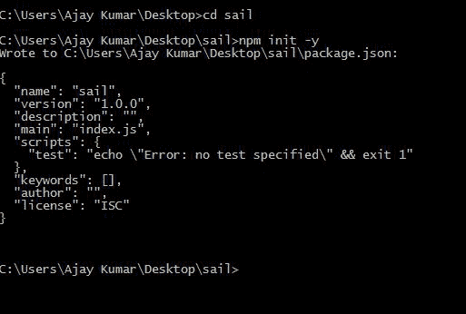
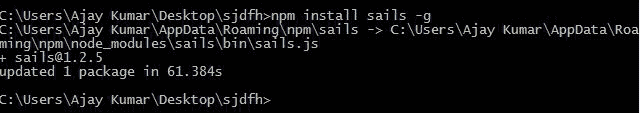
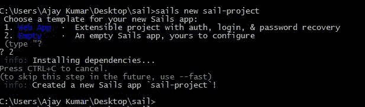
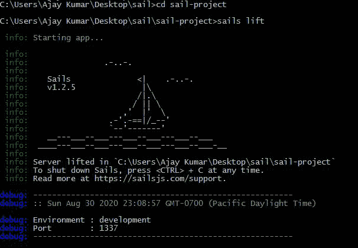
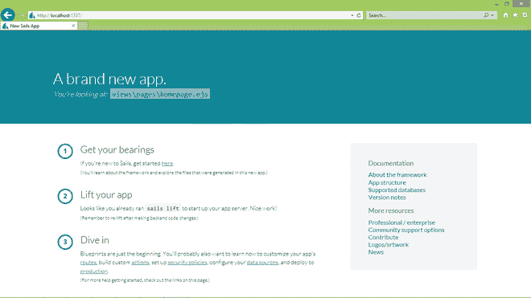

# 帆板基础和安装

> 原文:[https://www . geesforgeks . org/sails-js-basic-and-installation/](https://www.geeksforgeeks.org/sails-js-basics-and-installation/)

**Node.js:** Node.js 是一个开源的跨平台运行时环境，用于在浏览器外执行 JavaScript 代码。你需要记住 NodeJS 不是一个框架，也不是一种编程语言。大多数人都很困惑，明白这是一个框架或者一种编程语言。我们经常使用 Node.js 来构建后端服务，比如像 Web App 或者移动 App 这样的 API。

**Sails.js:** Sails.js 是建立在 Express.js 之上的 Node.js 框架，是 Node.js 的实时模型-视图-控制器(MVC)框架，Sails 与 Ruby on Rails 很像。它使开发人员能够快速组装 REST APIs、单页应用程序等等。Sails.js 是一个完美的 JavaScript 解决方案，支持多种前端技术和多个数据库并发运行。

**通过 **NPM** ( *节点包管理器* )** 创建基本的 *Sails.js* 应用程序

*   **步骤 1:** 制作一个空的项目文件夹。在命令提示符(**cmd**)/终端，运行 npm init 初始化 **package.json** 文件:

    ```
    >> npm init -y 
    // The -y can be added to gain default settings in package.json

    ```

    

    我们项目目录中的 npm init

*   **步骤 2:** 这通常需要大约 48 秒，具体取决于您的互联网连接。您可以选择安装 [nodemon](https://nodemon.io/) 进行热重装。安装帆

    ```
    >> npm install sails -g 
    // The -g installs the library globally

    ```

    

    安装帆

*   **第三步:**要生成新的应用，只需将目录( *cd* )更改为您想要的目录，然后键入:

    ```
    >> sails new sails-project

    ```

    我们将看到如下所示的选择项目模板的提示:

    

    新帆项目

*   **第 4 步:**键入 1(或按回车键)以默认的“*网络应用程序*模板开始，该模板包括*登录、密码恢复、电子邮件、*和*计费*等基本功能。或者，如果你想从一个空项目开始，选择 2 作为经典的帆板应用。

    一旦选择了模板，您需要等待一会儿来安装一些依赖项。然后，看看你的新帆应用:

    ```
    >> cd sails-project
    >> sails lift

    ```

    

    通过风帆启动服务器

*   在 [*本地主机:1337*](http://localhost:1337/) 端口的浏览器中，我们获得了如下渲染的全新主页:

    

    最终设置

**参考:**T2】https://sailsjs.com/get-started