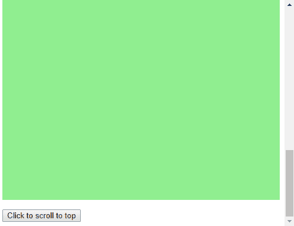

# 使用 JavaScript/jQuery 滚动到页面顶部

> 原文:[https://www . geeksforgeeks . org/使用-javascript-jquery 滚动到页面顶部/](https://www.geeksforgeeks.org/scroll-to-the-top-of-the-page-using-javascript-jquery/)

可滚动页面可以使用两种方法滚动到顶部:

**方法一:使用[window . scroll to()](https://www.geeksforgeeks.org/javascript-window-scrollto-method/)**
窗口界面的 **scrollTo()** 方法可以滚动到页面上的指定位置。它接受两个参数，即要滚动到的页面的 x 和 y 坐标。将两个参数都作为 0 传递会将页面滚动到最顶端和最左端。

**语法:**

```
window.scrollTo(x-coordinate, y-coordinate)
```

**示例:**

```
<!DOCTYPE html>
<html>

<head>
    <title>
      Scroll to the top of the
      page using JavaScript/jQuery?
  </title>
    <style>
        .scroll {
            height: 1000px;
            background-color: lightgreen;
        }
    </style>
</head>

<body>
    <h1 style="color: green">
      GeeksforGeeks
  </h1>
    <b>Scroll to the top of the page 
      using JavaScript/jQuery?</b>

    <p>Click on the button below to 
      scroll to the top of the page.</p>

    <p class="scroll">GeeksforGeeks is a
      computer science portal. This is a 
      large scrollable area.</p>

    <button onclick="scrollToTop()">
      Click to scroll to top
  </button>
    <script>
        function scrollToTop() {
            window.scrollTo(0, 0);
        }
    </script>
</body>

</html>
```

**输出:**

*   **点击按钮前:**
    
*   **点击按钮后:**
    

**方法二:在 jQuery** 中使用 scrollTo()

在 jQuery 中， **scrollTo()** 方法用于**设置**或**返回** *所选元素*的垂直滚动条位置。通过对 window 属性应用此方法，可以使用此行为滚动到页面顶部。将位置参数设置为 0 会将页面滚动到顶部。

**语法:**

```
$(window).scrollTop(position);
```

**示例:**

```
<!DOCTYPE html>
<html>

<head>
    <title>
      Scroll to the top of the
      page using JavaScript/jQuery?
  </title>
    <style>
        .scroll {
            height: 1000px;
            background-color: lightgreen;
        }
    </style>

</head>

<body>
    <h1 style="color: green">
      GeeksforGeeks
  </h1>
    <b>
      Scroll to the top of the page
      using JavaScript/jQuery?
  </b>
    <p>
      Click on the button below to 
      scroll to the top of the page.
  </p>
    <p class="scroll">
      GeeksforGeeks is a computer
      science portal. 
      This is a large scrollable area.
  </p>
    <button onclick="scrollToTop()">
      Click to scroll to top
  </button>
    <script src=
"https://code.jquery.com/jquery-3.3.1.min.js">
  </script>
    <script>
        function scrollToTop() {
            $(window).scrollTop(0);
        }
    </script>
</body>

</html>
```

**输出:**

*   **点击按钮前:**
    
*   **点击按钮后:**
    

JavaScript 最出名的是网页开发，但它也用于各种非浏览器环境。您可以通过以下 [JavaScript 教程](https://www.geeksforgeeks.org/javascript-tutorial/)和 [JavaScript 示例](https://www.geeksforgeeks.org/javascript-examples/)从头开始学习 JavaScript。

jQuery 是一个开源的 JavaScript 库，它简化了 HTML/CSS 文档之间的交互，它以其“少写多做”的理念而闻名。
跟随本 [jQuery 教程](https://www.geeksforgeeks.org/jquery-tutorials/)和 [jQuery 示例](https://www.geeksforgeeks.org/jquery-examples/)可以从头开始学习 jQuery。