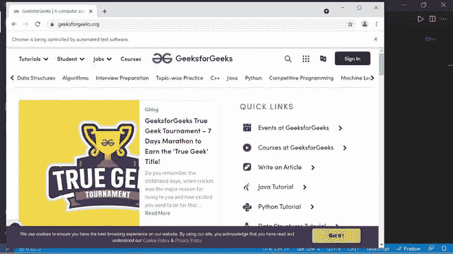

# 硒 JavaScript 安装

> 原文:[https://www . geesforgeks . org/selenium-JavaScript-installation/](https://www.geeksforgeeks.org/selenium-javascript-installation/)

硒是一种工具，帮助我们自动化网络上出现的任何东西。将这个定义分解成比 selenium 更简单的术语，可以让我们使用代码自动与网络浏览器进行交互。从登录网站到喜欢、分享或评论帖子，我们都可以在 selenium 的帮助下自动完成。所以如果你认为你会写一段代码，一旦你运行了这段代码，事情就会自动在网上完成，那么“是的”，你是对的，在硒的帮助下，我们可以自动控制我们在网上做的动作。

如果你想探索更多关于硒的有趣的基本概念，那么请给 [*硒的基本知识*](https://www.geeksforgeeks.org/selenium-basics-components-features-uses-and-limitations/) 一篇阅读文章。

在本文中，我们将看到如何安装 selenium，并使用 selenium 和 javascript 进行运行 web 自动化所需的设置。

**硒 JavaScript 安装**

**第一步。安装节点**

首先，为了用 javascript 运行 selenium，我们必须安装 node。要查看如何在 linux 或 windows 中安装节点，请给 [*如何在 Linux 上安装节点*](https://www.geeksforgeeks.org/installation-of-node-js-on-linux/) 或 [*如何在 windows 上安装节点*](https://www.geeksforgeeks.org/installation-of-node-js-on-windows/) 一读。

**第二步。创建包. json 文件**

在我们的系统中有了一个节点之后，现在我们需要通过创建一个 package.json 文件来初始化项目，为此，我们将在运行项目的位置打开一个终端，然后提供以下命令。

> npm 初始化

**第三步。安装硒网络驱动程序**

现在我们必须安装 selenium-webdriver 包，为此我们只需运行以下命令。

> npm 安装 selenium-webdriver

**第四步。安装浏览器驱动程序**

最后，我们必须安装一个特定于浏览器的 webdriver，在这篇使用 selenium javascript 的 web 自动化系列文章中，我们将自动化并使用 chrome browser，这就是为什么我们将使用以下命令安装 chromedriver。

> npm 安装 chromedriver

如果你想在不同的浏览器中运行自动化，那么你可以安装那个粒子浏览器的 webdriver。

**第五步。测试简单代码:**

下面是一个简单的代码，它将使用 selenium 和 javascript 打开 geeksforgeeks 网站。

## java 描述语言

```
// Require selenium webdriver
let webdriver = require("selenium-webdriver");

// Require webdriver for chrome
// browser called chromedriver
require("chromedriver");

// Build new window of chrome
let driver =  new webdriver.Builder()
    .forBrowser("chrome").build();

// Open geeksforgeeks using get method
driver.get("https://www.geeksforgeeks.org/");
```

#### **第六步。**运行代码:

为了运行代码，我们可以简单地使用运行节点文件的常规方法，如下所示

> 节点文件名. js

#### **输出:**

