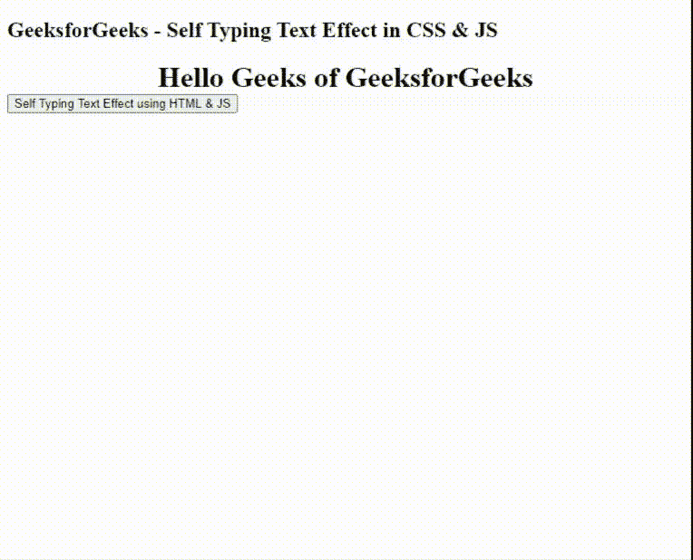

# Self-Typing Text Effect using CSS & JavaScript

> 原文：[https://www.geeksforgeeks.org/self-typing-text-effect-using-css-javascript/](https://www.geeksforgeeks.org/self-typing-text-effect-using-css-javascript/)

**Self-Typing Text Effect** is a type of effect in which all the alphabets of the text are revealed one-by-one, one after the other to give the look and feel of being typed on the screen by themselves. Even though this is a basic text effect, it is still an eye capturing and an effective animation. This animation is widely used in all modern web application and is very easy to implement. This can be designed and implemented using only **CSS** or only **JavaScript** and developers can modify this animation depending upon their creativity. For example, we can increase or decrease the speed of the text reveals or even add a blinking cursor to the end of the text to enhance the animation. For a different version of the text reveal effect which works on the same lines and is similar to this text effect, refer the article:

**[How to create text-reveal effect using HTML and CSS ?](https://www.geeksforgeeks.org/how-to-create-text-reveal-effect-using-html-and-css/)**

In this tutorial, we will implement Self-Typing Text Effect using **[HTML](https://www.geeksforgeeks.org/html-tutorials/)**, **[CSS](https://www.geeksforgeeks.org/css-tutorials/)** and **[JavaScript](https://www.geeksforgeeks.org/javascript-tutorial/)**. We assume that you are familiar with HTML and CSS rules and have a basic knowledge of CSS Animations.

*   **Step 1:** Install **[Browsersync](https://www.browsersync.io/)** using **[npm](https://www.geeksforgeeks.org/node-js-npm-node-package-manager/)**. We will use Browsersync to start a server and provide a URL to view the HTML site, CSS Animation and to load the respective JavaScript files. We will install Browsersync globally.

    ```html
    npm install -g browser-sync
    ```

*   **Step 2:** Create an *“index.html”* file, an *index.css* file and an *index.js* in your project root folder.
    **index.html:** Add the following code snippet in that file. This file contains the codes for both CSS and JavaScript files which are included.

## html

```html
<!DOCTYPE html>
<html lang="en">

<head>
    <meta charset="UTF-8">
    <meta name="viewport" content=
        "width=device-width, initial-scale=1.0">
    <title>GeeksforGeeks</title>

    <!-- Loading External index.css file -->
    <link rel="stylesheet" href="index.css">
</head>

<body>
    <h2>
        GeeksforGeeks - Self Typing 
        Text Effect in CSS & JS
    </h2>

    <div class="wrapper">
        <div class="typewriter">
            <h1>Hello Geeks of GeeksforGeeks</h1>
        </div>
    </div>
    <button class="btn btn-lg" onclick="textEffect()">
        Self Typing Text Effect using HTML & JS
    </button>
    <h1 id="effect"></h1>
    <!-- Loading External index.js file -->
    <script src="index.js"></script>
</body>

</html>
```

**index.css** The *overflow: hidden;* CSS property specifies the behavior of the content if it overflows the HTML elements default box. As we have specified *hidden*, the content will be clipped initially and will be invisible to the user. This is important since we want to ensure that the text is not revealed until the animation is completed.

The *white-space: nowrap;* CSS property specifies the behavior of the white spaces in the text content. A sequence of white spaces, if present, will collapse into a single white space and the content will never be wrapped to the next line until a *br* HTML tag is encountered. This is important to keep the CSS Animation from breaking.

The *margin: 0 auto;* CSS property simply extends the margin as the text is revealed, to support the typing effect. Refer the code comments for better understanding. We have defined an additional *wrapper* class surrounding the entire CSS animation to align it to the center of the screen using the *display: flex;* and *justify-content: center;* CSS properties. The CSS Animation will be triggered as soon as the website is loaded. We have used simple CSS animation to achieve the typing effect as shown below. A detailed explanation of which can be found [here](https://www.geeksforgeeks.org/css-animations/). The *steps(30, end)* is a CSS animation timing function. The first parameter specifies the number of intervals in the function and it should be a positive integer greater than *0*. The second parameter is an optional parameter and value is set as an *end*.

Refer the article

```html
CSS | animation-timing-function property
```

## css

```html
.wrapper {

    /* Keeping the Text in the 
       center of the Screen */
    display: flex;
    justify-content: center;
}

.typewriter h1 {
    /* Content is not revealed 
       until the animation */
    overflow: hidden;

    /* Keeps the content on a single line */
    white-space: nowrap;

    /* Gives that scrolling effect 
       as the typing happens */
    margin: 0 auto;

    /* Typing Effect Animation */
    animation: typing 3.5s steps(30, end)
}

/* Typing Effect on Website Loading */
@keyframes typing {
    from {
        width: 0
    }
    to {
        width: 100%
    }
}
```

**index.js:** In this file, we are manually appending every alphabet to the HTML emh1 tag’s *#effect* element by incrementing an *index* value, fetching, and appending every character from the text using the [charAt()](http://geeksforgeeks.org/javascript-string-charat/) and the [setTimeout()](https://www.geeksforgeeks.org/java-script-settimeout-setinterval-method/) JavaScript functions. The interval set in the **setTimeout()** function determines the speed at which the text will be revealed thereby displaying the Self-Typing Effect. The **textEffect()** function is triggered by the **onClick** HTML property of the *Self Typing Text Effect using HTML & JS* button. In our case, we have set the interval as *50 ms* but it can re-adjusted according to the convenience.

```html
var index = 0;
var text = 'Hello Geeks of GeeksforGeeks';
var speed = 50;

function textEffect() {
    if (index < text.length) {
        document.getElementById("effect")
                .innerHTML += text.charAt(index);
        index++;
        setTimeout(textEffect, speed);
    }
}
```

*   **Step 3:** At this point our **Self-Typing Text Effect** is ready. To launch the application using Browsersync, run the following command in the project directory or you can run the HTML file directly into your browser.

    ```html
    browser-sync start --server --files "*"
    ```

    *   **Output:** This starts Browsersync in server mode and watches all the files within the directory for changes as specified by the *** wildcard. The application will be launched at *http://localhost:3000/* by default.

    