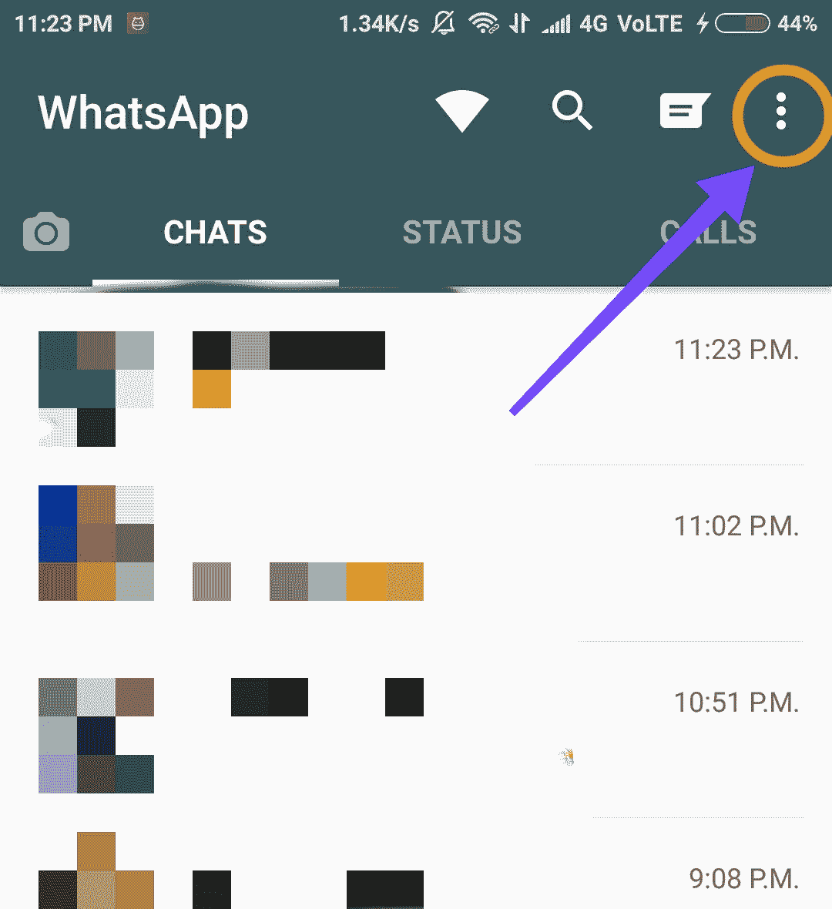
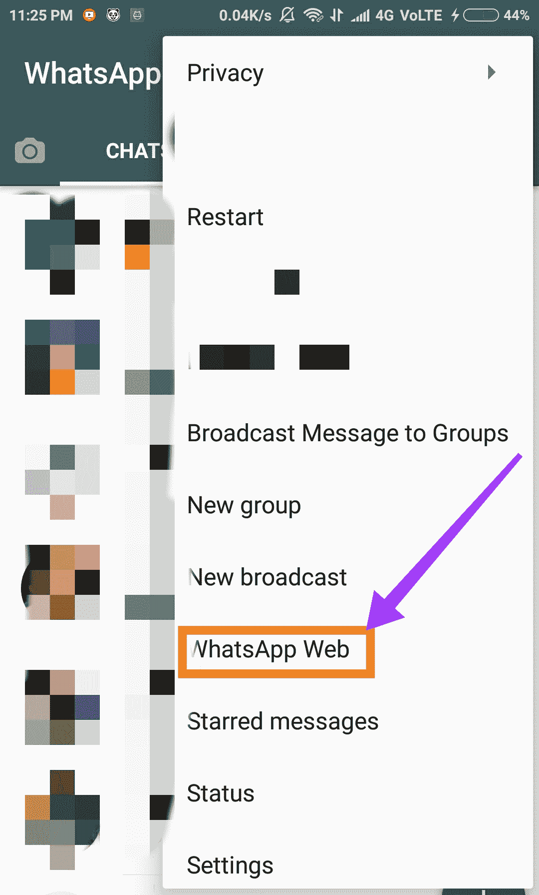
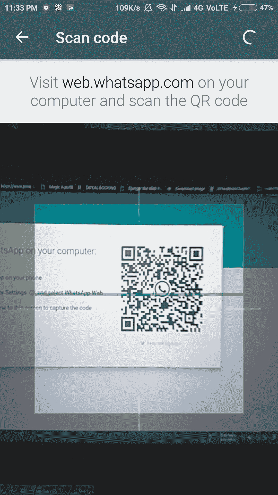
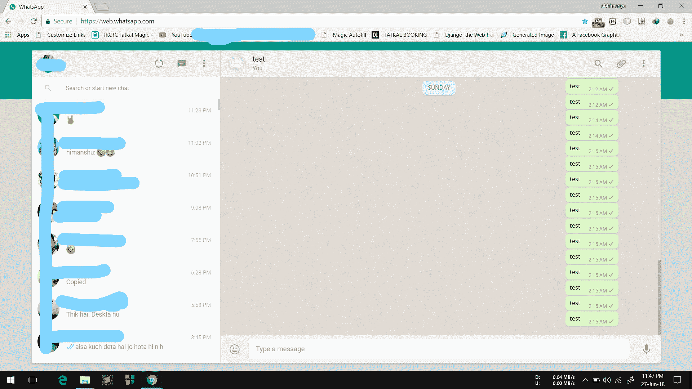

# 使用 JavaScript 发送无限的 Whatsapp 消息

> 原文:[https://www . geesforgeks . org/send-unlimited-whatsapp-messages-use-JavaScript/](https://www.geeksforgeeks.org/send-unlimited-whatsapp-messages-using-javascript/)

说到网页开发，JavaScript 可以创造奇迹！让我向你展示 JavaScript 的另一个奇迹。
如果我们可以一键发送无限的 WhatsApp 消息，岂不是很酷？成为第一个向我们所爱的人祝生日/纪念日/特别活动的人？在您的 WhatsApp 上为任何联系人/群组安排任何消息？还有更多吗？

是的，我们可以在 JavaScript 的帮助下实现所有这些事情。最有趣的是，你只需要一部带 WhatsApp 的**手机、一台笔记本电脑/个人电脑和一个网络浏览器**(谷歌 Chrome、Edge、Mozilla 等)。)中启用了 Javascript(通常默认情况下是启用的)。*不需要安装其他东西。*

我们开始吧。
打开手机上的 WhatsApp。

*   点击右上角的 3 个点。
    *   Click on WhatsApp Web.

    

    *   Follow the instructions to open WhatsApp web on your computer.

    

    *   Assuming that by this time you have WhatsApp Web running on your computer, check if it looks like the image below:-

    

    现在让我们把注意力转移到电脑上。

    *   在浏览器中按 Ctrl，Shift 和我一起打开一个开发者控制台。
    *   找到“控制台”选项卡，然后点击它。
    *   现在我们差不多完成了。
    *   双击下面的代码进行编辑。
    *   查找下列变量并赋值:名称、消息和计数器。

    该代码的工作原理是通过再现发送动作来模拟发送，如果尚未发起对话，它就无法搜索联系人。

    阅读代码中的注释，您就知道该怎么做了🙂

    ```
    <script>
        function simulateMouseEvents(element, eventName)
    {
        var mouseEvent = document.createEvent('MouseEvents');
        mouseEvent.initEvent(eventName, true, true);
        element.dispatchEvent(mouseEvent);
    }

    /*Schedule your message section starts here
    var now = new Date();

    // Replace Hours, Mins and secs with your 
    // desired time in 24 hour time format e.g.
    // var rt = new Date(now.getFullYear(), now.getMonth(), 
    // now.getDate(), Hours, Minutes, Sec, 0) - now; 
    // to send message at 2.30PM 
    var rt = new Date(now.getFullYear(), now.getMonth(),
                    now.getDate(), 14, 30, 00, 0) - now; 

    if (rt < 0) {
        rt += 86400000; 
    }

    setTimeout(startTimer, rt);
    Schedule your message section ends here*/

    // Replace My Contact Name with the name 
    // of your WhatsApp contact or group e.g. title="Peter Parker"
    name = "My Contact Name" 

        simulateMouseEvents(document.querySelector('[title="' + name + '"]'), 'mousedown');

    function startTimer()
    {
        setTimeout(myFunc, 3000);
    }

    startTimer();

    var eventFire = (MyElement, ElementType) => {
        var MyEvent = document.createEvent("MouseEvents");
        MyEvent.initMouseEvent
         (ElementType, true, true, window, 0, 0, 0, 0, 0, false, false, false, false, 0, null);
        MyElement.dispatchEvent(MyEvent);
    };

    function myFunc()
    {

        messageBox = document.querySelectorAll("[contenteditable='true']")[1];

        message = "My Message"; // Replace My Message with your message use   to add spaces to your message

        counter = 5; // Replace 5 with the number of times you want to send your message

        for (i = 0; i < counter; i++) {
            event = document.createEvent("UIEvents");
            messageBox.innerHTML = message.replace(/ /gm, ''); // test it
            event.initUIEvent("input", true, true, window, 1);
            messageBox.dispatchEvent(event);

            eventFire(document.querySelector('span[data-icon="send"]'), 'click');
        }
    }    
    </script>                
    ```

    现在复制修改后的代码，并将其粘贴到之前打开的控制台窗口中。你现在可以走了！

    ***点击进入，瞧！*** 只需点击一下，您想要的消息数量就会发送出去。

    **额外乐趣**:要安排你的消息，删除代码中“安排你的消息部分”的评论，按照你的意愿设置时间！
    **注意:-** 确保您愿意发送消息的联系人/群组在浏览器中可见，无需向下滚动。

    > WhatsApp 可能会阻止您的帐户过度使用此类脚本。所以使用自担风险！

    > 本网站提供的所有信息仅用于教育目的。文章的网站和作者对任何滥用信息的行为概不负责。

    **可以根据需要随意调整代码，玩得开心！快乐编码🙂**