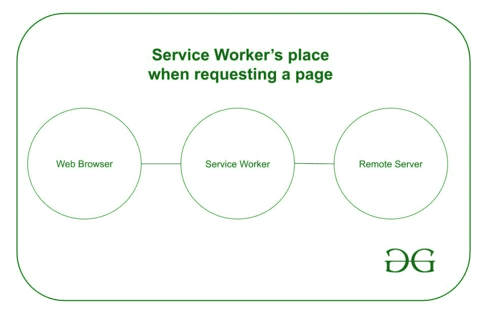

# Javascript 中的服务人员

> 原文:[https://www . geesforgeks . org/service-workers-in-JavaScript/](https://www.geeksforgeeks.org/service-workers-in-javascript/)

**什么是 Service Worker:**
Service Worker 是在浏览器后台独立运行的脚本。在用户端，它可以拦截其网络请求并决定加载什么(*获取*)。
服务人员主要提供后台同步、推送通知等功能，他们通常用于“离线优先”应用程序，让开发人员有机会完全控制用户体验。

之前已经有了名为 *AppCache* 的 API，一直在尝试服务于离线体验功能。但是 *AppCache API* 的界面出现了很多问题，服务人员在这里，一遍一遍。

**服务人员生命周期:**
服务人员生命周期与网页完全分离。这是一个可编程的网络代理，当它不使用时被终止，当它下次需要时被重启。服务人员很大程度上依赖于使用 [Javascript Promises](https://www.geeksforgeeks.org/javascript-promises/) ，所以如果他们对你来说是新的，那么复习一下他们是很好的。

在安装过程中，服务人员可以缓存一些静态资产，比如网页。如果浏览器成功地缓存了文件，服务工作人员就会被安装。

之后，工人需要被激活。在激活过程中，服务工作人员可以管理和决定旧缓存会发生什么，通常它们会被删除并被新版本替换。

最后，在激活之后，服务工作人员控制其范围内的所有页面，*而不包括最初注册服务工作人员的页面*，该页面需要刷新。服务工作人员在内存使用方面很聪明，如果没有要提取的内容并且没有消息事件发生，服务工作人员将被终止。

下图是一名服务人员在浏览器和网络之间的位置。



使用服务人员的网站请求链。

**先决条件:**

1.  HTTPS，除非在本地主机上
    *   服务人员需要使用 HTTPS 连接。在部署之前，工作人员在[本地主机](https://www.geeksforgeeks.org/what-is-local-host/)服务器下工作，但是如果您想将其上传到互联网，您需要在服务器上安装 HTTPS 系统。举办免费演示的一个好地方是 *[GitHub Pages](https://www.geeksforgeeks.org/using-github-to-host-a-free-static-website/)* ，它们是 HTTPS 的服务器。
2.  浏览器支持
    *   *Chrome* 、*火狐*、 *Opera* 、 *Safari* 、 *Edge* 在互联网上高度支持服务工作者，值得部署。

**注册:**
设置服务人员需要注册。这是在你的页面的 Javascript 中完成的。一旦服务人员注册，这将导致浏览器开始在后台安装它。

```
// Ensure that the browser supports the service worker API
if (navigator.serviceWorker) {
  // Start registration process on every page load
  window.addEventListener('load', () => {
      navigator.serviceWorker
          // The register function takes as argument
          // the file path to the worker's file
          .register('/service_worker.js')
          // Gives us registration object
          .then(reg => console.log('Service Worker Registered'))
          .catch(swErr => console.log(
                `Service Worker Installation Error: ${swErr}}`));
    });
}
```

**安装:**
服务工作人员注册后，需要安装它，这是在服务工作人员文件中完成的，您通常希望在其中获取缓存资产。

需要采取以下步骤:

1.  打开缓存
2.  缓存资产
3.  确认缓存是否成功

```
var cacheName = 'geeks-cache-v1';
var cacheAssets = [
    '/assets/pages/offline-page.html',
    '/assets/styles/offline-page.css',
    '/assets/script/offline-page.js',

];

// Call install Event
self.addEventListener('install', e => {
    // Wait until promise is finished 
    e.waitUntil(
        caches.open(cacheName)
        .then(cache => {
            console.log(`Service Worker: Caching Files: ${cache}`);
            cache.addAll(cacheAssets)
                // When everything is set
                .then(() => self.skipWaiting())
        })
    );
})
```

**激活:**

```
// Call Activate Event
self.addEventListener('activate', e => {
    console.log('Service Worker: Activated');
    // Clean up old caches by looping through all of the
    // caches and deleting any old caches or caches that
    // are not defined in the list
    e.waitUntil(
        caches.keys().then(cacheNames => {
            return Promise.all(
                cacheNames.map(
                    cache => {
                        if (cache !== cacheName) {
                            console.log('Service Worker: Clearing Old Cache');
                            return caches.delete(cache);
                        }
                    }
                )
            )
        })
    );
})
```

**取数事件:**
一旦设置了服务工作器，它就应该开始交互并使用缓存的响应。当特定用户浏览网页时，服务人员开始接收*获取*事件。下面的例子演示了一个案例，当工作人员收到一个提取事件并搜索匹配的缓存(如果有)时，它返回缓存的文件/值，否则，它返回调用*提取*的默认响应

```
var cacheName = 'geeks-cache-v1';

// Call Fetch Event 
self.addEventListener('fetch', e => {
    console.log('Service Worker: Fetching');
    e.respondWith(
        fetch(e.request)
        .then(res => {
            // The response is a stream and in order the browser 
            // to consume the response and in the same time the 
            // cache consuming the response it needs to be 
            // cloned in order to have two streams.
            const resClone = res.clone();
            // Open cache
            caches.open(cacheName)
                .then(cache => {
                    // Add response to cache
                    cache.put(e.request, resClone);
                });
            return res;
        }).catch(
            err => caches.match(e.request)
            .then(res => res)
        )
    );
});
```

**服务人员不能:**

*   访问父对象*   访问窗口对象*   访问文档对象*   Access the DOM

    **但是，服务人员可以:**

    *   缓存资产和应用编程接口调用*   管理推送通知*   控制网络流量*   Store the Application Cache

    **常用用例:**

    *   离线优化体验*   发送推送通知*   Background sync

    **参考:**[https://developers . Google . com/web/foundation/primer/service-workers/](https://developers.google.com/web/fundamentals/primers/service-workers/)