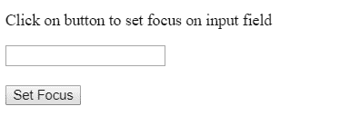
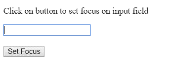
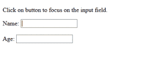
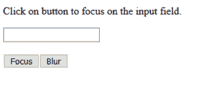
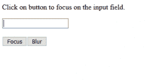

# 使用 JavaScript 将焦点设置到 HTML 表单元素

> 原文:[https://www . geesforgeks . org/set-the-focus-to-html-form-element-use-JavaScript/](https://www.geeksforgeeks.org/set-the-focus-to-html-form-element-using-javascript/)

要将焦点设置到 HTML 表单元素，可以使用 JavaScript 的 focus()方法。为此，请在要聚焦的元素的对象上调用此方法，如示例所示。

**例 1:** 当用户点击 focus 按钮时，Focus()方法被设置为输入标签。

```
<!DOCTYPE html>
<html>

<head>
    <title>
        Set focus to HTML form element
    </title>
</head>

<body>
    <p>
        Click on button to set focus
        on input field
    </p>

    <form>
        <input type="text" id="input1">

        <br><br>

        <button type="button" onclick="focusInput()">
            Set Focus
        </button>
    </form>

    <script>
        function focusInput() {
            document.getElementById("input1").focus();
        }
    </script>
</body>

</html>                    
```

**输出:**

*   **点击按钮前:**
    
*   **点击按钮后:**
    

**示例 2:** 本示例关注页面加载时自动输入的字段。

```
<!DOCTYPE html>
<html>

<head>
    <title>
        Set focus to HTML form element
    </title>
</head>

<body>

    <p>
        Click on button to focus
        on the input field.
    </p>

    <form>
        Name: <input type="text" id="input1">

        <br><br>

        Age: <input type="text" id="input2">
    </form>

    <script>
        window.onload = function() {
            document.getElementById("input1").focus();
        }
    </script>
</body>

</html>                    
```

**输出:**


**例 3:** 下面的程序在点击 Focus 按钮时会聚焦在输入字段上。要模糊聚焦的输入场，可以使用 blur()属性。

```
<!DOCTYPE html>
<html>

<head>
    <title>
        Set focus to HTML form element
    </title>
</head>

<body>
    <p>
        Click on button to focus
        on the input field.
    </p>

    <form>
        <input type="text" id="input1">

        <br><br>

        <button type="button" onclick="focusInput()">
            Focus
        </button>

        <button type="button" onclick="blurInput()">
            Blur
        </button>
    </form>

    <script>
        function focusInput() {
            document.getElementById("input1").focus();
        }
        function blurInput() {
            document.getElementById("input1").blur();
        }
    </script>
</body>

</html>                    
```

**输出:**

*   **点击按钮前:**
    
*   **点击关注按钮后:**
    
*   **点击模糊按钮后:**
    