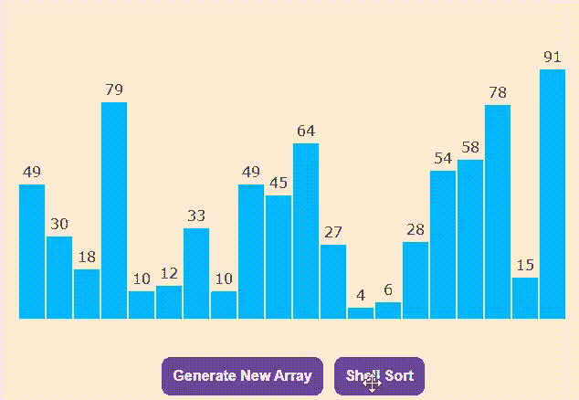

# 使用 JavaScript 的 Shell 排序可视化工具

> 原文:[https://www . geesforgeks . org/shell-sort-visualizer-use-JavaScript/](https://www.geeksforgeeks.org/shell-sort-visualizer-using-javascript/)

[贝壳排序](https://www.geeksforgeeks.org/shellsort/)主要是[插入排序](https://www.geeksforgeeks.org/insertion-sort/)的变体。shell 排序的思想是允许远程项目的交换。为了了解更多。请参考[贝壳分类](https://www.geeksforgeeks.org/shellsort/)。

像 **Shell Sort** 这样的算法可以通过可视化而不是长代码来轻松理解。在本文中， **Shell Sort** 可视化工具是使用 **HTML，CSS** & **JavaScript** 实现的。

**先决条件:**

*   [外壳排序](https://www.geeksforgeeks.org/shellsort/)。
*   基本的 HTML、CSS 和 JavaScript 知识。
*   JavaScript [承诺](https://www.geeksforgeeks.org/javascript-promises/)。
*   JavaScript [异步/等待](https://www.geeksforgeeks.org/async-await-function-in-javascript/)功能。

**进场:**

*   按钮**生成新数组**使用**数学.随机()**函数生成一个随机值数组，以及一个对应于该值的高度条。
*   不同的颜色用于指示哪些元素是未排序的(天蓝色)、已比较的(深蓝色)和已排序的(浅绿色)。
*   按钮**外壳排序**使用选择排序算法对元素进行排序。
*   最后，对元素进行排序。

**示例:**点击“生成新数组”按钮，生成新的随机数组。点击“外壳排序”按钮执行可视化。

## 超文本标记语言

```html
<!DOCTYPE html>
<html lang="en">

<!-- Head Section -->
<head>
    <meta charset="UTF-8" />
    <meta name="viewport" content="width=device-width, 
          initial-scale=1.0" />
    <meta http-equiv="X-UA-Compatible" content="ie=edge" />

    <!-- title -->
    <title>Shell Sort Visualizer using JavaScript</title>

    <!-- linking style.css -->
    <link href="style.css" rel="stylesheet" />
</head>

<!-- Body Section -->
<body>
    <section class="head">Shell Sort</section>
    <section class="data-container"></section>
    <section id="ele"></section>
    <div style="margin: auto; width: fit-content">

        <!-- "Generate New Array" button -->
        <button class="btn1" onclick="generate()" id="Button1">
            Generate New Array
        </button>

        <!-- "Shell Sort" button -->
        <button class="btn2" onclick="ShellSort(),disable()"
                id="Button2">Shell Sort</button>
    </div>

    <!-- linking script.js -->
    <script src="script.js"></script>
</body>

</html>
```

## style.css

```html
.mySlides {
  display: none;
}
body {
  background-color: rgb(255, 235, 211);
  font-family: Verdana, sans-serif;
}
.head {
  margin-top: 20px;
  margin-right: 20vw;
  margin-left: 20vw;
  text-align: center;
  font-size: 30px;
  background-color: #6f459e;
  color: white;
  border-radius: 19px;
  font-weight: bolder;
}
.data-container {
  width: 600px;
  height: 364px;
  position: relative;
  margin: 0 auto;
}
.bar {
  width: 28px;
  position: absolute;
  left: 0;
  bottom: 0;
  background-color: rgb(0, 183, 255);
  transition: 0.2s all ease;
}
.bar__id {
  position: absolute;
  top: -24px;
  width: 100%;
  text-align: center;
}
.btn1 {
  padding: 12px;
  font-weight: bolder;
  background-color: #6f459e;
  border-radius: 10px;
  color: white;
  font-size: 16px;
  border: white;
  margin-top: 1vw;
  margin-right: 1vw;
}
.btn2 {
  padding: 12px;
  font-weight: bolder;
  background-color: #6f459e;
  border-radius: 10px;
  color: white;
  font-size: 16px;
  border: white;
}
#ele {
  text-align: center;
  height: 35px;
}
```

## script.js

```html
const container = document.querySelector(".data-container");

// Function to generate bars
function generatebars(num = 20) {

    // For loop to generate 20 bars
    for (let i = 0; i < num; i += 1) {

        // To generate random values from 1 to 100
        const value = Math.floor(Math.random() * 100) + 1;

        // To create element "div"
        const bar = document.createElement("div");

        // To add class "bar" to "div"
        bar.classList.add("bar");

        // Provide height to the bar
        bar.style.height = `${value * 3}px`;

        // Translate the bar towards positive X axis
        bar.style.transform = `translateX(${i * 30}px)`;

        // To create element "label"
        const barLabel = document.createElement("label");

        // To add class "bar_id" to "label"
        barLabel.classList.add("bar__id");

        // Assign value to "label"
        barLabel.innerHTML = value;

        // Append "Label" to "div"
        bar.appendChild(barLabel);

        // Append "div" to "data-container div"
        container.appendChild(bar);
    }
}

// Asynchronous function to perform "Shell Sort"
async function ShellSort(delay = 600) {
    let bars = document.querySelectorAll(".bar");

    for (var i = 10; i > 0; i = Math.floor(i / 2)) {

        // To pause the execution of code
        // for 300 milliseconds
        await new Promise((resolve) =>
            setTimeout(() => {
                resolve();
            }, 300)
        );

        for (var j = i; j < 20; j++) {
            var temp = parseInt(
                bars[j].childNodes[0].innerHTML);
            var k;

            var temp1 = bars[j].style.height;
            var temp2 = bars[j].childNodes[0].innerText;

            for (
                k = j;
                k >= i && parseInt(bars[k - i]
                    .childNodes[0].innerHTML) > temp;
                k -= i
            ) {
                bars[k].style.height 
                        = bars[k - i].style.height;

                bars[k].childNodes[0].innerText = 
                    bars[k - i].childNodes[0].innerText;

                // To pause the execution of code
                // for 300 milliseconds
                await new Promise((resolve) =>
                    setTimeout(() => {
                        resolve();
                    }, 300)
                );
            }

            // Provide darkblue color to the jth bar
            bars[j].style.backgroundColor = "darkblue";

            // Provide darkblue color to the kth bar
            bars[k].style.backgroundColor = "darkblue";
            bars[k].style.height = temp1;
            bars[k].childNodes[0].innerText = temp2;

            // To pause the execution of code for
            // 300 milliseconds
            await new Promise((resolve) =>
                setTimeout(() => {
                    resolve();
                }, 600)
            );

            // Provide skyblue color to the jth bar
            bars[j].style.backgroundColor = "rgb(0, 183, 255)";

            // Provide skyblue color to the kth bar
            bars[k].style.backgroundColor = "rgb(0, 183, 255)";

            // To pause the execution of code for
            // 300 milliseconds
            await new Promise((resolve) =>
                setTimeout(() => {
                    resolve();
                }, 300)
            );
        }
    }
    for (var x = 0; x < 20; x++) {
        bars[x].style.backgroundColor 
            = "rgb(49, 226, 13)";
    }

    // To enable the button "Generate New Array"
    // after final(sorted)
    document.getElementById("Button1")
            .disabled = false;

    document.getElementById("Button1")
        .style.backgroundColor = "#6f459e";

    // To enable the button "Shell Sort"
    // after final(sorted)
    document.getElementById("Button2").disabled = false;
    document.getElementById("Button2")
        .style.backgroundColor = "#6f459e";
}

// Call "generatebars()" function
generatebars();

// Function to generate new random array
function generate() {
    window.location.reload();
}

// Function to disable the button
function disable() {
    // To disable the button "Generate New Array"
    document.getElementById("Button1").disabled = true;
    document.getElementById("Button1")
        .style.backgroundColor = "#d8b6ff";

    // To disable the button "Shell Sort"
    document.getElementById("Button2").disabled = true;
    document.getElementById("Button2")
        .style.backgroundColor = "#d8b6ff";
}
```

**输出:**

