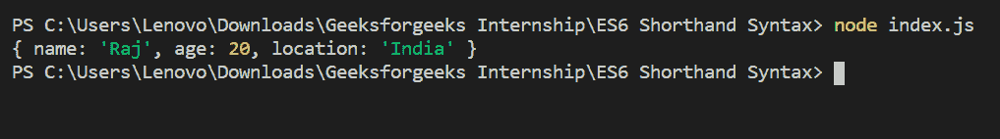

# ES6 中对象属性值的简写语法

> 原文:[https://www . geesforgeks . org/速记-语法-for-object-property-value-in-es6/](https://www.geeksforgeeks.org/shorthand-syntax-for-object-property-value-in-es6/)

JavaScript 中的对象是最重要的数据类型，构成了现代 JavaScript 的构建块。这些对象与 JavaScript 基本数据类型(数字、字符串、布尔、空、未定义和符号)有很大不同，因为这些基本数据类型都存储一个值(取决于它们的类型)。

对象属性值的简写语法现在非常流行并被广泛使用。代码看起来更加清晰易读。速记属性使代码变得更小更简单。

**示例:**本示例使用 ES6 中对象属性值的速记语法显示对象的详细信息。

```
// Object property shorthand
const name = 'Raj'
const age = 20
const location = 'India'

// User with ES6 shorthand
// property 
const user = {
    name,      
    age,
    location
}

console.log(user) 
```

**输出:**


**示例:**本示例显示对象的详细信息，而不使用对象属性值的简写语法。

```
// Object property shorthand
const name = 'Raj'
const age = 20
const location = 'India'

// User without ES6 
// shorthand property 
const user = {
    name: name,      
    age: age,
    location: location
}

console.log(user) 
```

**输出:**
