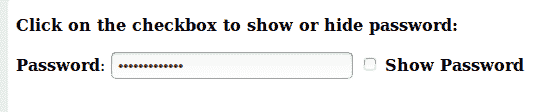
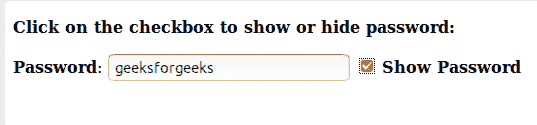

# 使用 JavaScript 显示和隐藏密码

> 原文:[https://www . geesforgeks . org/show-hide-password-use-JavaScript/](https://www.geeksforgeeks.org/show-hide-password-using-javascript/)

在填写表格时，会出现这样一种情况:我们键入密码，并想看看到目前为止我们键入了什么。要看到这一点，有一个复选框点击，使字符可见。
在这篇文章中，这个功能，即切换密码是使用 JavaScript 实现的。

> **算法**
> 1)创建一个包含密码输入字段的 HTML 表单。
> 
> 2)创建一个负责切换的复选框。
> 
> 3)创建一个功能，当用户点击复选框时，该功能将响应切换。

示例:

> 密码是 geeksforgeeks。
> 所以，在输入时它会显示这样的*** * * * * * * * * * * ***
> 并且在点击复选框时它会显示字符:**极客头像**。

```
<!DOCTYPE html>
<html>
<body>

 <b><p>Click on the checkbox to show
           or hide password: </p></b>

 <b>Password</b>: <input type="password" 
     value="geeksforgeeks" id="typepass"> 

 <input type="checkbox" onclick="Toggle()">
    <b>Show Password</b>

    <script>
    // Change the type of input to password or text
        function Toggle() {
            var temp = document.getElementById("typepass");
            if (temp.type === "password") {
                temp.type = "text";
            }
            else {
                temp.type = "password";
            }
        }
</script>
</body>
</html>
```

输出:

*   隐藏密码:
    
*   显示密码:
    