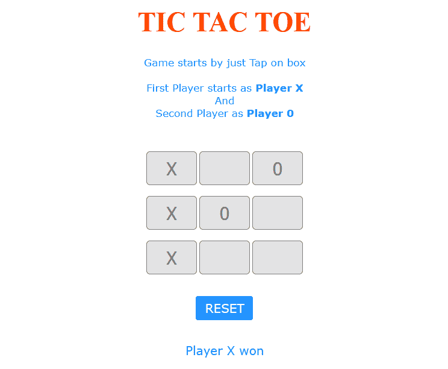
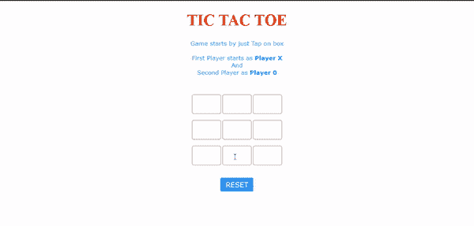
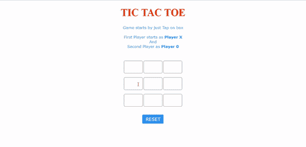

# 使用 JavaScript 的简单井字游戏

> 原文:[https://www . geesforgeks . org/simple-TIC-tac-toe-game-use-JavaScript/](https://www.geeksforgeeks.org/simple-tic-tac-toe-game-using-javascript/)

**如何用 JavaScript 实现 2 人井字游戏？**

通过一些简单的验证和错误检查很容易开发。玩家 1 开始玩游戏，两个玩家连续轮流移动。连续 3-区块链的球员赢得比赛。这款游戏建立在前端，只使用简单的逻辑和验证检查。

**先决条件:【HTML、CSS、JavaScript 等一些前端技术的基础知识。**T3】****



井字游戏观

**文件名:index.html**

## 超文本标记语言

```html
<!DOCTYPE html>

<head>
    <meta name="viewport" content=
        "width=device-width, initial-scale=1.0">

    <!-- CSS file Included -->
    <link rel="stylesheet" 
        type="text/css" href="tic.css">

    <!-- JavaScript file included -->
    <script src="tic.js"></script>
</head>

<body>
    <div id="main">
        <h1>TIC TAC TOE</h1>

        <!-- Game Instructions -->
        <p id="ins">Game starts by just Tap on 
            box<br><br>First Player starts as 
            <b>Player X</b><br>And<br>Second 
            Player as <b>Player 0</b>
        </p>

        <br><br>
        <!-- 3*3 grid of Boxes -->
        <input type="text" id="b1" onclick=
            "myfunc_3(); myfunc();" readonly>

        <input type="text" id="b2" onclick=
            "myfunc_4(); myfunc();" readonly>

        <input type="text" id="b3" onclick=
            "myfunc_5(); myfunc();" readonly>
        <br><br>

        <input type="text" id="b4" onclick=
            "myfunc_6(); myfunc();" readonly>

        <input type="text" id="b5" onclick=
            "myfunc_7(); myfunc();" readonly>

        <input type="text" id="b6" onclick=
            "myfunc_8(); myfunc();" readonly>
        <br><br>

        <input type="text" id="b7" onclick=
            "myfunc_9(); myfunc();" readonly>

        <input type="text" id="b8" onclick=
            "myfunc_10();myfunc();" readonly>

        <input type="text" id="b9" onclick=
            "myfunc_11();myfunc();" readonly>

        <!-- Grid end here  -->
        <br><br><br>
        <!-- Button to reset game -->
        <button id="but" onclick="myfunc_2()">
            RESET
        </button>

        <br><br>
        <!-- Space to show player turn -->
        <p id="print"></p>

    </div>
</body>

</html>
```

文件名:tic.css

## 半铸钢ˌ钢性铸铁(Cast Semi-Steel)

```html
<style>
    /* CSS Code */
    /* Heading */
    h1 {
        color: orangered;
        font-size: 45px;
    }

    /* 3*3 Grid */
    #b1, #b2, #b3, #b4, #b5, 
    #b6, #b7, #b8, #b9 {
        width: 80px;
        height: 52px;
        margin: auto;
        border: 1px solid gray;
        border-radius: 6px;
        font-size: 30px;
        text-align: center;
    }

    /* Reset Button */
    #but {
        box-sizing: border-box;
        width: 95px;
        height: 40px;
        border: 1px solid dodgerblue;
        margin: auto;
        border-radius: 4px;
        font-family: Verdana, 
            Geneva, Tahoma, sans-serif;

        background-color: dodgerblue;
        color: white;
        font-size: 20px;
        cursor: pointer;
    }

    /* Player turn space */
    #print {
        font-family: Verdana, 
            Geneva, Tahoma, sans-serif;

        color: dodgerblue;
        font-size: 20px;
    }

    /* Main Container */
    #main {
        text-align: center;
    }

    /* Game Instruction Text */
    #ins {
        font-family: Verdana, 
            Geneva, Tahoma, sans-serif;

        color: dodgerblue;
        font-size: 17px;
    }
</style>
```

文件名:tic.js

## Java Script 语言

```html
// Function called whenever user tab on any box
function myfunc() {

    // Setting DOM to all boxes or input field
    var b1, b2, b3, b4, b5, b6, b7, b8, b9;
    b1 = document.getElementById("b1").value;
    b2 = document.getElementById("b2").value;
    b3 = document.getElementById("b3").value;
    b4 = document.getElementById("b4").value;
    b5 = document.getElementById("b5").value;
    b6 = document.getElementById("b6").value;
    b7 = document.getElementById("b7").value;
    b8 = document.getElementById("b8").value;
    b9 = document.getElementById("b9").value;

    // Checking if Player X won or not and after 
    // that disabled all the other fields
    if ((b1 == 'x' || b1 == 'X') && (b2 == 'x' ||
        b2 == 'X') && (b3 == 'x' || b3 == 'X')) {
        document.getElementById('print')
            .innerHTML = "Player X won";
        document.getElementById("b4").disabled = true;
        document.getElementById("b5").disabled = true;
        document.getElementById("b6").disabled = true;
        document.getElementById("b7").disabled = true;
        document.getElementById("b8").disabled = true;
        document.getElementById("b9").disabled = true;
        window.alert('Player X won');
    }
    else if ((b1 == 'x' || b1 == 'X') && (b4 == 'x' ||
        b4 == 'X') && (b7 == 'x' || b7 == 'X')) {
        document.getElementById('print')
            .innerHTML = "Player X won";
        document.getElementById("b2").disabled = true;
        document.getElementById("b3").disabled = true;
        document.getElementById("b5").disabled = true;
        document.getElementById("b6").disabled = true;
        document.getElementById("b8").disabled = true;
        document.getElementById("b9").disabled = true;

        window.alert('Player X won');
    }
    else if ((b7 == 'x' || b7 == 'X') && (b8 == 'x' || 
        b8 == 'X') && (b9 == 'x' || b9 == 'X')) {
        document.getElementById('print')
            .innerHTML = "Player X won";
        document.getElementById("b1").disabled = true;
        document.getElementById("b2").disabled = true;
        document.getElementById("b3").disabled = true;
        document.getElementById("b4").disabled = true;
        document.getElementById("b5").disabled = true;
        document.getElementById("b6").disabled = true;
        window.alert('Player X won');
    }
    else if ((b3 == 'x' || b3 == 'X') && (b6 == 'x' || 
        b6 == 'X') && (b9 == 'x' || b9 == 'X')) {
        document.getElementById('print')
            .innerHTML = "Player X won";
        document.getElementById("b1").disabled = true;
        document.getElementById("b2").disabled = true;
        document.getElementById("b4").disabled = true;
        document.getElementById("b5").disabled = true;
        document.getElementById("b7").disabled = true;
        document.getElementById("b8").disabled = true;
        window.alert('Player X won');
    }
    else if ((b1 == 'x' || b1 == 'X') && (b5 == 'x' || 
        b5 == 'X') && (b9 == 'x' || b9 == 'X')) {
        document.getElementById('print')
            .innerHTML = "Player X won";
        document.getElementById("b2").disabled = true;
        document.getElementById("b3").disabled = true;
        document.getElementById("b4").disabled = true;
        document.getElementById("b6").disabled = true;
        document.getElementById("b7").disabled = true;
        document.getElementById("b8").disabled = true;
        window.alert('Player X won');
    }
    else if ((b3 == 'x' || b3 == 'X') && (b5 == 'x' || 
        b5 == 'X') && (b7 == 'x' || b7 == 'X')) {
        document.getElementById('print')
            .innerHTML = "Player X won";
        document.getElementById("b1").disabled = true;
        document.getElementById("b2").disabled = true;
        document.getElementById("b4").disabled = true;
        document.getElementById("b6").disabled = true;
        document.getElementById("b8").disabled = true;
        document.getElementById("b9").disabled = true;
        window.alert('Player X won');
    }
    else if ((b2 == 'x' || b2 == 'X') && (b5 == 'x' || 
        b5 == 'X') && (b8 == 'x' || b8 == 'X')) {
        document.getElementById('print')
            .innerHTML = "Player X won";
        document.getElementById("b1").disabled = true;
        document.getElementById("b3").disabled = true;
        document.getElementById("b4").disabled = true;
        document.getElementById("b6").disabled = true;
        document.getElementById("b7").disabled = true;
        document.getElementById("b9").disabled = true;
        window.alert('Player X won');
    }
    else if ((b4 == 'x' || b4 == 'X') && (b5 == 'x' || 
        b5 == 'X') && (b6 == 'x' || b6 == 'X')) {
        document.getElementById('print')
            .innerHTML = "Player X won";
        document.getElementById("b1").disabled = true;
        document.getElementById("b2").disabled = true;
        document.getElementById("b3").disabled = true;
        document.getElementById("b7").disabled = true;
        document.getElementById("b8").disabled = true;
        document.getElementById("b9").disabled = true;
        window.alert('Player X won');
    }

    // Checking of Player X finsh
    // Checking for Player 0 starts, Is player 0 won or
    // not and after that disabled all the other fields
    else if ((b1 == '0' || b1 == '0') && (b2 == '0' || 
        b2 == '0') && (b3 == '0' || b3 == '0')) {
        document.getElementById('print')
            .innerHTML = "Player 0 won";
        document.getElementById("b4").disabled = true;
        document.getElementById("b5").disabled = true;
        document.getElementById("b6").disabled = true;
        document.getElementById("b7").disabled = true;
        document.getElementById("b8").disabled = true;
        document.getElementById("b9").disabled = true;
        window.alert('Player 0 won');
    }
    else if ((b1 == '0' || b1 == '0') && (b4 == '0' || 
        b4 == '0') && (b7 == '0' || b7 == '0')) {
        document.getElementById('print')
            .innerHTML = "Player 0 won";
        document.getElementById("b2").disabled = true;
        document.getElementById("b3").disabled = true;
        document.getElementById("b5").disabled = true;
        document.getElementById("b6").disabled = true;
        document.getElementById("b8").disabled = true;
        document.getElementById("b9").disabled = true;
        window.alert('Player 0 won');
    }
    else if ((b7 == '0' || b7 == '0') && (b8 == '0' || 
        b8 == '0') && (b9 == '0' || b9 == '0')) {
        document.getElementById('print')
            .innerHTML = "Player 0 won";
        document.getElementById("b1").disabled = true;
        document.getElementById("b2").disabled = true;
        document.getElementById("b3").disabled = true;
        document.getElementById("b4").disabled = true;
        document.getElementById("b5").disabled = true;
        document.getElementById("b6").disabled = true;
        window.alert('Player 0 won');
    }
    else if ((b3 == '0' || b3 == '0') && (b6 == '0' || 
        b6 == '0') && (b9 == '0' || b9 == '0')) {
        document.getElementById('print')
            .innerHTML = "Player 0 won";
        document.getElementById("b1").disabled = true;
        document.getElementById("b2").disabled = true;
        document.getElementById("b4").disabled = true;
        document.getElementById("b5").disabled = true;
        document.getElementById("b7").disabled = true;
        document.getElementById("b8").disabled = true;
        window.alert('Player 0 won');
    }
    else if ((b1 == '0' || b1 == '0') && (b5 == '0' || 
        b5 == '0') && (b9 == '0' || b9 == '0')) {
        document.getElementById('print')
            .innerHTML = "Player 0 won";
        document.getElementById("b2").disabled = true;
        document.getElementById("b3").disabled = true;
        document.getElementById("b4").disabled = true;
        document.getElementById("b6").disabled = true;
        document.getElementById("b7").disabled = true;
        document.getElementById("b8").disabled = true;
        window.alert('Player 0 won');
    }
    else if ((b3 == '0' || b3 == '0') && (b5 == '0' || 
        b5 == '0') && (b7 == '0' || b7 == '0')) {
        document.getElementById('print')
            .innerHTML = "Player 0 won";
        document.getElementById("b1").disabled = true;
        document.getElementById("b2").disabled = true;
        document.getElementById("b4").disabled = true;
        document.getElementById("b6").disabled = true;
        document.getElementById("b8").disabled = true;
        document.getElementById("b9").disabled = true;
        window.alert('Player 0 won');
    }
    else if ((b2 == '0' || b2 == '0') && (b5 == '0' || 
        b5 == '0') && (b8 == '0' || b8 == '0')) {
        document.getElementById('print')
            .innerHTML = "Player 0 won";
        document.getElementById("b1").disabled = true;
        document.getElementById("b3").disabled = true;
        document.getElementById("b4").disabled = true;
        document.getElementById("b6").disabled = true;
        document.getElementById("b7").disabled = true;
        document.getElementById("b9").disabled = true;
        window.alert('Player 0 won');
    }
    else if ((b4 == '0' || b4 == '0') && (b5 == '0' || 
        b5 == '0') && (b6 == '0' || b6 == '0')) {
        document.getElementById('print')
            .innerHTML = "Player 0 won";
        document.getElementById("b1").disabled = true;
        document.getElementById("b2").disabled = true;
        document.getElementById("b3").disabled = true;
        document.getElementById("b7").disabled = true;
        document.getElementById("b8").disabled = true;
        document.getElementById("b9").disabled = true;
        window.alert('Player 0 won');
    }

    // Checking of Player 0 finsh
    // Here, Checking about Tie
    else if ((b1 == 'X' || b1 == '0') && (b2 == 'X' 
        || b2 == '0') && (b3 == 'X' || b3 == '0') && 
        (b4 == 'X' || b4 == '0') && (b5 == 'X' || 
        b5 == '0') && (b6 == 'X' || b6 == '0') && 
        (b7 == 'X' || b7 == '0') && (b8 == 'X' || 
        b8 == '0') && (b9 == 'X' || b9 == '0')) {
            document.getElementById('print')
                .innerHTML = "Match Tie";
            window.alert('Match Tie');
    }
    else {

        // Here, Printing Result
        if (flag == 1) {
            document.getElementById('print')
                .innerHTML = "Player X Turn";
        }
        else {
            document.getElementById('print')
                .innerHTML = "Player 0 Turn";
        }
    }
}

// Function to reset game
function myfunc_2() {
    location.reload();
    document.getElementById('b1').value = '';
    document.getElementById("b2").value = '';
    document.getElementById("b3").value = '';
    document.getElementById("b4").value = '';
    document.getElementById("b5").value = '';
    document.getElementById("b6").value = '';
    document.getElementById("b7").value = '';
    document.getElementById("b8").value = '';
    document.getElementById("b9").value = '';

}

// Here onwards, functions check turn of the player 
// and put accordingly value X or 0
flag = 1;
function myfunc_3() {
    if (flag == 1) {
        document.getElementById("b1").value = "X";
        document.getElementById("b1").disabled = true;
        flag = 0;
    }
    else {
        document.getElementById("b1").value = "0";
        document.getElementById("b1").disabled = true;
        flag = 1;
    }
}

function myfunc_4() {
    if (flag == 1) {
        document.getElementById("b2").value = "X";
        document.getElementById("b2").disabled = true;
        flag = 0;
    }
    else {
        document.getElementById("b2").value = "0";
        document.getElementById("b2").disabled = true;
        flag = 1;
    }
}

function myfunc_5() {
    if (flag == 1) {
        document.getElementById("b3").value = "X";
        document.getElementById("b3").disabled = true;
        flag = 0;
    }
    else {
        document.getElementById("b3").value = "0";
        document.getElementById("b3").disabled = true;
        flag = 1;
    }
}

function myfunc_6() {
    if (flag == 1) {
        document.getElementById("b4").value = "X";
        document.getElementById("b4").disabled = true;
        flag = 0;
    }
    else {
        document.getElementById("b4").value = "0";
        document.getElementById("b4").disabled = true;
        flag = 1;
    }
}

function myfunc_7() {
    if (flag == 1) {
        document.getElementById("b5").value = "X";
        document.getElementById("b5").disabled = true;
        flag = 0;
    }
    else {
        document.getElementById("b5").value = "0";
        document.getElementById("b5").disabled = true;
        flag = 1;
    }
}

function myfunc_8() {
    if (flag == 1) {
        document.getElementById("b6").value = "X";
        document.getElementById("b6").disabled = true;
        flag = 0;
    }
    else {
        document.getElementById("b6").value = "0";
        document.getElementById("b6").disabled = true;
        flag = 1;
    }
}

function myfunc_9() {
    if (flag == 1) {
        document.getElementById("b7").value = "X";
        document.getElementById("b7").disabled = true;
        flag = 0;
    }
    else {
        document.getElementById("b7").value = "0";
        document.getElementById("b7").disabled = true;
        flag = 1;
    }
}

function myfunc_10() {
    if (flag == 1) {
        document.getElementById("b8").value = "X";
        document.getElementById("b8").disabled = true;
        flag = 0;
    }
    else {
        document.getElementById("b8").value = "0";
        document.getElementById("b8").disabled = true;
        flag = 1;
    }
}

function myfunc_11() {
    if (flag == 1) {
        document.getElementById("b9").value = "X";
        document.getElementById("b9").disabled = true;
        flag = 0;
    }
    else {
        document.getElementById("b9").value = "0";
        document.getElementById("b9").disabled = true;
        flag = 1;
    }
}
```

**运行程序的步骤:**

```html
Run the index.html file by opening it in any browser.
```

**输出:**

```html
When Player 'X' Won
```



玩家 X 赢了

```html
When Player '0' Won
```


玩家 0 赢了

```html
When Match is Tie
```



搭配领带