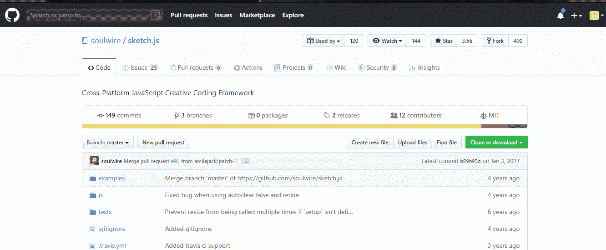
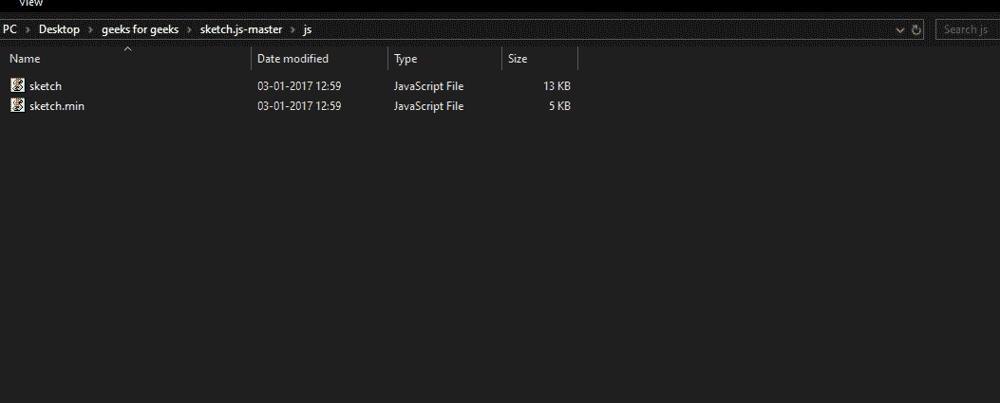
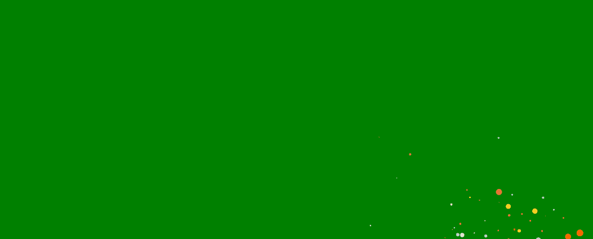

# Sketch.js |简介

> 原文:[https://www.geeksforgeeks.org/sketch-js-introduction/](https://www.geeksforgeeks.org/sketch-js-introduction/)

Sketch.js 是一个轻量级的创意编码平台。它提供了所有需要添加的片段和代码，以便为您的网站制作酷的动画和效果。Sketch.js 使动画的实现变得非常快速和容易。类似于使用[处理](https://processing.org/)。它的主要概念是基于像鼠标事件、触摸事件和键盘事件这样的事件。为了方便起见，所有事件都进行了扩充，以便您可以轻松地使用它们，如果您愿意，也可以在事件处理程序之外使用它们。为了获得鼠标和触摸事件的坐标，我们有 *x* 和 *y* 坐标，这些坐标也在普通的 JavaScript 中使用。使用 sketch.js 使编码变得更快更有趣，而不用担心设置和为配置编写大量样板代码。它提供了内置的图形上下文和动画循环。所以最后我们应该使用 sketch.js 来制作动画，因为它速度快，容易设置和使用，而且可以省去你写很多代码。

**安装:**

*   **第一步:**首先你需要在你的机器上下载。下载链接如下。
    **下载 Sketch.js:** [立即下载](https://github.com/soulwire/sketch.js)。
    这就是他们 github 页面的样子。点击下载或克隆按钮下载压缩文件。
    
*   **步骤 2:** 现在，提取 zip 文件。您需要将 *sketch.min.js* 文件添加到项目中。
    
*   **Step-3:** Now, if you go into the examples folder, you will see three HTML files. All you need to do is to copy the JS of the file whose effect you want to add into your project.
    

    这就是你需要做的所有工作。下面是将示例中的一个 JS 添加到项目中后的最终代码。

    **示例:**

    ```
    <!DOCTYPE html>
    <html lang="en">

    <head>
        <meta charset="UTF-8">
        <meta name="viewport" content=
            "width=device-width, initial-scale=1.0">

        <title>Sketch.js</title>

        <style>
            body {
                margin: 0;
                padding: 0;
                background: green;
            }
        </style>
    </head>

    <body>
        <script src="sketch.min.js"></script>
        <script>

            // Particle function
            function Particle(x, y, radius) {
                this.init(x, y, radius);
            }

            Particle.prototype = {
                init: function (x, y, radius) {
                    this.alive = true;
                    this.radius = radius || 10;
                    this.wander = 0.15;
                    this.theta = random(TWO_PI);
                    this.drag = 0.92;
                    this.color = '#fff';
                    this.x = x || 0.0;
                    this.y = y || 0.0;
                    this.vx = 0.0;
                    this.vy = 0.0;
                },

                move: function () {
                    this.x += this.vx;
                    this.y += this.vy;
                    this.vx *= this.drag;
                    this.vy *= this.drag;
                    this.theta += random(-0.5, 0.5) * this.wander;
                    this.vx += sin(this.theta) * 0.1;
                    this.vy += cos(this.theta) * 0.1;
                    this.radius *= 0.96;
                    this.alive = this.radius > 0.5;
                },

                draw: function (ctx) {
                    ctx.beginPath();
                    ctx.arc(this.x, this.y, this.radius, 0, TWO_PI);
                    ctx.fillStyle = this.color;
                    ctx.fill();
                }
            };

            var MAX_PARTICLES = 280;
            var COLOURS = ['#69D2E7',
                '#A7DBD8',
                '#E0E4CC',
                '#F38630',
                '#FA6900',
                '#FF4E50',
                '#F9D423'];

            var particles = [];
            var pool = [];
            var demo = Sketch.create({
                container: document.getElementById('container'),
                retina: 'auto'
            });

            demo.setup = function () {

                // Set off some initial particles.
                var i, x, y;

                for (i = 0; i < 20; i++) {
                    x = (demo.width * 0.5) + random(-100, 100);
                    y = (demo.height * 0.5) + random(-100, 100);
                    demo.spawn(x, y);
                }
            };

            demo.spawn = function (x, y) {
                var particle, theta, force;
                if (particles.length >= MAX_PARTICLES)
                    pool.push(particles.shift());

                particle = pool.length ? pool.pop() : new Particle();
                particle.init(x, y, random(5, 40));

                particle.wander = random(0.5, 2.0);
                particle.color = random(COLOURS);
                particle.drag = random(0.9, 0.99);

                theta = random(TWO_PI);
                force = random(2, 8);

                particle.vx = sin(theta) * force;
                particle.vy = cos(theta) * force;

                particles.push(particle);
            };

            demo.update = function () {

                var i, particle;

                for (i = particles.length - 1; i >= 0; i--) {

                    particle = particles[i];

                    if (particle.alive) particle.move();
                    else pool.push(particles.splice(i, 1)[0]);
                }
            };

            demo.draw = function () {

                demo.globalCompositeOperation = 'lighter';

                for (var i = particles.length - 1; i >= 0; i--) {
                    particles[i].draw(demo);
                }
            };

            demo.mousemove = function () {

                var particle, theta, force, touch, max, i, j, n;

                for (i = 0, n = demo.touches.length; i < n; i++) {

                    touch = demo.touches[i], max = random(1, 4);
                    for (j = 0; j < max; j++) {
                        demo.spawn(touch.x, touch.y);
                    }

                }
            };
        </script>
    </body>

    </html>
    ```

    如果我们看一下上面的代码，我们所做的就是提供一个后台添加两个 JS 文件一个是 *sketch.min.js* 另一个是来自示例文件夹的其中一个文件。我们在这里演示了*粒子*。

    **输出:**
    