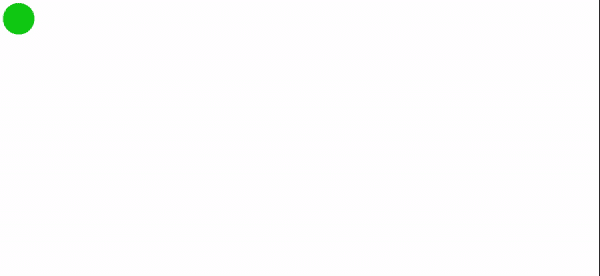

# 使用 CSS 和 JavaScript 的蛇形效果

> 原文:[https://www . geesforgeks . org/snake-like-effect-use-CSS-and-JavaScript/](https://www.geeksforgeeks.org/snake-like-effect-using-css-and-javascript/)

在本文中，我们将看到如何使用 [**CSS**](https://www.geeksforgeeks.org/css-tutorials/) 和 [**JavaScript**](https://www.geeksforgeeks.org/javascript-tutorial/) 创建**蛇形效果**。

**CDN 链接:**在你的 HTML 代码中包含以下 **GSAP** 库。

**进场:**

*   我们取了一个名为 snake 的 *div* 标签，它是完整蛇的一个实例。我们已经采取了圆形，我们可以通过使用简单的 CSS 采取另一种形状。
*   我们创造了更多的*草皮*来给出蛇的长度。我们可以包含更多的 *div* 标签来增加它的长度。
*   [**document . body . addevent listener**](https://www.geeksforgeeks.org/html-dom-addeventlistener-method/)**(【mouse move】):**这个函数在 JavaScript 中将移动的鼠标事件附加到文档上。当用户将鼠标指针移动到文档中的任何位置时，所提到的事件就会发生。
*   **e.clientX:** 获取水平坐标。
*   **e.clientY:** 获取垂直坐标。
*   **错开:**对于动画中的延迟(0.05 秒)，我们可以看到蛇。
*   **gsap.to(。蛇”):**它会参照指针坐标跟踪蛇。

**例:**

## 超文本标记语言

```html
<!DOCTYPE html>
<html>
<head>

    <style type="text/css">
        /* Area part for snake */
        .area
        {
            width: 80px;
            height: 80px;
            position: relative;
        }
        /* Designing of a part of snake (here circle) */
        .area .snake
        {
            position: absolute;
            top: 0;
            left: 0;
            width: 100%;
            height: 100%;
            background: rgb(3, 171, 15);
            border: 2px soild white;
            border-radius: 50%;
        }
    </style>
</head>
<body>
    <div class="area">
        <!-- You can add more divs for a long snake-->
        <div class="snake"></div>
        <div class="snake"></div>
        <div class="snake"></div>
        <div class="snake"></div>
        <div class="snake"></div>
        <div class="snake"></div>
        <div class="snake"></div>
        <div class="snake"></div>
        <div class="snake"></div>
        <div class="snake"></div>
    </div>

<!-- GSAP Library -->
<script 
 src="https://cdnjs.cloudflare.com/ajax/libs/gsap/3.6.0/gsap.min.js">
</script>

<!-- JavaScript Code for mouse event -->
<script type="text/javascript">
    document.body.addEventListener("mousemove", e => {
        gsap.to(".snake", {
            x : e.clientX,
            y : e.clientY,
            stagger : -0.05,
        })
        })
</script>
</body>
</html>
```

**Output : **

从上面的输出可以看出，我们已经创建了一条跟随鼠标指针的蛇，使它看起来像一个**蛇一样的效果。**