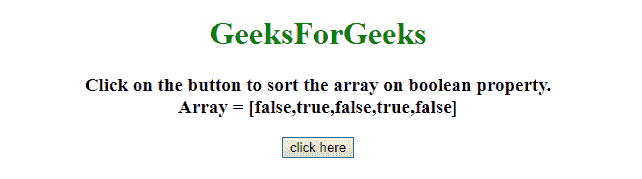
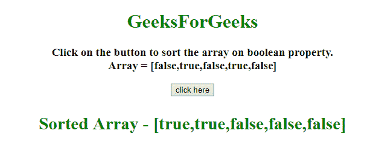
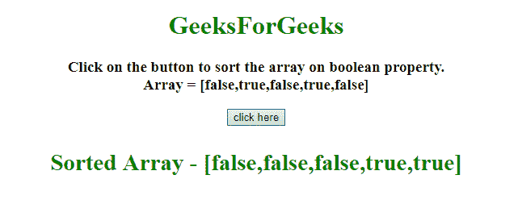

# 使用 JavaScript 中的布尔属性对对象数组进行排序

> 原文:[https://www . geesforgeks . org/sort-a-array-of-objects-use-boolean-property-in-JavaScript/](https://www.geeksforgeeks.org/sort-an-array-of-objects-using-boolean-property-in-javascript/)

给定包含布尔值的 JavaScript 数组。任务是在 JavaScript 的帮助下，根据布尔值对数组进行排序。这里讨论两种方法。
**进场 1:**

*   使用 **JavaScript Array.sort()方法**。
*   在比较条件下，使用 **===运算符**来比较布尔对象。
*   返回 **0、1 和-1** 根据比较分别表示相等、较大和较小。

**示例 1:** 该示例实现了上述方法。

```
<!DOCTYPE HTML>
<html>

<head>
    <title>
        Sort an array of objects by a
      Boolean property in JavaScript.
    </title>
    <script src=
"https://ajax.googleapis.com/ajax/libs/jquery/3.4.0/jquery.min.js">
    </script>
</head>

<body style="text-align:center;">
    <h1 style="color:green;">  
            GeeksForGeeks  
        </h1>
    <p id="GFG_UP">
    </p>
    <button onclick="GFG_Fun();">
        click here
    </button>
    <p id="GFG_DOWN" 
       style="color: green;">
    </p>
    <script>
        var up = document.getElementById('GFG_UP');
        var down = document.getElementById('GFG_DOWN');
        a = [false, true, false, true, false];
        up.innerHTML =
            "Click on the button to sort the array"+
          "on boolean property.<br>Array = [" + a + "]";

        function GFG_Fun() {
            a.sort(function(x, y) {
                return (x === y) ? 0 : x ? -1 : 1;
            });
            down.innerHTML = "Sorted Array - [" + a + "]";
        }
    </script>
</body>

</html>
```

**输出:**

*   **点击按钮前:**
    

*   **After clicking on the button:**
    

    **方法 2:**

    *   使用 **JavaScript Array.sort()方法**。
    *   在比较条件下，从第二个元素中减去第一个元素来比较对象并返回该值。
    *   使用**。反转()方法**，如果结果需要反转。

    **示例 2:** 该示例实现了上述方法。

    ```
    <!DOCTYPE HTML>
    <html>

    <head>
        <title>
            Sort an array of objects by a 
          Boolean property in JavaScript.
        </title>
        <script src=
    "https://ajax.googleapis.com/ajax/libs/jquery/3.4.0/jquery.min.js">
        </script>
    </head>

    <body style="text-align:center;">
        <h1 style="color:green;">  
                GeeksForGeeks  
            </h1>
        <p id="GFG_UP">
        </p>
        <button onclick="GFG_Fun();">
            click here
        </button>
        <p id="GFG_DOWN"
           style="color: green;">
        </p>
        <script>
            var up = document.getElementById('GFG_UP');
            var down = document.getElementById('GFG_DOWN');
            a = [false, true, false, true, false];
            up.innerHTML = 
              "Click on the button to sort the array on boolean "+
              "property.<br>Array = [" + a + "]";

            function GFG_Fun() {
                a.sort((a, b) => b - a).reverse();
                down.innerHTML = "Sorted Array - [" + a + "]";
            }
        </script>
    </body>

    </html>
    ```

    **输出:**

    *   **点击按钮前:**
        *   **点击按钮后:**
    