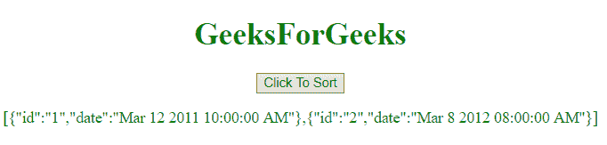
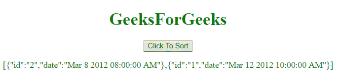

# 在 JavaScript 中按日期对对象数组进行排序

> 原文:[https://www . geesforgeks . org/按 javascript 中的日期对对象数组进行排序/](https://www.geeksforgeeks.org/sort-an-object-array-by-date-in-javascript/)

要按日期对对象数组进行排序，有许多方法，但我们将看到几个最受欢迎的方法。

**日期对象:**JavaScript 中的日期对象用来表示某个时刻。该时间值自世界协调时 1970 年 1 月 1 日起。我们可以通过调用新的 date()构造函数，使用 Date 对象创建日期，如下语法所示。
**语法:**

```
new Date();
new Date(value);
new Date(dateString);
new Date(year, month, day, hours, minutes, seconds, milliseconds);

```

**参数:**

*   **值:**该值是自 1970 年 1 月 1 日 00:00:00 UTC 以来的毫秒数。
*   **日期字符串:**表示日期格式。
*   **年份:**代表 1900 年至 1999 年的整数值。
*   **月:**用整数值表示，1 月为 0，12 月为 11。
*   **日:**为可选参数。它由一个月中某一天的整数值表示。
*   **小时:**为可选参数。它由一天中某个小时的整数值表示。
*   **分钟:**为可选参数。它由一分钟的整数值表示。
*   **秒:**为可选参数。它由一秒钟的整数值表示。
*   **毫秒:**为可选参数。它由时间毫秒的整数值表示。

**示例 1:** 本示例使用 **Date** 对象按日期对对象数组进行排序。

```
<!DOCTYPE html> 
<html> 
    <head> 
        <title> 
            JavaScript | Sort Object Array By Date
        </title> 
    </head>

    <body style = "text-align:center;"> 

        <h1 style = "color:green;" > 
            GeeksForGeeks 
        </h1> 

        <button onclick = "geeks_outer()"> 
            Click To Sort 
        </button> 

        <p id = "GFG_P" style = "color:green;"></p>

        <script> 
            var array = [{id: "1", date: "Mar 11 2012 10:00:00 AM"},
                        {id: "2", date: "Mar 8 2012 08:00:00 AM"}];

            var el = document.getElementById("GFG_P");
            function geeks_outer() {
                array.sort(function(a, b){

                    return new Date(a.date) - new Date(b.date);
                });

                el.innerHTML = JSON.stringify(array);
            }

        </script> 
    </body> 
</html>                    
```

**输出:**

*   **点击按钮前:**
    
*   **点击按钮后:**
    

**示例 2:** 本示例与上一个示例相同，但排序功能略有修改。

```
<!DOCTYPE html> 
<html> 
    <head> 
        <title> 
            JavaScript | Sort Object Array By Date. 
        </title> 
    </head>

    <body style = "text-align:center;"> 

        <h1 style = "color:green;" > 
            GeeksForGeeks 
        </h1> 

        <button onclick = "geeks_outer()"> 
            Click To Sort
        </button> 

        <p id = "GFG_P" style = "color:green;"></p>

        <!-- Script to sort array of object by date -->
        <script> 
            var array = [{id: "1", date: "Mar 12 2012 10:00:00 AM"},
                        {id: "2", date: "Mar 8 2012 08:00:00 AM"}];

            var el = document.getElementById("GFG_P");

            function geeks_outer() {
                array.sort(GFG_sortFunction);
                el.innerHTML = JSON.stringify(array);
            }

            function GFG_sortFunction(a, b) { 
                var dateA = new Date(a.date).getTime();
                var dateB = new Date(b.date).getTime();
                return dateA > dateB ? 1 : -1; 
            }; 
        </script> 
    </body> 
</html>                    
```

**输出:**

*   **点击按钮前:**
    
*   **点击按钮后:**
    