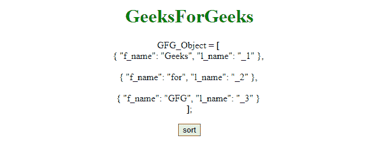
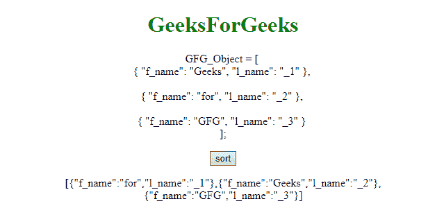
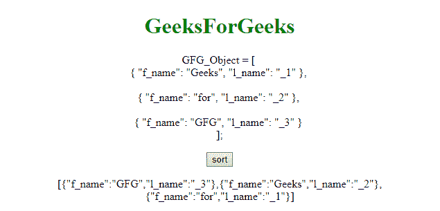

# 按照 JavaScript 中的字符串属性值对对象数组进行排序

> 原文:[https://www . geesforgeks . org/sort-objects-array-by-string-property-value-in-JavaScript/](https://www.geeksforgeeks.org/sort-array-of-objects-by-string-property-value-in-javascript/)

可以使用用户定义的函数对对象数组进行排序。该函数通过对象的属性来比较对象数组。例如，第一个示例比较对象的 l_name，如果 l_name 很小，则将其放置在左侧，否则将其放置在右侧。

**示例 1:** 本示例按 **l_name** 属性对对象数组进行排序。

```
<!DOCTYPE html> 
<html> 

<head> 
    <title> 
        Sort array of objects
    </title>
</head> 

<body style = "text-align:center;"> 

    <h1 style = "color:green;" > 
        GeeksForGeeks 
    </h1> 

    <p id="demo2">GFG_Object = [ <br>
        { "f_name": "Geeks", "l_name": "_1" },
        <br><br>
        { "f_name": "for", "l_name": "_2" },
        <br><br>
        { "f_name": "GFG", "l_name": "_3" }
        <br>];
    </p> 

    <button onClick="fun()">
        sort
    </button>

    <p id="GFG"></p> 

    <!-- Script to compare the object and
        sort its content -->
    <script>
        function fun() {
            function compare(a, b) {
                if (a.l_name < b.l_name)
                    return -1;
                if (a.l_name > b.l_name)
                    return 1;
                return 0;
            }
            var GFG_Object = [ 
                { f_name: 'Geeks', l_name: '_2' },
                { f_name: 'for', l_name: '_1' },
                { f_name: 'GFG', l_name: '_3' }
            ];

            GFG_Object.sort(compare);

            document.getElementById("GFG").innerHTML
                    = JSON.stringify(GFG_Object);
        }
        </script> 
    </body> 
</html>                    
```

**输出:**

*   **之前点击按钮:**
    
*   **点击按钮后:**
    

**示例 2:** 本示例按 **f_name** 属性对对象数组进行排序。

```
<!DOCTYPE html> 
<html> 

<head> 
    <title> 
        Sort array of objects
    </title>
</head> 

<body style = "text-align:center;"> 

    <h1 style = "color:green;" > 
        GeeksForGeeks 
    </h1> 

    <p id="demo2"> GFG_Object = [ <br>
        { "f_name": "Geeks", "l_name": "_1" },
        <br><br>
        { "f_name": "for", "l_name": "_2" },
        <br><br>
        { "f_name": "GFG", "l_name": "_3" }
        <br>];
    </p> 

    <button onClick="fun()">
        sort
    </button>

    <p id="GFG"></p> 

    <script>
        function fun() {
            function compare(a, b) {
                if (a.f_name < b.f_name)
                    return -1;
                if (a.f_name > b.f_name)
                    return 1;
                return 0;
            }
            var GFG_Object = [ 
                { f_name: 'Geeks', l_name: '_2' },
                { f_name: 'for', l_name: '_1' },
                { f_name: 'GFG', l_name: '_3' }
            ];

            GFG_Object.sort(compare);

            document.getElementById("GFG").innerHTML
                    = JSON.stringify(GFG_Object);
        }
    </script> 
</body> 

</html>                    
```

**输出:**

*   **之前点击按钮:**
    
*   **点击按钮后:**
    