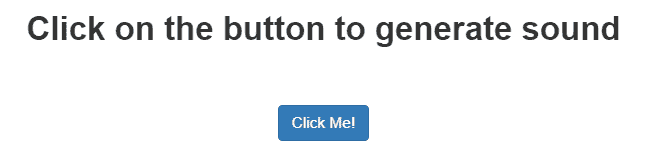

# 使用 JavaScript 点击按钮产生声音

> 原文:[https://www . geesforgeks . org/声音生成-点击-按钮-使用-javascript/](https://www.geeksforgeeks.org/sound-generation-on-clicking-the-button-using-javascript/)

点击按钮、接收通知或页面加载时的声音生成可以通过使用 JavaScript 来完成。

**注:**

*   playSound 函数中提供的 url 可以更改，以给出自定义的声音 URL。
*   样式属性不是实现的一部分。它被用来为观众提供一个很好的界面。

**示例:**本示例在点击按钮后产生声音。

```
<!DOCTYPE html>
<html>

<head>
    <title>
        Sound generation after clicking the button
    </title>

    <link rel="stylesheet" href=
"https://maxcdn.bootstrapcdn.com/bootstrap/3.4.0/css/bootstrap.min.css">

    <script src='https://code.jquery.com/jquery-2.2.0.min.js'>
    </script>
    <script src=
'https://cdn.rawgit.com/admsev/jquery-play-sound/master/jquery.playSound.js'>
    </script>
</head>

<body style="text-align:center;">
    <div class="container-fluid" style="margin:35px;">
        <p style="font-size:30px;">
            <strong>
                Click on the button to generate sound
            </strong>
        </p>

        <br><br>

        <button class="btn btn-primary" onclick=
'$.playSound("http://tusharbaheti28.000webhostapp.com/notification.mp3")'>
            Click Me!
        </button>
    </div>
</body>

</html>                    
```

**输出:**
