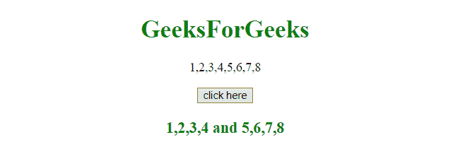
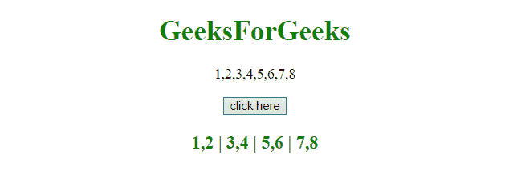

# 在 JavaScript 中将数组拆分成块

> 原文:[https://www . geesforgeks . org/将数组拆分为 javascript 中的块/](https://www.geeksforgeeks.org/split-an-array-into-chunks-in-javascript/)

我们有一个大数组，我们想把它分成几块。所以这些是做这件事的少数方法。

*   **splice()**
    This method adds/removes items to/from an array, and returns the list of removed item(s).
    **Syntax:**

    ```
    array.splice(index, number, item1, ....., itemN)

    ```

    **参数:**

    *   **索引:**此参数为必选项。它指定在什么位置添加/删除项目的整数，负值有助于指定从末尾开始的位置。
    *   **编号:**此参数为可选。它指定要删除的项目数。0 表示没有要移除的内容。
    *   **第 1 项，…..，itemN:** 此参数可选。这将指定要添加到数组中的新项。

    **返回值:**
    返回一个新的数组，包含移除的项目。

*   **slice()**
    这个方法返回一个包含所选元素的新数组。
    该方法选择的元素从给定的开始参数开始，到给定的结束参数结束，但不包括给定的结束参数。
    **语法:**

```
array.slice(start, end)

```

**参数:**

*   **开始:**此参数为可选。它指定从何处开始选择的整数(第一个元素在索引 0 处)。负数用于从数组末尾进行选择。如果不使用，它的行为就像“0”
*   **结束:**此参数为可选。它指定结束选择的整数。如果不使用，从数组开始到结束的所有元素都将包含在选择中。负数用于从末尾开始选择。

**返回值:**
返回一个新数组，包含所选项目。

**示例-1:** 本示例使用 **slice()** 方法将数组拆分为数组块。这个方法可以重复使用来分割任何大小的数组。

```
<!DOCTYPE html>
<html>

<head>
    <title>
        JavaScript 
      | Split array into chunks.
    </title>
</head>

<body style="text-align:center;"
      id="body">
    <h1 style="color:green;">  
            GeeksForGeeks  
        </h1>
    <p id="GFG_UP" style="font-size: 16px;">

    </p>
    <button onclick="gfg_Run()">
        click here
    </button>
    <p id="GFG_DOWN" style="color:green;
                            font-size: 20px; 
                            font-weight: bold;">
    </p>
    <script>
        var el_up = document.getElementById("GFG_UP");
        var el_down = document.getElementById("GFG_DOWN");
        var i, j, chunk = 4;
        var array = [1, 2, 3, 4, 5, 6, 7, 8];
        el_up.innerHTML = array;

        function gfg_Run() {
            var array1 = 
                array.slice(0, chunk);

            var array2 =
                array.slice(chunk, chunk + array.length);

            el_down.innerHTML = array1 + ' and ' + array2;
        }
    </script>
</body>

</html>
```

**输出:**

*   **点击按钮前:**
    
*   **点击按钮后:**
    

**示例-2:** 本示例使用**拼接()**方法将数组拆分为数组的组块。此方法从原始数组中移除项。这个方法可以重复使用来分割任何大小的数组。

```
<!DOCTYPE html>
<html>

<head>
    <title>
        JavaScript 
      | Split array into chunks.
    </title>
</head>

<body style="text-align:center;" 
      id="body">
    <h1 style="color:green;">  
            GeeksForGeeks  
        </h1>
    <p id="GFG_UP" style="font-size: 16px;">

    </p>
    <button onclick="gfg_Run()">
        click here
    </button>
    <p id="GFG_DOWN" style="color:green; 
                            font-size: 20px;
                            font-weight: bold;">
    </p>
    <script>
        var el_up = document.getElementById("GFG_UP");
        var el_down = document.getElementById("GFG_DOWN");
        var i, j, chunk = 2;
        var array = [1, 2, 3, 4, 5, 6, 7, 8];
        el_up.innerHTML = array;

        function gfg_Run() {
            var array1 = array.splice(0, chunk);
            var array2 = array.splice(0, chunk);
            var array3 = array.splice(0, chunk);
            var array4 = array.splice(0, chunk);
            el_down.innerHTML = array1 + ' | ' 
                              + array2 + ' | '
                              + array3 + ' | '
                              + array4;
        }
    </script>
</body>

</html>
```

**输出:**

*   **点击按钮前:**
    
*   **点击按钮后:**
    