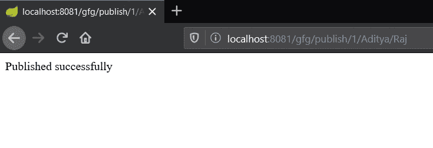
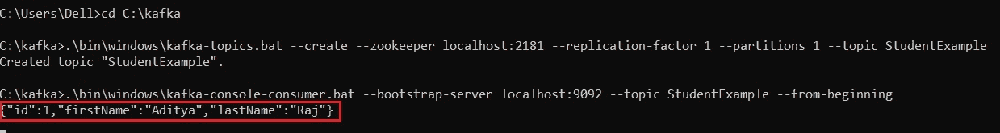

# Spring Boot |如何在 Apache Kafka 上发布 JSON 消息

> 原文:[https://www . geesforgeks . org/spring-boot-how-publish-JSON-messages-on-Apache-Kafka/](https://www.geeksforgeeks.org/spring-boot-how-to-publish-json-messages-on-apache-kafka/)

[Apache Kafka](https://www.geeksforgeeks.org/apache-kafka/) 是一个发布-订阅消息系统。消息队列允许您在进程、应用程序和服务器之间发送消息。在本文中，我们将看到如何在春季启动应用程序中向 Apache Kafka 发送 JSON 消息。

为了学习如何创建一个弹簧靴项目，参考[这篇文章](https://www.geeksforgeeks.org/how-to-create-a-basic-application-in-java-spring-boot/?ref=rp)。

JSON 的完整形式是 JavaScript 对象符号。JSON 是一种轻量级的数据交换格式，人类可以轻松读写，机器可以轻松解析和生成。虽然它是从 JavaScript 的一个子集派生出来的，但是它是独立于语言的。这是一种完全独立于语言的文本格式。为了向 Apache Kafka 发布 JSON 消息，可以遵循以下步骤:

1.  转到 [spring initializr](https://start.spring.io/) 并创建一个包含以下依赖项的初始项目:
    *   弹簧网
    *   阿帕奇卡夫卡的春天
2.  在集成开发环境中打开项目，并同步依赖项。在本文中，我们将创建一个学生模型，并在其中发布学生的详细信息。因此，创建一个模型类*学生*。添加数据成员并创建[构造器](https://www.geeksforgeeks.org/constructors-in-java/)并创建获取器和设置器。以下是学生班的实施:

    ```
    // Java program to implement a
    // student class

    // Creating a student class
    public class Student {

        // Data members of the
        // student class
        int id;
        String firstName;
        String lastName;

        // Constructor of the student
        // class
        public Student(int id, String firstName,
                       String lastName)
        {
            this.id = id;
            this.firstName = firstName;
            this.lastName = lastName;
        }

        // Implementing the getters
        // and setters
        public int getId()
        {
            return id;
        }

        public void setId(int id)
        {
            this.id = id;
        }

        public String getFirstName()
        {
            return firstName;
        }

        public void setFirstName(String firstName)
        {
            this.firstName = firstName;
        }

        public String getLastName()
        {
            return lastName;
        }

        public void setLastName(String lastName)
        {
            this.lastName = lastName;
        }
    }
    ```

3.  现在，用注释 *@RestController* 创建一个新的类 *Controller* 。创建一个 [GET API](https://www.geeksforgeeks.org/rest-api-introduction/) 并用参数作为字符串和模型类对象初始化 *KafkaTemplate* 。以下是控制器的实现:

    ```
    // Java program to implement a
    // controller

    @RestController
    @RequestMapping("gfg")
    public class UserResource {

        @Autowired
        private KafkaTemplate<String, Student>
            kafkaTemplate;

        private static final String TOPIC
            = "StudentExample";

        @GetMapping("/publish/{id}/"
                    + "{firstName}/{lastName}")

        public String post(
            @PathVariable("id") final int id,
            @PathVariable("firstName") final
                String firstName,
            @PathVariable("lastName") final
                String lastName)
        {

            kafkaTemplate.send(
                TOPIC,
                new Student(
                    id, firstName,
                    lastName));

            return "Published successfully";
        }
    }
    ```

4.  创建一个带有注释*@配置*的类*学生配置*。在这个类中，我们将序列化模型类的对象。

    ```
    // Java program to serialize the
    // object of the model class

    @Configuration
    public class StudentConfig {

        @Bean
        public ProducerFactory<String, Student>
        producerFactory()
        {
            // Create a map of a string
            // and object
            Map<String, Object> config
                = new HashMap<>();

            config.put(
                ProducerConfig.BOOTSTRAP_SERVERS_CONFIG,
                "127.0.0.1:9092");

            config.put(
                ProducerConfig.KEY_SERIALIZER_CLASS_CONFIG,
                StringSerializer.class);

            config.put(
                ProducerConfig.VALUE_SERIALIZER_CLASS_CONFIG,
                JsonSerializer.class);

            return new DefaultKafkaProducerFactory<>(config);
        }

        @Bean
        public KafkaTemplate<String, Student>
        kafkaTemplate()
        {
            return new KafkaTemplate<>(
                producerFactory());
        }
    }
    ```

5.  现在，启动动物园管理员和卡夫卡服务器。我们需要创建一个名为 *StudentExample* 的新主题。为此，请打开一个新的命令提示符窗口，并将目录更改为 Kafka 文件夹。
6.  现在，使用下面给出的命令创建一个新主题:

    > 适用于苹果个人计算机和 Linux:bin/Kafka-主题。sh–create–动物园管理员本地主机:2181–复制因子 1–分区 1–话题 _ 话题 _ 名称
    > 
    > 对于 Windows:\ bin \ windows \ Kafka-主题。bat–create–动物园管理员 localhost:2181–复制因子 1–分区 1–话题话题 _ 名称

7.  现在要实时查看卡夫卡服务器上的消息，请使用下面的命令:

    > 适用于苹果个人计算机和 Linux:bin/Kafka-控制台-消费者。sh-bootstrap-server localhost:9092-topic _ name-从头开始
    > 
    > 对于 Windows:\ bin \ windows \ Kafka-控制台-消费者。bat-bootstrap-server localhost:9092-topic _ name-从头开始

8.  Run the application and call the API as:

    > localhost:8080/gfg/publish/{ id }/{名字}/{姓氏}

    **注意:**如果使用了不同的端口，则用 8080 替换该端口。

**输出:**

*   调用 API:
    [](https://media.geeksforgeeks.org/wp-content/uploads/20200611010735/json11.jpg)
*   实时查看消息:
    [](https://media.geeksforgeeks.org/wp-content/uploads/20200611010752/json2.jpg)