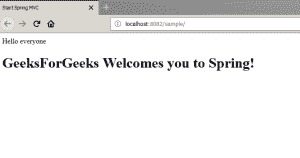

# 带 JSP 视图的 Spring MVC

> 原文:[https://www.geeksforgeeks.org/spring-mvc-with-jsp-view/](https://www.geeksforgeeks.org/spring-mvc-with-jsp-view/)

Spring MVC 架构使用“FrontController”设计模式，这是任何 MVC 设计实现的基础。DispatcherServlet 是这种设计的核心，通过它，HTTP 请求被委托给控制器，视图被解析为底层视图技术，此外还为上传文件提供支持。像任何常规 Servlet 一样，DispatcherServlet 可以与自定义处理程序映射一起配置。

Spring MVC 框架支持模块分离，即模型、视图和控制，并无缝地处理应用程序集成。这使得开发人员也可以使用普通的 java 类创建复杂的应用程序。可以使用“地图”在视图和控制器之间传递模型对象。此外，还提供了用户界面中的类型不匹配验证和双向数据绑定支持。有了 spring form 标签、模型对象和注释，用户界面中的表单提交和数据绑定就变得容易了。

本文讨论了开发 Spring web MVC 应用程序所涉及的步骤，解释了 Spring 中 MVC 应用程序的初始项目设置。JSP(Java 服务器页面)被用作视图技术。

以下是 Spring web MVC 的依赖项。虽然 spring-web MVC jar 足以满足开发 MVC 应用程序的所有容器需求，但是 JSTL-jar 包含在 JSP 中:
依赖项在 pom.xml 中

```
<dependency>
                <groupId>org.springframework</groupId>
                <artifactId>spring-webmvc</artifactId>
                <version>4.3.7</version>
            </dependency>
             <dependency>
                <groupId>jstl</groupId>
                <artifactId>jstl</artifactId>
                <version>1.2</version>
            </dependency> 
            <dependency>
                <groupId>javax.servlet</groupId>
                <artifactId>javax.servlet-api</artifactId>
                <version>3.0.1</version>
                <scope>provided</scope>
            </dependency>
```

DispatcherServlet 将在 web.xml 中配置如下。侦听器类 *ContextLoaderListener* 将加载根应用程序上下文，并将句柄传输到 servlet 映射元素中提到的 dispatcher servlet。对应于“/”URL 映射的所有请求都将由这个 dispatcher servlet 处理。
T3

```
<web-app>
  <display-name>SampleMVC</display-name>
  <listener>
  <listener-class>org.springframework.web.context.ContextLoaderListener
  </listener-class>
  </listener>
<context-param>
    <param-name>contextConfigLocation</param-name>
    <param-value>/WEB-INF/mvc-dispatcher-servlet.xml</param-value>
</context-param>

<servlet>
<servlet-name>mvc-dispatcher</servlet-name>
<servlet-class>org.springframework.web.servlet.DispatcherServlet
</servlet-class>
<load-on-startup>1</load-on-startup>
</servlet>

    <servlet-mapping>
       <servlet-name>mvc-dispatcher</servlet-name>
        <url-pattern>/</url-pattern>
    </servlet-mapping>

      <welcome-file-list>
      <welcome-file>
      /index.html
      </welcome-file>
      </welcome-file-list>
```

使用上下文参数*上下文配置位置*，可以在默认位置“servlet name”-servlet . XML 中找到调度器 servlet 的相关*网络应用上下文*。*网络应用上下文*包含特定于 MVC 的配置，包括视图解析器、数据源、消息源、多部分解析器(文件上传)等。

**WEB-INF/MVC-dispatcher-servlet . XML**

```

        <context:component-scan base-package="com.springsamples*"/>
      <mvc:annotation-driven/>    
  <!--  this will render home page from index.html-->    
      <mvc:default-servlet-handler/>

     <bean id = "viewProvider" 
class = "org.springframework.web.servlet.view.InternalResourceViewResolver">
        <property name = "prefix" value = "/"/>
        <property name = "suffix" value = ".jsp"/>

        </bean>   
```

在上面的 XML 中，元素组件-带上下文名称空间的扫描将扫描所有组件类中的注释( *@Component、@Configuration、@Service、@Repository、@Autowired* )并初始化 beans。MVC 命名空间中的元素注释驱动将扫描并初始化*@控制器*注释的组件。
在 MVC 命名空间中，元素 default-servlet-handler 扩展了默认的 HTTP dispatcher servlet，也服务于对位于 web 根目录中的静态资源的请求。

我们还初始化了一个 id 为“viewProvider”的 bean 用于呈现。jsp 页面。类*InternalResourceViewResolver*将接受前缀和后缀参数来构造查看页面的路径。例如，如果控制器类返回一个名为“greet”的视图，那么视图解析器类将通过附加给定的后缀和前缀字符串，将相对于 web 根的路径标识为“/greet.jsp”。

最后。将作为视图的 jsp 文件。我们正在将一个属性从控制器类发送到视图，该视图将在点击匹配的网址时显示。

**greet.jsp**

```
<%@ page language="java" contentType="text/html; charset=ISO-8859-1"
    pageEncoding="ISO-8859-1" isELIgnored="false" %>
<!DOCTYPE html PUBLIC "-// W3C// DTD HTML 4.01 
 Transitional// EN" "http:// www.w3.org/TR/html4/loose.dtd">
<html>
<head>
<meta http-equiv="Content-Type" content="text/html; 
 charset=ISO-8859-1">
<title>Start Spring MVC</title>
</head>
<body>
<h1>Start here</h1>
${greeting}
</body>
</html>
```

控制器类代码如下。

```
@GetMapping(value = "/")
public ModelAndView firstView()
{
    ModelAndView mav = new ModelAndView("greet"); 
   // must match the jsp page name which is being requested.
    mav.addObject("greeting", "GeeksForGeeks Welcomes you to Spring!");
    return mav;
}
```

请查看下面显示控制器中提供的字符串“问候语”值的视图。

