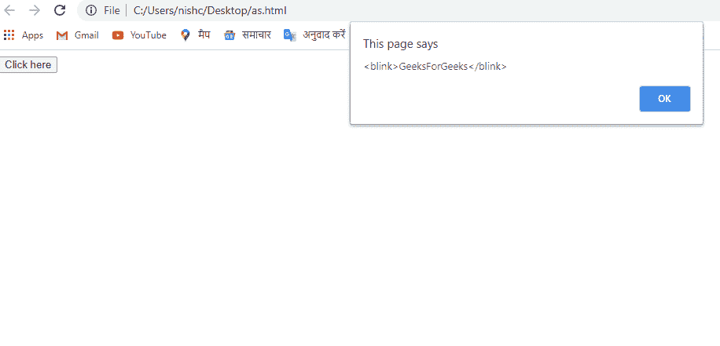

# Javascript 中的字符串闪烁()方法

> 原文:[https://www . geesforgeks . org/string-blink-method-in-JavaScript/](https://www.geeksforgeeks.org/string-blink-method-in-javascript/)

本教程解释了如何使用 Javascript blink()方法。

在 Javascript 中，blink()方法是一个字符串方法，用于在 blink 标记中显示字符串。

**语法:**

```
string.blink()
```

**参数值:**无。

**返回值:**返回一个带闪烁标签的字符串值。

**JavaScript 版本:** JavaScript 1.0

**程序 1:**

```
.<!DOCTYPE html>
<html>
<head>
<title>Blink Method</title>
</head>
<body>
  <button onclick="blinkMethod()">Click here</button>
    <script>
     function blinkMethod(){
         var simpleString="GeeksForGeeks";
           window.alert(simpleString.blink());
     }
      </script>
</body>
</html>
```

**输出:**

[](https://media.geeksforgeeks.org/wp-content/uploads/20200819155141/gfg.png)

**程序 2:**

```
<script>
function func(){
var simpleString="GeeksForGeeks";
console.log(simpleString.blink());
}
func();
</script>
```

**输出:**

```
<blink>GeeksForGeeks</blink>

```

在之前的程序中可以看到，blink()方法创建了一个包含标签的字符串。

**支持的浏览器:**

*   微软公司出品的 web 浏览器
*   火狐浏览器
*   谷歌 Chrome
*   旅行队
*   歌剧