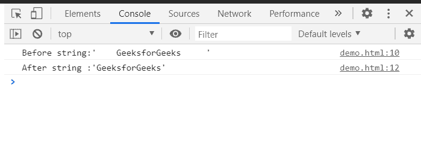

# JavaScript 中的字符串条()

> 原文:[https://www.geeksforgeeks.org/string-strip-in-javascript/](https://www.geeksforgeeks.org/string-strip-in-javascript/)

这里的任务是从字符串中删除所有前导和尾随空格和制表符。我们会用一些方法来达到目的。

**方法 1:** 这里，我们将使用 **[修剪()方法](https://www.geeksforgeeks.org/java-string-trim-method-example/)** 。我们可以使用 **trim()方法**剥离字符串，并可以从字符串中删除不必要的尾随和前导空格和制表符。

**例:**

## 超文本标记语言

```
<!DOCTYPE html>
<html>
<head>
    <title>String strip() for JavaScript</title>
</head>
<body>
    <script>
        var string="    GeeksforGeeks     ";
        console.log("Before string:'"+string+"'");

        console.log("After string :'"+string.trim()+"'");
    </script>
</body>
</html>
```

**输出:**


**方法 2:** 这里我们将制作一个用户自定义函数。我们将编写一个 JavaScript 来去除字符串和不必要的空格。

**例:**

## 超文本标记语言

```
<!DOCTYPE html>
<html>
   <head>
      <title>String strip() for JavaScript</title>
   </head>
   <body>
       <script>
          function strip(string) {
              return string.replace(/^\s+|\s+$/g, '');
        }

        var string="    GeeksforGeeks     ";
        console.log("Before string:'"+string+"'");

        console.log("After string :'"+strip(string)+"'");
      </script>
  </body>
</html>
```

**Output:**
