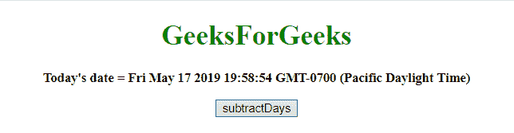
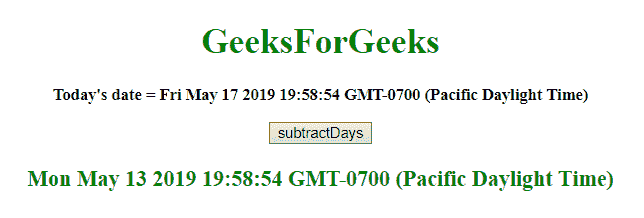
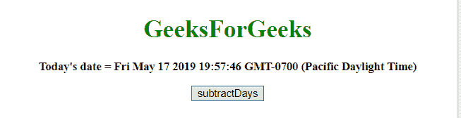
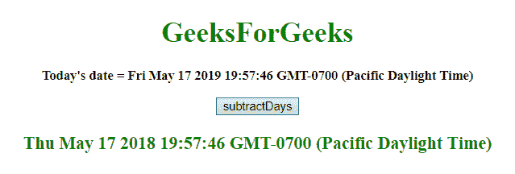

# 从 JavaScript 中的日期对象中减去天数

> 原文:[https://www . geeksforgeeks . org/从日期中减去天数-javascript 中的对象/](https://www.geeksforgeeks.org/subtract-days-from-date-object-in-javascript/)

给定一个日期，任务是从日期中减去天数。在 JavaScript 中，要从日期中减去天数，可以使用下面描述的一些方法:

*   **JavaScript getDate() Method:** This method returns the day of the month (from 1 to 31) for the defined date.

    **语法:**

    ```
    Date.getDate()

    ```

    **返回值:**返回 1 到 31 之间的数字，代表一个月中的某一天。

*   **JavaScript setDate()方法:**此方法将月中的某一天设置为 Date 对象。

    **语法:**

    ```
    Date.setDate(day)

    ```

    **参数:**

    *   **日:**为必输参数。它指定表示一个月中某一天的整数。值预期值为 1-31，但也允许其他值。
        *   0 将导致前一个月的最后一天。
        *   -1 将导致前一个月最后一天的前一天。
        *   如果该月有 31 天，32 天将导致下个月的第一天。
        *   如果该月有 30 天，32 将导致下个月的第二天。

    **返回值:**返回一个数字，表示日期对象和 1970 年 1 月 1 日午夜之间的毫秒数。

*   **JavaScript getTime() method:** This method returns the number of milliseconds between midnight of January 1, 1970, and the specified date.

    **语法:**

    ```
    Date.getTime()

    ```

    **返回值:**返回一个数字，代表 1970 年 1 月 1 日午夜以来的毫秒数。

*   **JavaScript setTime()方法:**此方法通过将定义的毫秒数加/减到 1970 年 1 月 1 日午夜/从午夜开始设置日期和时间。

    **语法:**

    ```
    Date.setTime(millisec)

    ```

    **参数:**

    *   **毫秒:**为必输参数。它指定要加/减的毫秒数，1970 年 1 月 1 日午夜。

    **返回值:**表示日期对象到 1970 年 1 月 1 日午夜之间的毫秒数。

    **例 1:** 本例使用 **setTime()和 getTime()方法**从**今天的 var**中减去 4 天。

    ```
    <!DOCTYPE HTML> 
    <html> 
        <head> 
            <title> 
                Subtract days from Date object
            </title>
        </head> 

        <body style = "text-align:center;"> 

            <h1 style = "color:green;" > 
                GeeksForGeeks 
            </h1>

            <p id = "GFG_UP" style = "font-size: 15px; font-weight: bold;">
            </p>

            <button onclick = "gfg_Run()"> 
                subtractDays
            </button>

            <p id = "GFG_DOWN" style = 
                "color:green; font-size: 20px; font-weight: bold;">
            </p>

            <script>
                var el_up = document.getElementById("GFG_UP");
                var el_down = document.getElementById("GFG_DOWN");
                var today = new Date();
                el_up.innerHTML = "Today's date = " + today;

                Date.prototype.subtractDays = function(d) { 
                    this.setTime(this.getTime() - (d*24*60*60*1000)); 
                    return this; 
                }

                function gfg_Run() {
                    var a = new Date();
                    a.subtractDays(4);
                    el_down.innerHTML = a;
                }         
            </script> 
        </body> 
    </html>                    
    ```

    **输出:**

    *   **点击按钮前:**
        
    *   **点击按钮后:**
        

    **例 2:** 本例使用 **setDate()和 getDate()方法**从**今天的 var**中减去 365 天。

    ```
    <!DOCTYPE HTML> 
    <html> 
        <head> 
            <title> 
                Subtract days from Date object
            </title>
        </head> 

        <body style = "text-align:center;">

            <h1 style = "color:green;" > 
                GeeksForGeeks 
            </h1>

            <p id = "GFG_UP" style = "font-size: 15px; font-weight: bold;">
            </p>

            <button onclick = "gfg_Run()"> 
                subtractDays
            </button>

            <p id = "GFG_DOWN" style = 
                "color:green; font-size: 20px; font-weight: bold;">
            </p>

            <script>
                var el_up = document.getElementById("GFG_UP");
                var el_down = document.getElementById("GFG_DOWN");
                var today = new Date();
                el_up.innerHTML = "Today's date = " + today;

                Date.prototype.subtractDays= function(d) {
                    this.setDate(this.getDate() - d);
                    return this;
                }

                function gfg_Run() {
                    var a = new Date();
                    a.subtractDays(365);
                    el_down.innerHTML = a;
                }         
            </script> 
        </body> 
    </html>                    
    ```

    **输出:**

    *   **点击按钮前:**
        
    *   **点击按钮后:**
        